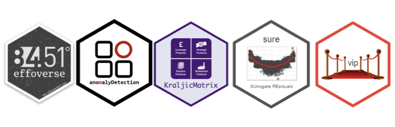
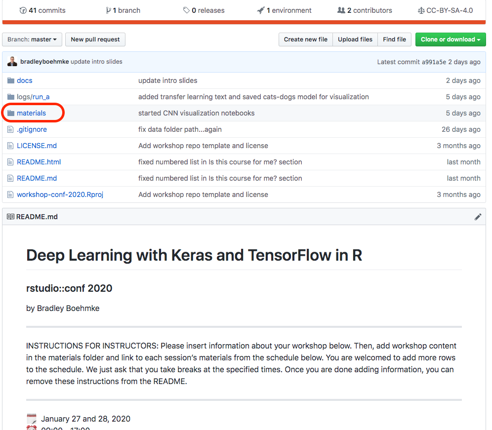
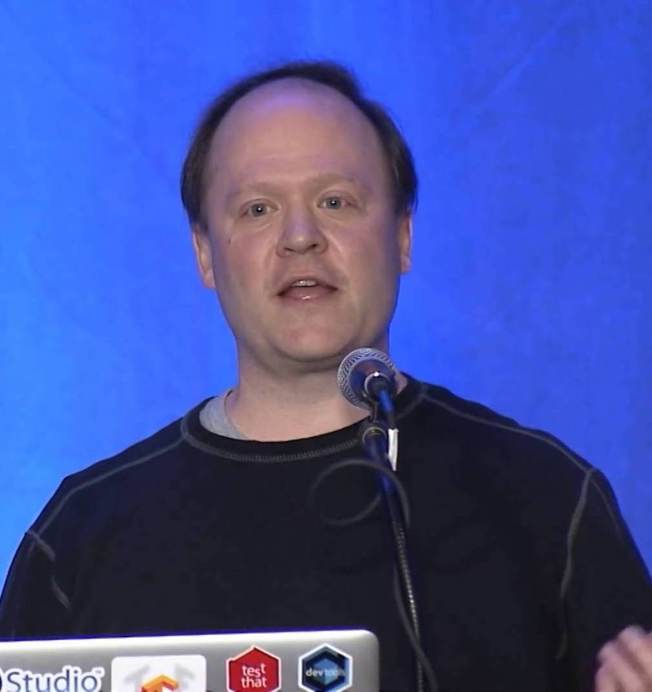
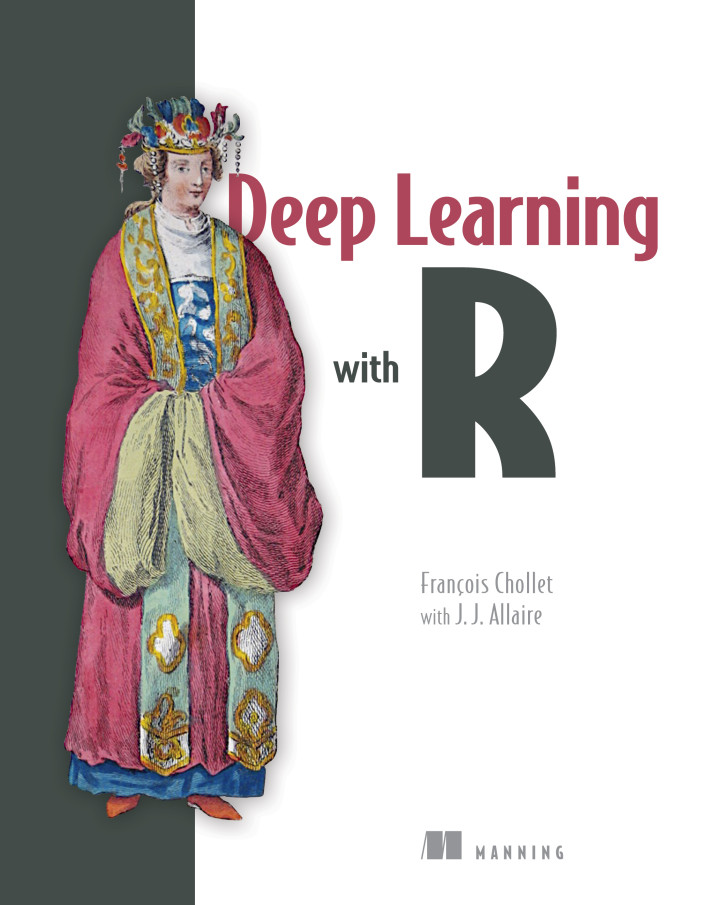

```{r setup, include=FALSE, cache=FALSE}
# set working directory to docs folder
setwd(here::here("docs"))

# Set global R options
options(htmltools.dir.version = FALSE, servr.daemon = TRUE)

# Set global knitr chunk options
knitr::opts_chunk$set(
  fig.align = "center", 
  cache = TRUE,
  error = FALSE,
  message = FALSE, 
  warning = FALSE, 
  collapse = TRUE 
)

# Use a clean black and white ggplot2 theme
library(ggplot2)
thm <- theme_bw()
theme_set(thm)
```

class: title-slide   
<a href="https://github.com/rstudio-conf-2020/dl-keras-tf"></a>


<br><br><br><br>
# .font250[Deep Learning with `r anicon::faa("r-project", animate = 'pulse', speed = 'slow', color = 'steelblue')`]
# .font120[Using Keras with Tensorflow backend]

### Brad Boehmke
### `rstudio::conf(2020)`

---

# About me  

<br>

.pull-left[

```{r name-tag, echo=FALSE}
knitr::include_graphics("images/name-tag.png")
```

]

--

.pull-right[

```{r, echo=FALSE, out.height=400}
knitr::include_graphics("https://images-na.ssl-images-amazon.com/images/I/41ttvv4UJ%2BL._SX331_BO1,204,203,200_.jpghttps://images.tandf.co.uk/common/jackets/amazon/978113849/9781138495685.jpg")
```

]

---
# About me  

<br>

.pull-left[

```{r, echo=FALSE}
knitr::include_graphics("images/name-tag.png")
```

]

.pull-right[

```{r, echo=FALSE, out.height=400}
knitr::include_graphics("https://images.tandf.co.uk/common/jackets/amazon/978113849/9781138495685.jpg")
```

]

---
# About me  

<br>

.pull-left[

```{r, echo=FALSE}
knitr::include_graphics("images/name-tag.png")
```

]

.pull-right[

<br><br>

```{r, echo=FALSE}

```

]

---

# About me  

<br>

.pull-left[

```{r echo=FALSE}
knitr::include_graphics("images/name-tag.png")
```

]


.font120.pull-right[
<br><br>
[`r fontawesome::fa("globe", fill = "steelblue")`](http://bradleyboehmke.github.io/) bradleyboehmke.github.io  <br>
[`r fontawesome::fa("github", fill = "steelblue")`](https://github.com/bradleyboehmke/) @bradleyboehmke  <br>
[`r fontawesome::fa("twitter", fill = "steelblue")`](https://twitter.com/bradleyboehmke) @bradleyboehmke  <br>
[`r fontawesome::fa("envelope", fill = "steelblue")`](mailto:bradleyboehmke@gmail.com) bradleyboehmke@gmail.com  

]

---
class: inverse, center, middle

# What are we going to cover?

---
# Modeling purposes

.font130[
.pull-left[
* Regression

* Classification

* Computer vision

* Natural language processing

* Time series analysis

* Anomaly detection
]
]

---
# Model architectures

.font130[
.pull-left.opacity20[
* Regression

* Classification

* Computer vision

* Natural language processing

* Time series analysis

* Anomaly detection
]

.pull-right[
* Multilayer perceptron (MLP)

* Convolutional neural networks (CNNs)

* Recurrent neural networks (RNNs)

* Long-short term memory neural networks (LSTMs)

* Autoencoders
]
]

---
# Model gears

.font130[

.pull-left[
* Tensors

* Sequential vs functional models

* Activation functions

* Derivatives & gradient descent

* Backward propagation

* Batches & epochs

]

.pull-right[

* Learning rate

* Convolutions

* Embeddings

* Recurrent connections

* and more!

]

]

---
# Workflow procedures

.font130[

.pull-left[
* Data preprocessing

* Data augmentation

* Network architecture

* Model compiling

* Regularization

* Hyperparameter tuning

]

.pull-right[
* Callbacks procedures

* Model validation

* Transfer learning

* Model interpretation

* and more!

]
]

---
class: inverse

# My objective is to...

<br><br>
.font130.white[

* Provide an intuitive understanding of the engines and architectures that drive deep learning.<br><br>

* Apply a variety of deep learning algorithms.<br><br>

* Establish a mental model of deep learning.
]

---
# `r anicon::faa("exclamation-circle", colour="red", animate = FALSE)` I assume you are...

<br>


.font130[New to the field of deep learning and neural networks but eager to learn.]<br><br>

--

.font130[An experienced R user comfortable with the tidyverse, creating functions, and applying control (i.e. if, ifelse) and iteration (i.e. for, while) statements.]<br><br>

--

.font130[Familiar with machine learning concepts such as data splitting, feature engineering, resampling procedures (i.e. k-fold cross validation), hyperparameter tuning, and model validation.]


---
class: inverse, center, middle

# How are we going to learn?

---
# Hands-on notebooks

.pull-left[

.center[Active learning]

```{r, echo=FALSE}
knitr::include_graphics("images/notebook-preview.gif")
```

]

--

.pull-right[

https://github.com/rstudio-conf-2020/dl-keras-tf

```{r, echo=FALSE}

```

]

---
# On the shoulder of giants

.pull-left[

.center[Francois Chollet]
```{r, echo=FALSE, out.height="40%", out.width="40%"}

```

.center[J.J. Allaire]
```{r, echo=FALSE, out.height="40%", out.width="40%"}

```


]

.pull-right[

```{r, echo=FALSE, out.height="75%", out.width="75%"}

```

]

---
# Course overview


.font90[

.pull-left[

.center[.bold[Day 1]]

| Time          | Activity                 |
| :------------ | :----------------------- |
| 09:00 - 09:30 | Introduction             |
| 09:30 - 10:30 | The deep learning engine |
| 10:30 - 11:00 | *Coffee break*           |
| 11:00 - 12:30 | 3 case studies           |
| 12:30 - 13:30 | *Lunch break*            |
| 13:30 - 15:00 | Computer vision & CNNs   |
| 15:00 - 15:30 | *Coffee break*           |
| 15:30 - 17:00 | Project                  |

]
]

--

.font90[

.pull-right[

.center[.bold[Day 2]]
 
| Time          | Activity                 |
| :------------ | :----------------------- |
| 09:00 - 09:15 | Recap                    |
| 09:15 - 10:30 | NLP, RNNs & LSTMs        |
| 10:30 - 11:00 | *Coffee break*           |
| 11:00 - 12:30 | Time series with LSTMs   |
| 12:30 - 13:30 | *Lunch break*            |
| 13:30 - 15:00 | TBD                      |
| 15:00 - 15:30 | *Coffee break*           |
| 15:30 - 17:00 | Project                  |

]
]


---
# That's a lot of material!

.pull-left[

### You may be overwhelmed

```{r drowning, echo=FALSE, out.height="400"}
knitr::include_graphics("images/drowning.gif")
```

]

--

.pull-right[

### So work together

```{r helping, echo=FALSE, out.height="400"}
knitr::include_graphics("images/dogs-helping.gif")
```

]

---
class: yourturn
# Your Turn!

<br>
## .font140[Meet your neighbors:]

.font130[
1. What is their experience with R, machine learning, and/or deep learning?

2. What programming experience other than R do they have?

3. How are they using, or how do they plan to use, R and deep learning in their job?
]

---
class: yourturn
# Your Turn!

<br>
## .font140[Meet your neighbors:]

```{r best-friends, echo=FALSE, out.height="85%", out.width="85%"}
knitr::include_graphics("https://media1.tenor.com/images/82ed88212e7752741e898cdd0fba7824/tenor.gif?itemid=3426841")
```

---
# Help outside of the classroom
<br><r>
.font130[
* https://tensorflow.rstudio.com/

* https://keras.rstudio.com/

* https://community.rstudio.com/

* [Deep Learning with R in Motion](https://www.manning.com/livevideo/deep-learning-with-r-in-motion)
]

---
# Meet your friendly TAs

.pull-left[

.center[[Rick Scavetta](https://github.com/Scavetta)]
```{r ta1, echo=FALSE, out.height="83%", out.width="83%"}

```

]


.pull-right[

.center[[Omayma Said](https://www.onceupondata.com/)]
```{r ta2, echo=FALSE}

```

]

---
class: inverse, center, middle

# Why deep learning?

---
class: clear, center, middle
background-image: url(images/01-ai-ml-dl-landscape.002.jpeg)
background-size: cover

---
# Machine learning

```{r ML, echo=FALSE}
knitr::include_graphics("images/01-ai-ml-dl-landscape.003.jpeg")
```


---
# .red[Shallow] machine learning 

<br><br> 

```{r shallow-ML, echo=FALSE}
knitr::include_graphics("images/01-ai-ml-dl-landscape.004.jpeg")
```

---
# .red[Deep] machine learning 

<br><br> 

```{r deep-ML, echo=FALSE}
knitr::include_graphics("images/01-ai-ml-dl-landscape.005.jpeg")
```

---
class: inverse, center, middle

# Why Keras?

---
# Deep learning frameworks

```{r DL-frameworks, echo=FALSE}
knitr::include_graphics("images/01-ai-ml-dl-landscape.008.jpeg")
```

---
# Deep learning frameworks

```{r dl-framework-scores, echo=FALSE}
knitr::include_graphics("images/dl-framework-rankings.png")
```

---
# Our preferred DL framework

<br><br> 

```{r preferred-dl-framework, echo=FALSE}
knitr::include_graphics("images/01-ai-ml-dl-landscape.010.jpeg")
```

---
class: inverse, center, middle

# Ready?

.center.white[_Let’s start get started!_]

---
# Back home

<br><br><br><br>
[.center[`r anicon::faa("home", size = 10, animate = FALSE)`]](https://github.com/rstudio-conf-2020/dl-keras-tf)

.center[https://github.com/rstudio-conf-2020/dl-keras-tf]

