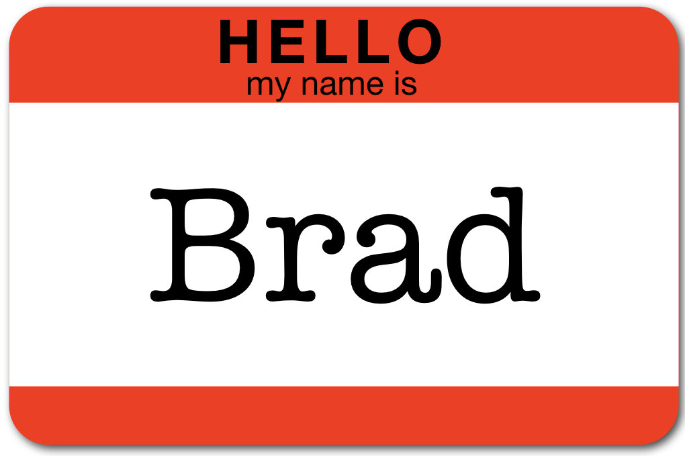
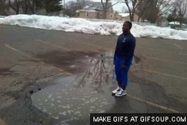
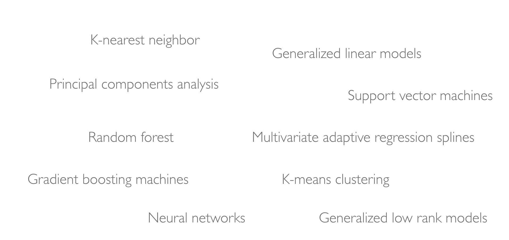
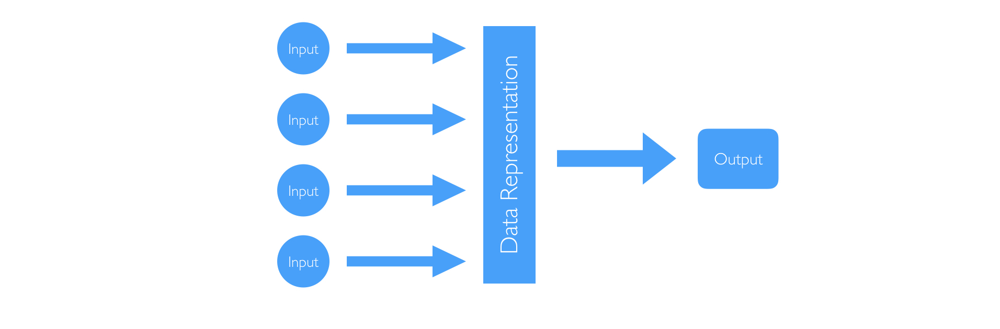
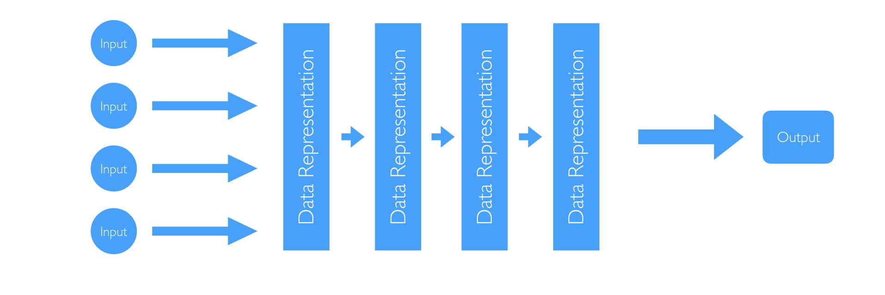
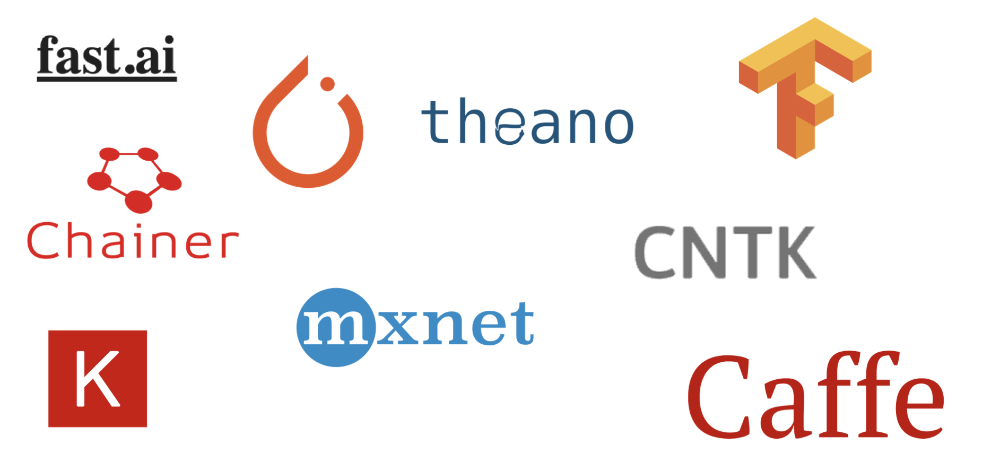
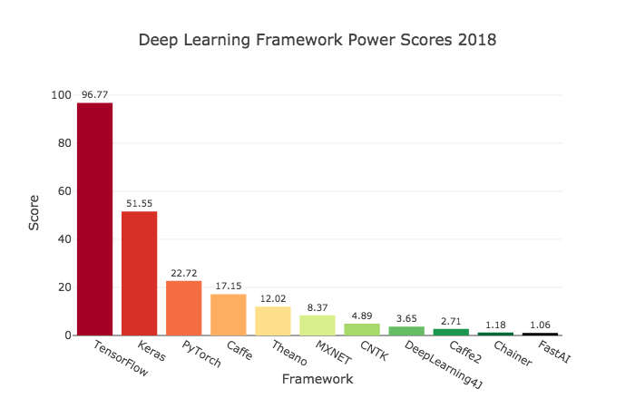

```{r setup, include=FALSE, cache=FALSE}
# set working directory to docs folder
setwd(here::here("docs"))

# Set global R options
options(htmltools.dir.version = FALSE, servr.daemon = TRUE)

# Set global knitr chunk options
knitr::opts_chunk$set(
  fig.align = "center", 
  cache = TRUE,
  error = FALSE,
  message = FALSE, 
  warning = FALSE, 
  collapse = TRUE 
)

# This is good for getting the ggplot background consistent with
# the html background color
library(ggplot2)
thm <- theme_bw()
theme_set(thm)
```

class: title-slide   
<a href="https://github.com/rstudio-conf-2020/dl-keras-tf"></a>


<br><br><br><br>
# .font250[Deep Learning with `r anicon::faa("r-project", animate = 'pulse', speed = 'slow', color = 'steelblue')`]
# .font120[Using Keras with Tensorflow backend]

### Brad Boehmke
### January 27-28, 2020

---
class: clear, center, middle

background-image: url(images/Welcome.jpg)
background-size: cover

---

# About me  

<br>

.pull-left[

```{r name-tag, echo=FALSE}

```

]


.font120.pull-right[
<br><br>
[`r fontawesome::fa("globe", fill = "steelblue")`](http://bradleyboehmke.github.io/) bradleyboehmke.github.io  <br>
[`r fontawesome::fa("github", fill = "steelblue")`](https://github.com/bradleyboehmke/) @bradleyboehmke  <br>
[`r fontawesome::fa("twitter", fill = "steelblue")`](https://twitter.com/bradleyboehmke) @bradleyboehmke  <br>
[`r fontawesome::fa("linkedin", fill = "steelblue")`](https://www.linkedin.com/in/brad-boehmke-ph-d-9b0a257/) @bradleyboehmke  <br>
[`r fontawesome::fa("envelope", fill = "steelblue")`](mailto:bradleyboehmke@gmail.com) bradleyboehmke@gmail.com  

]

---
# Course objectives

<br>
.font120[
* Establish a mental model of deep learning

* Provide an intuitive understanding of the engines and architectures that drive deep learning

* Apply a variety of deep learning algorithms
]
<br><br>

.center.bold[_You should have a firm grasp of deep learning and be able to implement a systematic approach for producing high quality modeling results!_]

---
# Assumptions

<br>
.font120[
* No prior knowledge of deep learning

* Minimal math

* Some experience with R
]

<br><br><br><br>

.center.bold[_Nearly any data scientist should be able to follow along and benefit from this course!_]

---
# Course overview


.font90[

.pull-left[

.center[.bold[Day 1]]

| Time          | Activity                 |
| :------------ | :----------------------- |
| 09:00 - 09:30 | Introduction             |
| 09:30 - 10:30 | The deep learning engine |
| 10:30 - 11:00 | *Coffee break*           |
| 11:00 - 12:30 | 3 case studies           |
| 12:30 - 13:30 | *Lunch break*            |
| 13:30 - 15:00 | Computer vision & CNNs   |
| 15:00 - 15:30 | *Coffee break*           |
| 15:30 - 17:00 | Project                  |

]
]

--

.font90[

.pull-right[

.center[.bold[Day 2]]
 
| Time          | Activity                 |
| :------------ | :----------------------- |
| 09:00 - 09:15 | Recap                    |
| 09:15 - 10:30 | Sequence data & LSTMs    |
| 10:30 - 11:00 | *Coffee break*           |
| 11:00 - 12:30 | Anomaly detection        |
| 12:30 - 13:30 | *Lunch break*            |
| 13:30 - 15:00 | TBD                      |
| 15:00 - 15:30 | *Coffee break*           |
| 15:30 - 17:00 | Project                  |

]
]

---
class: inverse, center, middle

# What are we going to cover?

---
# Model gears
<br>
.font130[
* Tensors

* Forward & backward propagation

* Activation

* Derivatives & gradient descent
]

---
# Workflow procedures
<br>
.font130[
* Data preprocessing

* Regularization

* Hyperparameter tuning

* Batches & epochs

* Model validation
]

---
# Modeling purposes
<br>
.font130[
* Regression

* Classification

* Computer vision

* Sequence data

* Anomaly detection

* Word embeddings
]

---
# Model architectures
<br>
.font130[
* Multilayer perceptron (MLP)

* Convolutional neural networks (CNNs)

* Recurrent neural networks (RNNs)

* Long-short term memory neural networks (LSTMs)

* Autoencoders
]

---
# That's a lot of material!

.pull-left[

### You may be overwhelmed

```{r drowning, echo=FALSE, out.height="400"}

```

]

--

.pull-right[

### So work together

```{r helping, echo=FALSE, out.height="400"}
knitr::include_graphics("images/dogs-helping.gif")
```

]

---
class: yourturn
# Your Turn!

<br>
## .font140[Meet your neighbors:]

.font130[
1. What is their experience with R, machine learning, and/or deep learning?

2. What programming experience other than R do they have?

3. How are they using, or how do they plan to use, R and deep learning in their job?
]

---
class: yourturn
# Your Turn!

<br>
## .font140[Meet your neighbors:]

```{r best-friends, echo=FALSE, out.height="85%", out.width="85%"}
knitr::include_graphics("https://media1.tenor.com/images/82ed88212e7752741e898cdd0fba7824/tenor.gif?itemid=3426841")
```

---
# Meet your friendly TAs

.pull-left[

```{r ta1, echo=FALSE}
knitr::include_graphics("images/TA-image.png")
```

]

--

.pull-right[

```{r ta2, echo=FALSE}
knitr::include_graphics("images/TA-image.png")
```

]

---
class: inverse, center, middle

# Why deep learning?

---
class: clear, center, middle
background-image: url(images/01-ai-ml-dl-landscape.002.jpeg)
background-size: cover

---
# Machine learning

```{r ML, echo=FALSE}

```


---
# .red[Shallow] machine learning 

<br><br> 

```{r shallow-ML, echo=FALSE}

```

---
# .red[Deep] machine learning 

<br><br> 

```{r deep-ML, echo=FALSE}

```

---
class: inverse, center, middle

# Why Keras?

---
# Deep learning frameworks

```{r DL-frameworks, echo=FALSE}

```

---
# Deep learning frameworks

```{r dl-framework-scores, echo=FALSE}

```

---
# Our preferred DL framework

<br><br> 

```{r preferred-dl-framework, echo=FALSE}

```

---
class: inverse, center, middle

# Bored?

.center.white[_Let’s start creating a mental model by coding!_]

---
# Back home

<br><br><br><br>
[.center[`r anicon::faa("home", size = 10, animate = FALSE)`]](https://github.com/rstudio-conf-2020/dl-keras-tf)

.center[https://github.com/rstudio-conf-2020/dl-keras-tf]
