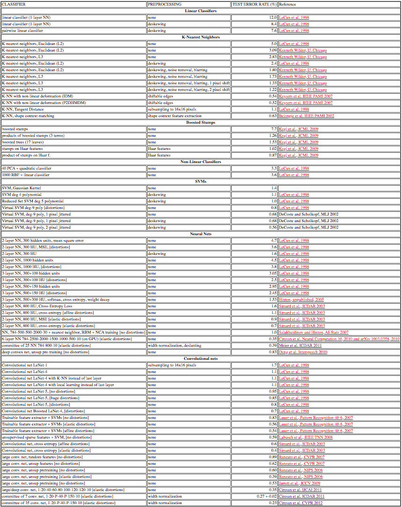
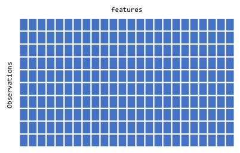
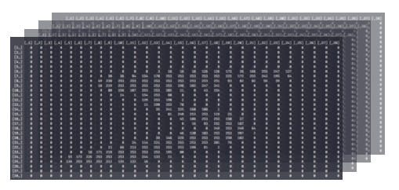
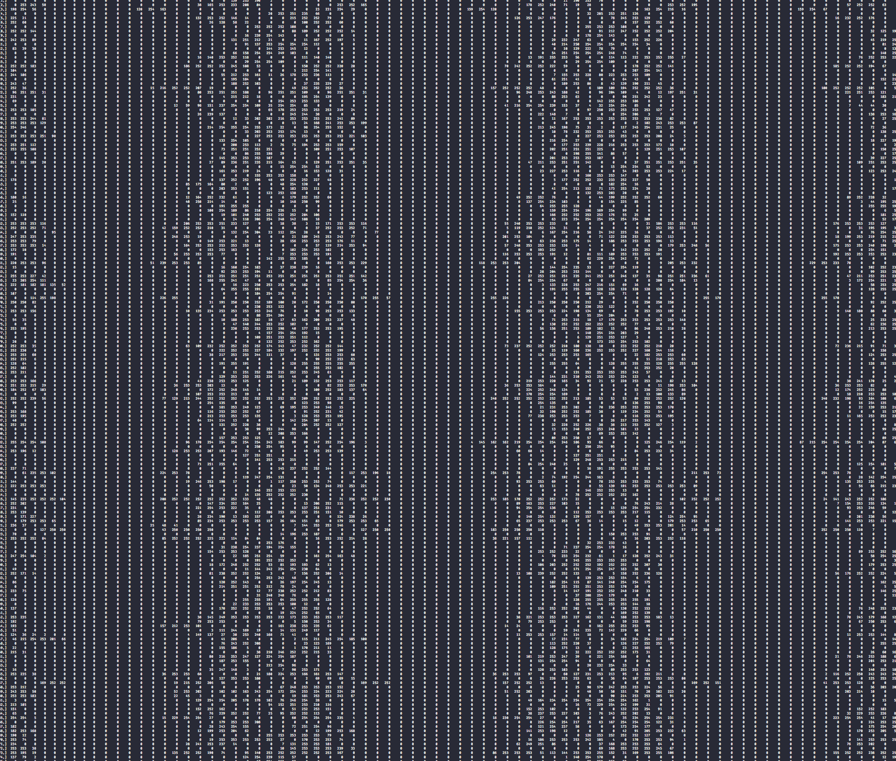
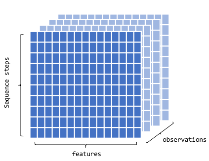
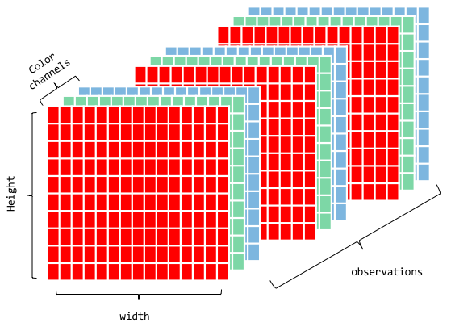
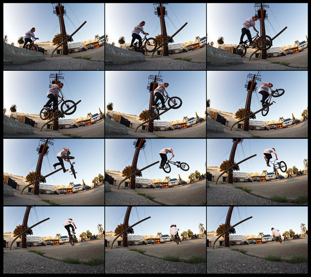
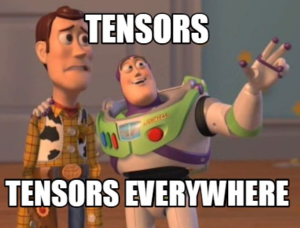

class: clear, center, middle

background-image: url(images/MnistExamples.png)
background-size: cover

.font1000.bold[MNIST]

```{r setup, include=FALSE, cache=FALSE}
# set working directory to docs folder
setwd(here::here("docs"))

# Set global R options
options(htmltools.dir.version = FALSE, servr.daemon = TRUE)

# Set global knitr chunk options
knitr::opts_chunk$set(
  fig.align = "center", 
  cache = TRUE,
  error = FALSE,
  message = FALSE, 
  warning = FALSE, 
  collapse = TRUE 
)

# Use a clean black and white ggplot2 theme
library(ggplot2)
thm <- theme_bw()
theme_set(thm)
```

---
# Origination

.scrollable90[
.pull-left[

* National Institute of Standards and Technology (NIST) database

* MNIST (Modified NIST)

* 60,000 training images and 10,000 testing images

* normalized to fit into a 28x28 pixel bounding box

]

.pull-right[

```{r nist-sample-form, echo=FALSE}

```

]
]

---
# Important benchmark

.scrollable90[
.pull-left[

* Used as an important benchmark for image processing from 1990s - 2012

* 1998: 12% error rate

* 2012: 0.23% error rate

* Website: http://yann.lecun.com/exdb/mnist/

]

.pull-right[

```{r mnist-benchmarks, echo=FALSE}

```

]
]

---
class: clear, center, middle

.font1000.bold[`%<-%`]

.font300[object unpacking]

---
# zeallot `r anicon::faa("box-open", animate = FALSE)`

Object unpacking mimicks tuple unpacking in Python

--

A simple vector

```{r}
my_name <- c('Brad', 'Boehmke')
```

--

.pull-left[

Traditional assignment unpacking

```{r}
first <- my_name[1]
last <- my_name[2]
```

]

.pull-right[

Object unpacking

```{r}
c(first, last) %<-% my_name
```

]

--

Both result in:

```{r}
first
last
```


---
# zeallot `r anicon::faa("box-open", animate = FALSE)`

Object unpacking mimicks tuple unpacking in Python

A data frame

```{r}
head(mtcars)
```


.pull-left[

Traditional assignment unpacking

```{r}
# data frames
mpg <- mtcars$mpg
cyl <- mtcars$cyl
disp <- mtcars $disp
hp <- mtcars$hp
```

]

.pull-right[

Object unpacking

```{r}
# data frames
c(mpg, cyl, disp, hp) %<-% mtcars[, 1:4]
```

]

Both result in:

```{r}
mpg
cyl
disp
hp
```


---
# zeallot `r anicon::faa("box-open", animate = FALSE)`

```{r}
mnist <- dataset_mnist()
str(mnist)
```

.pull-left[

Traditional assignment unpacking

```{r}
mnist <- dataset_mnist()

train_images <- mnist$train$x
train_labels <- mnist$train$y
test_images <- mnist$test$x
test_labels <- mnist$test$y
```

]

.pull-right[

Object unpacking

```{r}
c(c(train_images, train_labels), c(test_images, test_labels)) %<-% mnist
```

]

---
class: clear, center, middle

.font1000.bold[Tensors]
---
# The .red[tensor] in TensorFlow

.pull-left[

```{r, echo=FALSE}

```

]

--

.pull-right[
<br><br><br>
.center.bold[
_Don't worry, you actually use tensors everyday (at least everyday you use R!)_
]
]

---
# The .red[tensor] in TensorFlow

.pull-left[

<br><br><br><br>

```{r, echo=FALSE, fig.width=1}

```

]

.pull-right[
<br><br><br>
.center.bold.opacity20[
_Don't worry, you actually use tensors everyday (at least everyday you use R!)_
]
.center.bold.blue[Vectors are 1D tensors]

]

---
# The .red[tensor] in TensorFlow

.pull-left[

<br><br>

```{r, echo=FALSE}

```

]

.pull-right[
<br><br><br>
.center.bold.opacity20[
_Don't worry, you actually use tensors everyday (at least everyday you use R!)_

Vectors are 1D tensors
]
.center.bold.blue[Matrices are 2D tensors]

]

---
# MNIST tensor

* Since our MNIST data are gray scale it is simply a 2D tensor
* We just needed to reshape it so:
   - each column `r anicon::faa("hand-point-right", color = "red", animate = "horizontal")` feature
   - each row `r anicon::faa("hand-point-right", color = "red", animate = "horizontal")` observation
   
.pull-left[

.center[`array_reshape` reshapes 3D array to...]

```{r, echo=FALSE}

```


]

.pull-right[

.center[2D tensor]

```{r, echo=FALSE}

```

]

---
# .red[Tensor] benefits

<br>

* .red.bold[generalization]: Tensors generalize vectors and matrices to an arbitary
number of dimensions,

* .red.bold[Flexibility]: can hold a wide range of data dimensions,

* .red.bold[Speed]: provide fast, parallel processing computations.

<br><br><br><br><br><br>

--

.center.bold[_They just get a bit complicated when you start working with higher dimensions_]

---
# .red.bold[3D] Tensor

.pull-left[

* Represented as arrays

* Sequence data
   - time series
   - text
   - dim = (observations, seq steps, features)

* Examples
   - 250 days of high, low, and current stock price for 390 minutes of trading
   in a day; dim = c(250, 390, 3)
   - 1M tweets that can be 140 characters long and include 128 unique characters; dim = c(1M, 140, 128)

]

.pull-right[

```{r, echo=FALSE}

```

]

---
# .red.bold[4D] Tensor

.pull-left[

* Represented as arrays

* Image data
   - RGB channels
   - dim = (observations, height, width, color_depth)


]

.pull-right[

```{r, echo=FALSE}

```

]

---
# .red.bold[4D] Tensor

.pull-left[

* Represented as arrays

* Image data
   - RGB channels
   - dim = (observations, height, width, .red[color_depth])

* Technically, we could treat our original MNIST data as a 4D tensor where
.red[color_depth = 1]

* We'll see this play out when we start working with CNNs

]

.pull-right[

<br><br>

```{r, echo=FALSE}

```

]

---
# .red.bold[5D] Tensor

.pull-left[

* Represented as arrays

* Video data
   - samples: 4 (each video is 1 minute long)
   - frames: 240 (4 frames/second)
   - width: 256 (pixels)
   - height: 144 (pixels)
   - channels: 3 (red, green, blue)
   
* Tensor shape (4, 240, 256, 144, 3)   

]

.pull-right[

```{r, echo=FALSE}

```

]

---
# Now you know what tensors are

.pull-left[

<br>

* Tensors aren't that bad, humans are just really bad at visualizing multiple dimensions! 

* Feeling comfortable will come with practice

]

.pull-right[

<br>

```{r, echo=FALSE}

```

]

---
class: clear, center, middle

.font500.bold[Network architecture]

---
class: clear, center, middle

.font500.bold[Network compilation]

---
class: clear, center, middle

.font500.bold[Training loop]

