class: clear, center, middle

background-image: url(images/MnistExamples.png)
background-size: cover

.font1000.bold[MNIST]

```{r setup, include=FALSE, cache=FALSE}
# set working directory to docs folder
setwd(here::here("docs"))

# Set global R options
options(htmltools.dir.version = FALSE, servr.daemon = TRUE)

# Set global knitr chunk options
knitr::opts_chunk$set(
  fig.align = "center", 
  cache = TRUE,
  error = FALSE,
  message = FALSE, 
  warning = FALSE, 
  collapse = TRUE 
)

# Use a clean black and white ggplot2 theme
library(ggplot2)
library(gganimate)
thm <- theme_bw()
theme_set(thm)
```

---
# Origination

.scrollable90[
.pull-left[

* National Institute of Standards and Technology (NIST) database

* MNIST (Modified NIST)

* 60,000 training images and 10,000 testing images

* normalized to fit into a 28x28 pixel bounding box

]

.pull-right[

```{r nist-sample-form, echo=FALSE}
knitr::include_graphics("images/nist-sample-form.png")
```

]
]

---
# Important benchmark

.scrollable90[
.pull-left[

* Used as an important benchmark for image processing from 1990s - 2012

* 1998: 12% error rate

* 2012: 0.23% error rate

* Website: http://yann.lecun.com/exdb/mnist/

]

.pull-right[

```{r mnist-benchmarks, echo=FALSE}
knitr::include_graphics("images/MNIST-benchmarks.png")
```

]
]

---
class: clear, center, middle

.font1000.bold[`%<-%`]

.font300[object unpacking]

---
# zeallot `r anicon::faa("box-open", animate = FALSE)`

Object unpacking mimicks tuple unpacking in Python

--

A simple vector

```{r}
my_name <- c('Brad', 'Boehmke')
```

--

.pull-left[

Traditional assignment unpacking

```{r}
first <- my_name[1]
last <- my_name[2]
```

]

.pull-right[

Object unpacking

```{r}
c(first, last) %<-% my_name
```

]

--

Both result in:

```{r}
first
last
```


---
# zeallot `r anicon::faa("box-open", animate = FALSE)`

```{r}
mnist <- dataset_mnist()
str(mnist)
```

.pull-left[

Traditional assignment unpacking

```{r}
mnist <- dataset_mnist()

train_images <- mnist$train$x
train_labels <- mnist$train$y
test_images <- mnist$test$x
test_labels <- mnist$test$y
```

]

.pull-right[

Object unpacking

```{r}
c(c(train_images, train_labels), c(test_images, test_labels)) %<-% mnist
```

]

---
class: clear, center, middle

.font1000.bold[Tensors]
---
# The .red[tensor] in TensorFlow

.pull-left[

```{r, echo=FALSE}
knitr::include_graphics("images/whats_a_tensor.png")
```

]

--

.pull-right[
<br><br><br>
.center.bold[
_Don't worry, you actually use tensors everyday (at least everyday you use R!)_
]
]

---
# The .red[tensor] in TensorFlow

.pull-left[

<br><br><br><br>

```{r, echo=FALSE, fig.width=1}
knitr::include_graphics("images/1D_tensor.png")
```

]

.pull-right[
<br><br><br>
.center.bold.opacity20[
_Don't worry, you actually use tensors everyday (at least everyday you use R!)_
]
.center.bold.blue[Vectors are 1D tensors]

]

---
# The .red[tensor] in TensorFlow

.pull-left[

<br><br>

```{r, echo=FALSE}
knitr::include_graphics("images/2D_tensor.png")
```

]

.pull-right[
<br><br><br>
.center.bold.opacity20[
_Don't worry, you actually use tensors everyday (at least everyday you use R!)_

Vectors are 1D tensors
]
.center.bold.blue[Matrices are 2D tensors]

]

---
# MNIST tensor

* Since our MNIST data are gray scale it can be represented as a 2D tensor
* We just needed to reshape it so:
   - each column `r anicon::faa("hand-point-right", color = "red", animate = "horizontal")` feature
   - each row `r anicon::faa("hand-point-right", color = "red", animate = "horizontal")` observation
   
.pull-left[

.center[`array_reshape` reshapes 3D array to...]

```{r, echo=FALSE}
knitr::include_graphics("images/untidy_matrix.png")
```


]

.pull-right[

.center[2D tensor]

```{r, echo=FALSE}
knitr::include_graphics("images/tidy_matrix.png")
```

]

---
# .red[Tensor] benefits

<br>

* .red.bold[Generalization]: Tensors generalize vectors and matrices to an arbitary
number of dimensions,

* .red.bold[Flexibility]: can hold a wide range of data dimensions,

* .red.bold[Speed]: provide fast, parallel processing computations.

<br><br><br><br><br><br>

--

.center.bold[_They just get a bit complicated when you start working with higher dimensions_]

---
# .red.bold[3D] Tensor

.pull-left[

* Represented as arrays

* Sequence data
   - time series
   - text
   - dim = (observations, seq steps, features)

* Examples
   - 250 days of high, low, and current stock price for 390 minutes of trading
   in a day; dim = c(250, 390, 3)
   - 1M tweets that can be 140 characters long and include 128 unique characters; dim = c(1M, 140, 128)

]

.pull-right[

```{r, echo=FALSE}
knitr::include_graphics('images/3D_tensor.png')
```

]

---
# .red.bold[4D] Tensor

.pull-left[

* Represented as arrays

* Image data
   - RGB channels
   - dim = (observations, height, width, color_depth)


]

.pull-right[

```{r, echo=FALSE}
knitr::include_graphics('images/4D_tensor.png')
```

]

---
# .red.bold[4D] Tensor

.pull-left[

* Represented as arrays

* Image data
   - RGB channels
   - dim = (observations, height, width, .red[color_depth])

* Technically, we could treat our original MNIST data as a 4D tensor where
.red[color_depth = 1]

* We'll see this play out when we start working with CNNs

]

.pull-right[

<br><br>

```{r, echo=FALSE}
knitr::include_graphics("images/untidy_matrix.png")
```

]

---
# .red.bold[5D] Tensor

.pull-left[

* Represented as arrays

* Video data
   - samples: 4 (each video is 1 minute long)
   - frames: 240 (4 frames/second)
   - width: 256 (pixels)
   - height: 144 (pixels)
   - channels: 3 (red, green, blue)
   
* Tensor shape (4, 240, 256, 144, 3)   

]

.pull-right[

```{r, echo=FALSE}
knitr::include_graphics("images/5D_tensor.jpg")
```

]

---
# Now you know what tensors are

.pull-left[

<br>

* Tensors aren't that bad, humans are just really bad at visualizing multiple dimensions! 

* Feeling comfortable will come with practice

]

.pull-right[

<br>

```{r, echo=FALSE}
knitr::include_graphics("images/tensors_everywhere.jpeg")
```

]

---
class: clear, center, middle

.font500.bold[Network architecture]

---
# Sequential vs functional

.pull-left[

```{r, echo=FALSE}
knitr::include_graphics("images/sequential_model.png")
```

* Creating a single linear stack of layers
* Most common type of neural networks
* Examples:
   - Predicting sales price based on tabular data of home characteristics,
   - Predicting animal based on image,
   - Predicting author based on text,
   - Predicting hurricane path based on numeric meteorologic data.

]

--

.pull-right[

```{r, echo=FALSE}
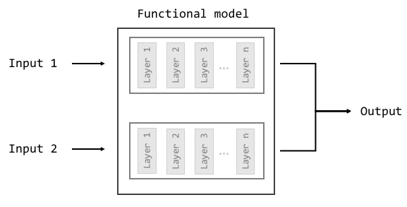
```

* More advanced modeling
* Allows flexible, customizable model structures
* Examples:
   - Predicting presence of cancer based on images <u>.bold[_and_]</u> patient 
   transcripts,
   - Forecasting time <u>.bold[_and_]</u> volume of sale based on tabular 
   transaction data <u>.bold[_and_]</u> customer text.

]

---
# Densely connected layers

.pull-left[
* `layer_dense()` is creating what's called a .bold[_fully connected feed forward neural network_]

* Fundamental building block of nearly all deep learning models
]

.pull-right[
```{r, echo=FALSE}
knitr::include_graphics("images/basic_mlp.png")
```
]

---
# Densely connected layers

.pull-left[
* `layer_dense()` is creating what's called a .bold[_fully connected feed forward neural network_]

* Fundamental building block of nearly all deep learning models

* So why do we call `layer_dense()` twice?  And what about the arguments inside?

```{r, eval=FALSE}
network <- keras_model_sequential() %>%
  layer_dense(units = 512, activation = 'relu', input_shape = ncol(train_images)) %>% #<<
  layer_dense(units = 10, activation = 'softmax') #<<
```

]

.pull-right[
```{r, echo=FALSE}
knitr::include_graphics("images/basic_mlp.png")
```
]

---
# Densely connected layers

.pull-left[

```{r, eval=FALSE}
network <- keras_model_sequential() %>%
  layer_dense() %>% # hidden layer #<< 
  layer_dense() # output layer #<<
```

* .font100[Each `layer_dense()` represents a hidden layer or the final output layer]

]

.pull-right[
```{r, echo=FALSE}
knitr::include_graphics("images/basic_mlp.png")
```

]

<br>

.center[.content-box-grey[We refer to a neural network with one or more hidden layer as a .blue[_multi-layer perceptron_]]]

---
# Densely connected layers

.pull-left[

```{r, eval=FALSE}
network <- keras_model_sequential() %>%
  layer_dense() %>% # hidden layer 1 #<< 
  layer_dense() %>% # hidden layer 2 #<< 
  layer_dense() %>% # hidden layer 3 #<< 
  layer_dense() # output layer #<<
```

* We can add multiple hidden layers by adding more `layer_dense()` functions

* Technically, .blue[_deep learning_] refers to any neural network that has 
2 or more hidden layers

* The last `layer_dense()` will always represent the output layer

]

.pull-right[
```{r, echo=FALSE}
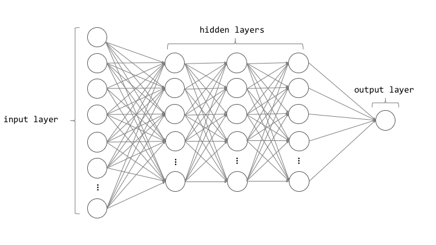
```
]

---
# Hidden layer

```{r, eval=FALSE}
network <- keras_model_sequential() %>%
  layer_dense(units = 512, activation = 'relu', input_shape = ncol(train_images)) # hidden layer #<<
```

--

.pull-left[

* `units = 512`: number of nodes in the given layer

* `input_shape = ncol(train_images)`
   - tells the first hidden layer how many input features there are
   - only required for the first `layer_dense`

]

.pull-right[
```{r, echo=FALSE}
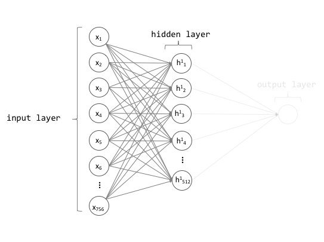
```
]

---
# Hidden layer

```{r, eval=FALSE}
network <- keras_model_sequential() %>%
  layer_dense(units = 512, activation = 'relu', input_shape = ncol(train_images)) # hidden layer #<<
```

.pull-left[

* `units = 512`: number of nodes in the given layer

* `input_shape = ncol(train_images)`
   - tells the first hidden layer how many input features there are
   - only required for the first `layer_dense`

* `activation`: `r anicon::cia("https://emojis.slackmojis.com/emojis/images/1499373537/2585/homer_thinking.png?1499373537", animate=FALSE)`
]

.pull-right[
```{r, echo=FALSE}
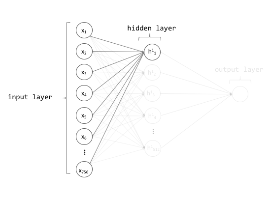
```
]

---
# Individual perceptron

.font100.pull-left[

* There is a two-step computation process when data goes through a node

]

.pull-right[
```{r, echo=FALSE}
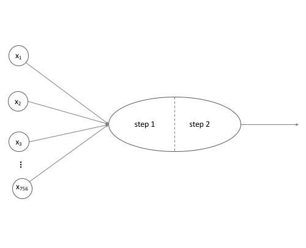
```
]

---
# Individual perceptron

.font100.pull-left[

* There is a two-step computation process when data goes through a node

* Step 1: _linear transformation_
   - $z = w_0b_0 + w_1x_1 + w_2x_2 + \cdots + w_nx_n$
   - note the extra bias term which is typically always set to 1

]

.pull-right[
```{r, echo=FALSE}
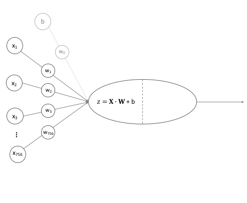
```
]

---
# Individual perceptron

.pull-left[

* There is a two-step computation process when data goes through a node

* .opacity20[Step 1: linear transformation]

* Step 2: _activation function_
   - in hidden layers, the most common activation function is the $\text{ReLU} = max(0, z)$
   - You will be introduced to other activation functions but ReLU should nearly
   always be your default for hidden layers
   
```{r, echo=FALSE, fig.height=2, fig.width=4}
x <- seq(-1, 1, by = 0.1)
y <- ifelse(x < 0, 0, x)
df <- data.frame(x, y)
ggplot(df, aes(x, y)) + 
   geom_line() +
   xlab("z") +
   ylab("f(z)")
```
   

]

.pull-right[
```{r, echo=FALSE}
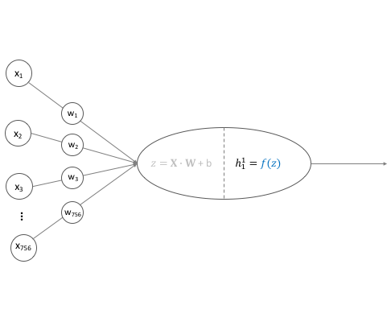
```
]

---
# Many ReLU transformations

.pull-left[

```{r, echo=FALSE, fig.height=2, fig.width=4}
x <- seq(-1, 1, by = 0.1)
y <- ifelse(x < 0, 0, x)
df <- data.frame(x, y)
ggplot(df, aes(x, y)) + 
   geom_line() +
   xlab("z") +
   ylab("f(z)")
```
   
How can a simple semi-linear transformation work so well?

]

---
# Many ReLU transformations

.pull-left[

```{r, echo=FALSE, fig.height=2, fig.width=4}
x <- seq(-1, 1, by = 0.1)
y <- ifelse(x < 0, 0, x)
df <- data.frame(x, y)
ggplot(df, aes(x, y)) + 
   geom_line() +
   xlab("z") +
   ylab("f(z)")
```
   
How can a simple semi-linear transformation work so well?

Like an origami, when we combine many simple geometric transformations, we can
create very complex patterns.

]

.pull-right[
```{r, echo=FALSE}
knitr::include_graphics("images/demoui.gif")
```

.right.font50[[http://apps.amandaghassaei.com/OrigamiSimulator/](http://apps.amandaghassaei.com/OrigamiSimulator/)]

]

---
# Output layer

```{r, eval=FALSE}
network <- keras_model_sequential() %>%
  layer_dense(units = 512, activation = 'relu', input_shape = ncol(train_images)) %>%
  layer_dense(units = 10, activation = 'softmax') #<<
```

---
# Output layer

```{r, eval=FALSE}
network <- keras_model_sequential() %>%
  layer_dense(units = 512, activation = 'relu', input_shape = ncol(train_images)) %>%
  layer_dense(units = 10, activation = 'softmax')
```

.font100.pull-left[
Two primary arguments of concern for the final output layer:

1. number of units
   - regression: `units = 1`:


]

.pull-right[

```{r, echo=FALSE, out.height="80%", out.width="80%"}
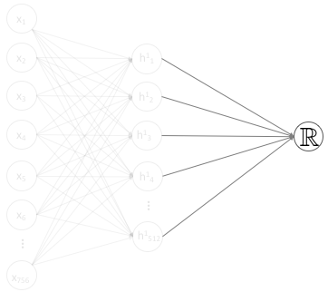
```

]

---
# Output layer

```{r, eval=FALSE}
network <- keras_model_sequential() %>%
  layer_dense(units = 512, activation = 'relu', input_shape = ncol(train_images)) %>%
  layer_dense(units = 10, activation = 'softmax')
```

.font100.pull-left[
Two primary arguments of concern for the final output layer:

1. number of units
   - regression: `units = 1`:
   - binary classification: `units = 1`

]

.pull-right[

```{r, echo=FALSE, out.height="80%", out.width="80%"}
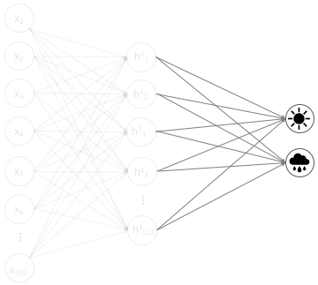
```

]


---
# Output layer

```{r, eval=FALSE}
network <- keras_model_sequential() %>%
  layer_dense(units = 512, activation = 'relu', input_shape = ncol(train_images)) %>%
  layer_dense(units = 10, activation = 'softmax') #<<
```

.font100.pull-left[
Two primary arguments of concern for the final output layer:

1. number of units
   - regression: `units = 1`:
   - binary classification: `units = 2`
   - multi-class classification: `units = n`

]

.pull-right[

```{r, echo=FALSE,  out.height="75%", out.width="75%"}
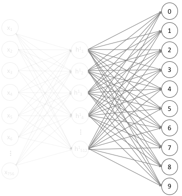
```

]

---
# Output layer

```{r, eval=FALSE}
network <- keras_model_sequential() %>%
  layer_dense(units = 512, activation = 'relu', input_shape = ncol(train_images)) %>%
  layer_dense(units = 10, activation = 'softmax')
```

.font100.pull-left[
Two primary arguments of concern for the final output layer:

1. .opacity20[number of units]
2. activation function
   - regression: `activation = NULL` (identity function)

]

.pull-right.center[

```{r, echo=FALSE}
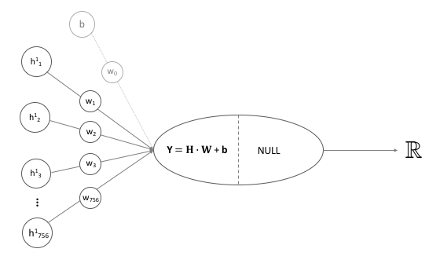
```

$y = w_0b_0 + w_1h^1_1 + w_2h^1_2 + \cdots + w_nh^1_n$

]

---
# Output layer

```{r, eval=FALSE}
network <- keras_model_sequential() %>%
  layer_dense(units = 512, activation = 'relu', input_shape = ncol(train_images)) %>%
  layer_dense(units = 10, activation = 'softmax') 
```

.font100.pull-left[
Two primary arguments of concern for the final output layer:

1. .opacity20[number of units]
2. activation function
   - regression: `activation = NULL` (identity function)
   - binary classification: `activation = 'sigmoid'`

]

.pull-right.center[

```{r, echo=FALSE, fig.height=3.5}
x <- seq(-5, 5, by = 0.01)
y <- 1 / (1 + exp(-x))
df <- data.frame(x, y)
ggplot(df, aes(x, y)) + 
   geom_line() +
   xlab("y") +
   ylab("f(y)") +
   ggtitle("Sigmoid activation function")
```

$f(y) = \frac{1}{1 + e^{-y}}$

]

---
# Output layer

```{r, eval=FALSE}
network <- keras_model_sequential() %>%
  layer_dense(units = 512, activation = 'relu', input_shape = ncol(train_images)) %>%
  layer_dense(units = 10, activation = 'softmax') #<<
```

.font100.pull-left[
Two primary arguments of concern for the final output layer:

1. .opacity20[number of units]
2. activation function
   - regression: `activation = NULL` (identity function)
   - binary classification: `activation = 'sigmoid'`
   - multi-class classification: `activation = 'softmax'`

]

.pull-right.center[

```{r, echo=FALSE}
knitr::include_graphics("images/softmax.png")
```

$f(y) = \frac{e^{y_i}}{\sum_je^{y_j}}$

]

---
# Output layer

```{r, eval=FALSE}
network <- keras_model_sequential() %>%
  layer_dense(units = 512, activation = 'relu', input_shape = ncol(train_images)) %>%
  layer_dense(units = 10, activation = 'softmax') #<<
```

.font100.pull-left[
Two primary arguments of concern for the final output layer:

1. .opacity20[number of units]
2. activation function
   - regression: `activation = NULL` (identity function)
   - binary classification: `activation = 'sigmoid'`
   - multi-class classification: `activation = 'softmax'`

]

.pull-right.center[

```{r, echo=FALSE}
knitr::include_graphics("images/softmax.png")
```

]

.center[.content-box-grey.font90.blue[_This is why we used `to_categorical()`, so that we can get the probabilities for each output class._]]

---
# Network architecture summary

.pull-left-30.font80[

1. A sequential, dense, fully connected neural network

2. 784 inputs

3. 1 hidden layer  
   a. 512 nodes  
   b. ReLU activation function
<br><br>   
  
4. multi-class output layer  
   a. 10 nodes (1 for each output)  
   b. Softmax activation function
]

.pull-right-70[

```{r, echo=FALSE}
knitr::include_graphics("images/network_architecture_summary.png")
```

]

---
# Network architecture summary

.pull-left.font80[

1. A sequential, dense, fully connected neural network

2. 784 inputs

3. 1 hidden layer  
   a. 512 nodes  
   b. ReLU activation function  
   $params = (784 \times 512) + 512 = 401920$
   
4. multi-class output layer  
   a. 10 nodes  
   b. Softmax activation function  
   $params = (512 \times 10) + 10 = 5130$
]

.pull-right[

```{r, eval=FALSE}
summary(network)
## Model: "sequential"
## ______________________________________________________________________________________
## Layer (type)                          Output Shape                       Param #      
## ======================================================================================
## dense (Dense)                         (None, 512)                        401920       
## ______________________________________________________________________________________
## dense_1 (Dense)                       (None, 10)                         5130         
## ======================================================================================
## Total params: 407,050
## Trainable params: 407,050
## Non-trainable params: 0
## ______________________________________________________________________________________
```

]

---
class: clear, center, middle

.font500.bold[Network compilation]

---
# Forward pass

.pull-left[

]

.pull-right[

```{r, echo=FALSE}
knitr::include_graphics("images/forward_pass.png")
```

]

---
# Forward pass

.pull-left.font120[
<br><br>
* Weights are _initialized_ as very small semi-random values

]

.pull-right[

```{r, echo=FALSE}
knitr::include_graphics("images/forward_pass.png")
```

]

---
# Forward pass

.pull-left.font100[
<br><br><br>
* Weights are _initialized_ as very small semi-random values

* Results in predicted values that are significantly different then the actual
targets

]

.pull-right[

```{r, echo=FALSE}
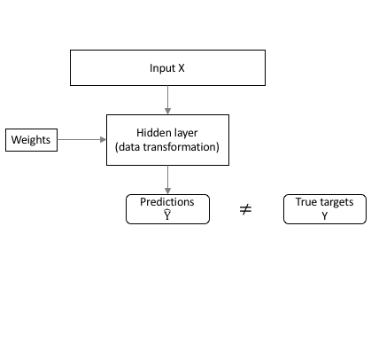
```

]

---
# Forward pass

.pull-left.code70[
<br><br><br>
* Weights are _initialized_ as very small semi-random values

* Results in predicted values that are significantly different then the actual
targets

* We measure this difference with a _loss function_

```{r, eval=FALSE}
network %>% compile(
  loss = "categorical_crossentropy", #<<
  optimizer = "rmsprop",
  metrics = c("accuracy")
)
```


]

.pull-right[

```{r, echo=FALSE}
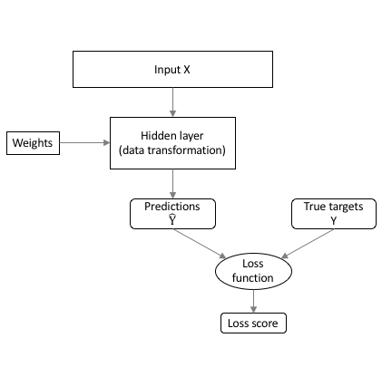
```

]

---
# Loss function

_Loss function (objective function)_ : the quantity that will be minimized during training.

.pull-left[

* Many options

* Should use the one that aligns best to the problem at hand; however,...

]

.pull-right[

* mean squared error (MSE)
* mean absolute error (MAE)
* mean absolute percentage error (MAPE)
* mean squared logarithmic error (MSLE)
* squared hinge
* log cosine hinge
* binary cross entropy
* categorical hinge
* categorical cross entropy
* sparse categorical cross entropy
* Kullback-Leibler divergence
* Poisson
* cosine proximity
* can even build your own custom loss functions!

]

---
# Loss function

_Loss function (objective function)_ : the quantity that will be minimized during training.

.pull-left[

* Many options

* Should use the one that aligns best to the problem at hand; however,...

* general recommendations for common problems include:
   - Regression: MSE
   - Binary classification: binary crossentropy
   - Multi-class classification: categorical crossentropy

]

.pull-right[

* .blue[mean squared error (MSE)]
* mean absolute error (MAE)
* mean absolute percentage error (MAPE)
* mean squared logarithmic error (MSLE)
* squared hinge
* log cosine hinge
* .blue[binary cross entropy]
* categorical hinge
* .blue[categorical cross entropy]
* sparse categorical cross entropy
* Kullback-Leibler divergence
* Poisson
* cosine proximity
* can even build your own custom loss functions!

]

---
# Loss function

_Loss function (objective function)_ : the quantity that will be minimized during training.

.pull-left[

* Many options

* Should use the one that aligns best to the problem at hand; however,...

* general recommendations for common problems include:
   - Regression: MSE
   - Binary classification: binary crossentropy
   - Multi-class classification: categorical crossentropy

   
.center[.content-box-grey.font80[_All three heavily penalize bad predictions!_]]

]

.pull-right[

* .blue[mean squared error (MSE)]
* mean absolute error (MAE)
* mean absolute percentage error (MAPE)
* mean squared logarithmic error (MSLE)
* squared hinge
* log cosine hinge
* .blue[binary cross entropy]
* categorical hinge
* .blue[categorical cross entropy]
* sparse categorical cross entropy
* Kullback-Leibler divergence
* Poisson
* cosine proximity
* can even build your own custom loss functions!

]

---
# Loss function

.pull-left[

<br><br><br><br><br>
.center.blue.bold[_Our goal is to find weights that minimize the loss score_]

]

.pull-right[

```{r, echo=FALSE}
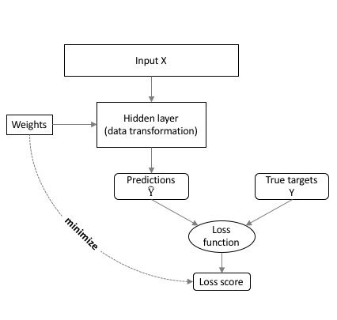
```

]

---
# Backward pass

.pull-left[

<br><br><br><br><br>
.center.blue.bold[_Our goal is to find weights that minimize the loss score_]

The ___backward pass___ is the process of using information from the loss function
to update the weights so that we improve the model's performance.

]

.pull-right[

```{r, echo=FALSE}
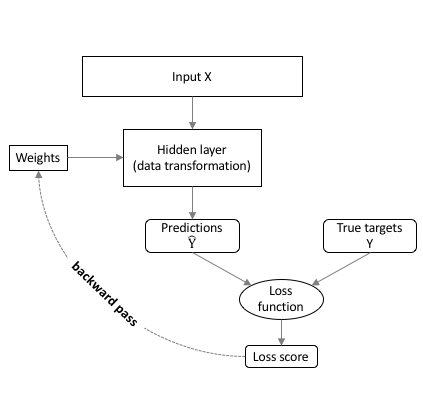
```

]

---
# Backward pass example

.pull-left[
```{r, echo=FALSE}
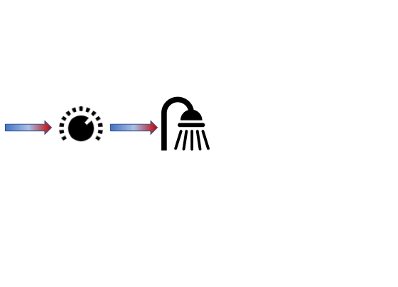
```
]

---
# Backward pass example

.pull-left[
```{r, echo=FALSE}
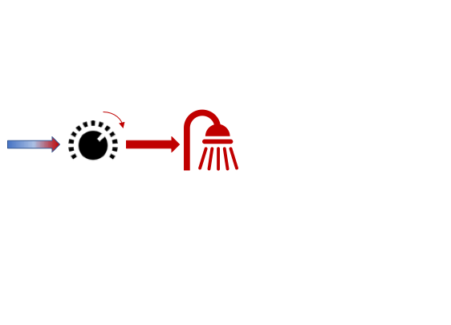
```
]

---
# Backward pass example

.pull-left[
```{r, echo=FALSE}
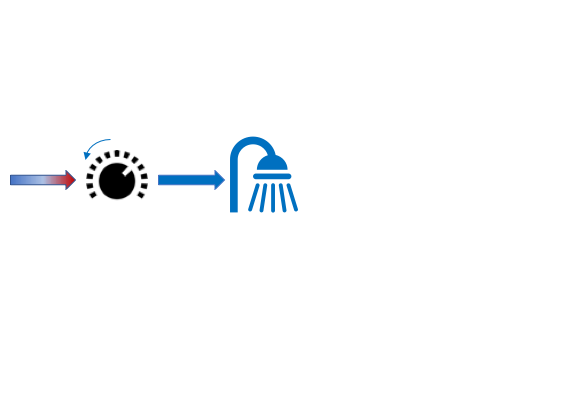
```
]

---
# Backward pass example

.pull-left[
```{r, echo=FALSE}
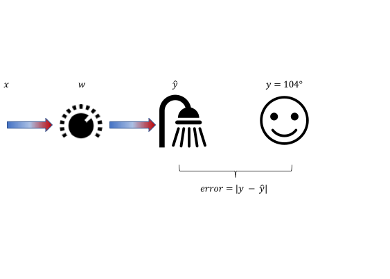
```
]

--

.pull-right[

<br><br><br>
```{r, echo=FALSE, fig.height=4}
x <- 1:25
y <- c(12:0, 1:12)
df <- data.frame(x, y)

ggplot(df, aes(x, y)) +
    geom_line(data = df[df$x >= 13, ], aes(x, y), size = 1.5, alpha = 0.5, color = 'red') +
    geom_line(data = df[df$x <= 13, ], aes(x, y), size = 1.5, alpha = 0.5, color = 'blue') +
    geom_step(data = df[df$x >= 13, ], aes(x, y), lty = "dotted", direction = "vh") +
    geom_step(data = df[df$x <= 13, ], aes(x, y), lty = "dotted", direction = "hv") +
    scale_y_continuous(expression('Error = ' *abs(y - hat(y))), breaks = 1:13, 
                       expand = c(0, 0), limits = c(0, 12.5)) +
    scale_x_continuous(expression('Change in shower handle position ('*~degree*radius*')'),
                       breaks = x) +
    theme(panel.grid.minor = element_blank())
   
```

]


---
# Derivatives

_Sensitivity_ is just the change in one thing per 1 unit change in another


.pull-left[
.font100[
$$= \frac{\text{Change in temperature error}}{\text{Change in shower handle position}} $$
]
<br>
.font100[
$$= \frac{\Delta \text{temperature error}}{\Delta \text{shower handle position}} $$
]
]

.pull-right[
<br>
```{r, echo=FALSE, fig.height=4}
x <- 1:25
y <- c(12:0, 1:12)
df <- data.frame(x, y)

ggplot(df, aes(x, y)) +
    geom_line(data = df[df$x >= 13, ], aes(x, y), size = 1.5, alpha = 0.5, color = 'red') +
    geom_line(data = df[df$x <= 13, ], aes(x, y), size = 1.5, alpha = 0.5, color = 'blue') +
    geom_step(data = df[df$x >= 13, ], aes(x, y), lty = "dotted", direction = "vh") +
    geom_step(data = df[df$x <= 13, ], aes(x, y), lty = "dotted", direction = "hv") +
    scale_y_continuous(expression('Error = ' *abs(y - hat(y))), breaks = 1:13, 
                       expand = c(0, 0), limits = c(0, 12.5)) +
    scale_x_continuous(expression('Change in shower handle position ('*~degree*radius*')'),
                       breaks = x) +
    theme(panel.grid.minor = element_blank())
   
```

]

---
# Derivatives

_Sensitivity_ is just the change in one thing per 1 unit change in another


.pull-left[
.font100[
$$= \frac{\text{Change in temperature error}}{\text{Change in shower handle position}} $$
]
<br>
.font100[
$$= \frac{\Delta \text{temperature error}}{\Delta \text{shower handle position}} $$
]
]

.pull-right[
<br>
```{r, echo=FALSE, fig.height=4}
x <- 1:25
y <- (-12:12)^2
df <- data.frame(x, y)

ggplot(df, aes(x, y)) +
    geom_line(data = df[df$x >= 13, ], aes(x, y), size = 1.5, alpha = 0.5, color = 'red') +
    geom_line(data = df[df$x <= 13, ], aes(x, y), size = 1.5, alpha = 0.5, color = 'blue') +
    geom_step(data = df[df$x >= 13, ], aes(x, y), lty = "dotted", direction = "vh") +
    geom_step(data = df[df$x <= 13, ], aes(x, y), lty = "dotted", direction = "hv") +
    scale_y_continuous(expression('Error = ' *(y - hat(y))^2),  
                       expand = c(0, 0), limits = c(0, 150)) +
    scale_x_continuous(expression('Change in shower handle position ('*~degree*radius*')'),
                       breaks = x) +
    theme(panel.grid.minor = element_blank())
   
```

]

<br>

.center[.content-box-grey[Sensitivity is not always linear.]]


---
# Derivatives

_Sensitivity_ is just the change in one thing per 1 unit change in another

.pull-left[
.font100[
$$= \frac{\text{Change in temperature}}{\text{Change in shower handle position}} $$
]
<br>
.font100[
$$= \frac{\Delta \text{temperature}}{\Delta \text{shower handle position}} $$
]
<br>
.font100[
$$= \frac{\text{d(temperature)}}{\text{d(shower handle position)}} $$

]
]

.pull-right[

<br>
```{r, echo=FALSE, fig.height=4}
x <- 1:25
y <- (-12:12)^2
df <- data.frame(x, y)

slope <- (8^2 - 7.9^2) / (8-7.9)
intercept <- 64 - (slope * 21)

ggplot(df, aes(x, y)) +
    geom_line(data = df[df$x >= 13, ], aes(x, y), size = 1.5, alpha = 0.5, color = 'red') +
    geom_line(data = df[df$x <= 13, ], aes(x, y), size = 1.5, alpha = 0.5, color = 'blue') +
    geom_abline(intercept = intercept, slope = slope, lty = 'dashed') +
    geom_point(data = df[21,], aes(x, y), size = 3, shape = 21, fill = 'yellow') +
    scale_y_continuous(expression('Error = ' *abs(y - hat(y))),  
                       expand = c(0, 0), limits = c(0, 150)) +
    scale_x_continuous(expression('Change in shower handle position ('*~degree*radius*')'),
                       breaks = x) +
    theme(panel.grid.minor = element_blank())
   
```

]

---
# More than one variable?

What if we have more than one variable?

.pull-left[

```{r, echo=FALSE}
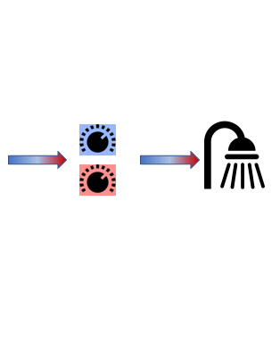
```


]

.pull-right[

```{r, echo=FALSE}
library(geoR)
data(elevation)

elevation.df <- data.frame(x = 50 * elevation$coords[,"x"],
  y = 50 * elevation$coords[,"y"], z = 10 * elevation$data)
elevation.loess <- loess(z ~ x*y, data = elevation.df,
  degree = 2, span = 0.25)
elevation.fit = expand.grid(list(x = seq(10, 300, 10), y = seq(10, 300, 10)))
z <- predict(elevation.loess, newdata = elevation.fit)

persp(z = z, phi = 15, theta = -145,
      xlab = "Change in hot handle", ylab = "Change in cold handle",
      zlab = "Error", shade = 0.1, col = "springgreen")
```

]

---
# Partial derivatives

What if we have more than one variable?

.pull-left[
.font100[
$$= \frac{\text{Change in temperature}}{\text{Change in shower handle position}} $$
]
<br>
.font100[
$$= \frac{\Delta \text{temperature}}{\Delta \text{shower handle position}} $$
]
<br>
.font100[
$$= \frac{\partial \text{ temperature}}{\partial \text{ shower handle position}} $$

]
]

.pull-right[

```{r, echo=FALSE}
persp(z = z, phi = 15, theta = -145,
      xlab = "Change in hot handle", ylab = "Change in cold handle",
      zlab = "Error", shade = 0.1, col = "springgreen")
```

]

---
# Gradient descent

.pull-left[

* We can use derivative information to point us in the right direction.

* Stepping in the opposite direction of the partial derivative leads us to the 
minimum.

* The size of the step is called our ___learning rate ( $\eta$ )___ .white[

   - Too small: will take forever to converge
   - Too big: risk never finding the minimum
   - Defaults are reliable]
   
$$-\eta \text{ }\frac{\partial \text{ temperature}}{\partial \text{ shower handle position}}$$

]

.pull-right[

<br>

```{r, echo=FALSE, fig.height=4.5}
x <- 1:25
y <- (-12:12)^2
df <- data.frame(x, y)

step <- 21
step_size <- .1

for(i in seq_len(15)) {
  next_step <- min(step) - round(diff(range(max(step), which.min(df$y))) * step_size, 0)
  step <- c(step, next_step)
  next
}

steps <- df[step, ] %>%
  mutate(x2 = lag(x), y2 = lag(y)) %>%
  dplyr::slice(1:18)

ggplot(df, aes(x, y)) +
    geom_line(data = df[df$x >= 13, ], aes(x, y), size = 1.5, alpha = 0.5, color = 'red') +
    geom_line(data = df[df$x <= 13, ], aes(x, y), size = 1.5, alpha = 0.5, color = 'blue') +
    geom_segment(data = df[c(21, which.min(df$y)), ], aes(x = x, y = y, xend = x, yend = -Inf), lty = "dashed") +
    geom_point(data = df[21,], aes(x, y), size = 3, shape = 21, fill = 'yellow') +
   geom_point(data = steps[2:9,], aes(x, y), size = 3, shape = 21, fill = "grey50") +
   geom_curve(data = steps[2:9,], aes(x = x, y = y, xend = x2, yend = y2), curvature = -1, lty = "dotted") +
    scale_y_continuous(expression('Error = ' *abs(y - hat(y))),  
                       expand = c(0.01, 0), limits = c(0, 150)) +
    scale_x_continuous(expression('Change in shower handle position ('*~degree*radius*')'),
                       breaks = x) +
    theme(panel.grid.minor = element_blank())
```

]

---
# Gradient descent

.pull-left[

* We can use derivative information to point us in the right direction.

* Stepping in the opposite direction of the partial derivative leads us to the 
minimum.

* The size of the step is called our ___learning rate ( $\eta$ )___

   - Too small: will take forever to converge
   - Too big: risk jumping over the minimum
   - Defaults are reliable
   
$$-\eta \text{ }\frac{\partial \text{ temperature}}{\partial \text{ shower handle position}}$$

]

.pull-right[

```{r, echo=FALSE, fig.height=7.5}
y <- seq(-12, 12, by = 0.1)^2
x <- seq(1, 25, length.out = length(y))
df <- data.frame(x, y)

step <- which(df$x == 21)
step_size <- .025

for(i in seq_len(30)) {
  next_step <- min(step) - round(diff(range(max(step), which.min(df$y))) * step_size, 3)
  step <- c(step, next_step)
  next
}

steps <- df[step, ] %>%
  mutate(
     x = as.numeric(x),
     x2 = lag(x), y2 = lag(y)) %>%
  dplyr::slice(1:20)

p1 <- ggplot(df, aes(x, y)) +
    geom_line(data = df[df$x >= 13, ], aes(x, y), size = 1.5, alpha = 0.5, color = 'red') +
    geom_line(data = df[df$x <= 13, ], aes(x, y), size = 1.5, alpha = 0.5, color = 'blue') +
    geom_segment(data = df[c(which(df$x == 21), which.min(df$y)), ], aes(x = x, y = y, xend = x, yend = -Inf), lty = "dashed") +
    geom_point(data = df[which(df$x == 21),], aes(x, y), size = 3, shape = 21, fill = 'yellow') +
   geom_point(data = steps[2:nrow(steps),], aes(x, y), size = 3, shape = 21, fill = "grey50") +
   geom_curve(data = steps[2:nrow(steps),], aes(x = x, y = y, xend = x2, yend = y2), curvature = -1, lty = "dotted") +
    scale_y_continuous(expression('Error = ' *abs(y - hat(y))),  
                       expand = c(0.01, 0), limits = c(0, 150)) +
    scale_x_continuous(expression('Change in shower handle position ('*~degree*radius*')'),
                       breaks = 1:25) +
    theme(panel.grid.minor = element_blank())

step <- which(df$x == 21)
step_size <- .6

for(i in seq_len(30)) {
  next_step <- min(step) - round(diff(range(max(step), which.min(df$y))) * step_size, 3)
  step <- c(step, next_step)
  next
}

steps <- df[step[step > 0], ] %>%
  mutate(
     x = as.numeric(x),
     x2 = lag(x), y2 = lag(y)) %>%
  dplyr::slice(1:3)

p2 <- ggplot(df, aes(x, y)) +
    geom_line(data = df[df$x >= 13, ], aes(x, y), size = 1.5, alpha = 0.5, color = 'red') +
    geom_line(data = df[df$x <= 13, ], aes(x, y), size = 1.5, alpha = 0.5, color = 'blue') +
    geom_segment(data = df[c(which(df$x == 21), which.min(df$y)), ], aes(x = x, y = y, xend = x, yend = -Inf), lty = "dashed") +
    geom_point(data = df[which(df$x == 21),], aes(x, y), size = 3, shape = 21, fill = 'yellow') +
   geom_point(data = steps[2:nrow(steps),], aes(x, y), size = 3, shape = 21, fill = "grey50") +
   geom_curve(data = steps[2:nrow(steps),], aes(x = x, y = y, xend = x2, yend = y2), curvature = -1, lty = "dotted") +
    scale_y_continuous(expression('Error = ' *abs(y - hat(y))),  
                       expand = c(0.01, 0), limits = c(0, 150)) +
    scale_x_continuous(expression('Change in shower handle position ('*~degree*radius*')'),
                       breaks = 1:25) +
    theme(panel.grid.minor = element_blank())

gridExtra::grid.arrange(p1, p2, ncol = 1)
```

]

---
# Chain rule

.pull-left[

* However, typically our problems have many layers of transformations $\rightarrow \hat y = f(g(x))$.

* The ___chain rule___ states that we can compute partial derivatives for each
layer as $\partial \text{layer}_2 \times \partial \text{layer}_1 \Rightarrow \partial f(g(x)) \times \partial g(x)$

* Consequently, we can compute the following:
   - $\Delta s = -\eta \frac{\partial \hat{y}}{\partial s} \cdot \frac{\partial E}{\partial \hat{y}}$ 
   - $\Delta m = -\eta \frac{\partial h}{\partial m} \cdot \frac{\partial \hat{y}}{\partial h} \cdot \frac{\partial E}{\partial \hat{y}}$ 

]

.pull-right[

```{r, echo=FALSE}
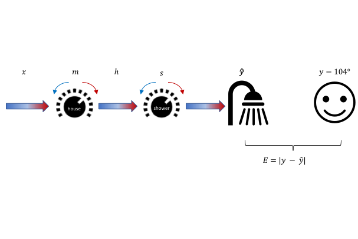
```

]
<br><br>

--

.center[.content-box-grey[_m_ and _s_ simply represent the weights of the first and second layer of a hypothetical neural net.]]

---
# Backpropagation

.pull-left[

* This updating of our weights is what is called ___backpropagation___.

* This simple example illustrated basic gradient descent backpropagation.

* There have been several algorithms developed that slightly modify and _optimize_ this approach [`r anicon::aia("google-scholar", animate = 'tada', anitype="hover", rtext = "(Sebastian Ruder)")`](http://ruder.io/optimizing-gradient-descent/).

* A main differentiating component is ___momentum___.


]

.pull-right[

```{r, echo=FALSE}
knitr::include_graphics("images/saddle_point_evaluation_optimizers.gif")
```

.right.font50[[Sebastian Ruder (2016)](https://ruder.io/optimizing-gradient-descent/)]

]

---
# Backpropagation

.pull-left[

* This updating of our weights is what is called ___backpropagation___.

* This simple example illustrated basic gradient descent backpropagation.

* There have been several algorithms developed that slightly modify and _optimize_ this approach [`r anicon::aia("google-scholar", animate = 'tada', anitype="hover", rtext = "(Sebastian Ruder)")`](http://ruder.io/optimizing-gradient-descent/).

* A main differentiating component is ___momentum___.


]

.pull-right[

```{r, echo=FALSE, fig.height=4, message=FALSE, warning=FALSE}
set.seed(123)  # for reproducibility
x <- seq(from = 0, to = 4.25 * pi, length = 100)
y <- sin(x) - x*.4

df <- data.frame(x, y)
df_points <- data.frame(x, y) %>%
   filter(x > 2 & x < 12) %>%
   mutate(x2 = x, y = y + 0.07) %>%
   select(-x)

global <- filter(df, y == min(y))
local  <- df %>% 
  filter(x < 6) %>% 
  filter(y == min(y))

p <- ggplot() +
  geom_line(data = df, aes(x, y), size = 1.5, alpha = 0.5) +
  scale_y_continuous("Loss function", expand = c(0, 0.08), limits = c(-6, 1)) +
  scale_x_continuous("Parameter value", expand = c(0.08, 0)) +
  annotate("text", x = global$x, y = global$y, label = "Global minimum", vjust = 2, size = 4) +
  annotate("text", x = local$x, y = local$y, label = "Local minimum", vjust = 2, size = 4) +
  geom_point(data = df_points, aes(x2, y), size = 3) +
  transition_time(x2)

suppressMessages(suppressWarnings(
   animate(p, renderer = magick_renderer(loop = TRUE), device = "png", fps = 25)
))
```

]


---
# Backpropagation

.pull-left[

* This updating of our weights is what is called ___backpropagation___.

* This simple example illustrates basic gradient descent backpropagation.

* There have been several algorithms developed that slightly modify and _optimize_ this approach [`r anicon::aia("google-scholar", animate = 'tada', anitype="hover", rtext = "(Sebastian Ruder)")`](http://ruder.io/optimizing-gradient-descent/).

* A main differentiating component is ___momentum___.


]

.pull-right[

<br><br><br>

```{r, eval=FALSE}
network %>% compile(
  loss = "categorical_crossentropy",
  optimizer = "rmsprop", #<<
  metrics = c("accuracy")
)
```

]

.center[.content-box-grey[RMSprop is typically a great default optimizer.]]

---
# Tracking additional metrics

In addition to the loss function, there are many other metrics we can track.

.pull-left[

* mean squared error (MSE)
* mean absolute error (MAE)
* mean absolute percentage error (MAPE)
* mean squared logarithmic error (MSLE)
* squared hinge
* log cosine hinge
* overall accuracy
* binary cross entropy
* categorical hinge
* categorical cross entropy
* sparse categorical cross entropy
* Kullback-Leibler divergence
* Poisson
* cosine proximity
* can even build your own custom metrics to track!

]

---
# Tracking additional metrics

In addition to the loss function, there are many other metrics we can track.

.pull-left[

* mean squared error (MSE)
* mean absolute error (MAE)
* mean absolute percentage error (MAPE)
* mean squared logarithmic error (MSLE)
* squared hinge
* log cosine hinge
* .blue[overall accuracy]
* binary cross entropy
* categorical hinge
* categorical cross entropy
* sparse categorical cross entropy
* Kullback-Leibler divergence
* Poisson
* cosine proximity
* can even build your own custom metrics to track!

]

.pull-right[

```{r, eval=FALSE}
network %>% compile(
  loss = "categorical_crossentropy",
  optimizer = "rmsprop", 
  metrics = c("accuracy") #<<
)
```

]

---
# Network compilation summary

.pull-left-narrow[
<br><br><br>

1. Loss function

2. Backpropagation optimizer

3. Additional metrics tracked

]

.pull-right-wide[

```{r, echo=FALSE}
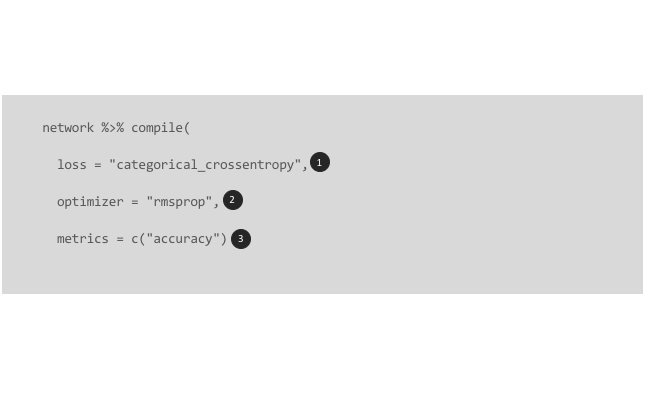
```

]

---
class: clear, center, middle

.font500.bold[Training loop]

---
# Supply data


.pull-left[

* We use `fit()` to start executing model training

* First, we need to supply the features and target response for our training data

]

.pull-right[

```{r, eval=FALSE}
history <- network %>% 
  fit(train_images, #<< 
      train_labels, #<<
      batch_size = 128, 
      epochs = 20, 
      validation_split = 0.2)
```

]

---
# 3 variants of gradient descent

.pull-left[

1. .bold[Batch gradient descent]
   - computes the error for each example in the training dataset and updates the 
     weights <u>after all training examples have been evaluated</u>
   - .bold.green[Pros]:
      - Fewer updates to the model can result in computational efficiencies
      - Aggregation of errors leads to smoother gradient descent and, often, 
        quicker convergence
   - .bold.red[Cons]:
      - Scales horribly to "longer" datasets
      - Aggregation of errors often leads to convergence at local minimums
]

.pull-right[

```{r, echo=FALSE}
df <- expand.grid(x = 1:50, y = 1:50)

ggplot(df, aes(x, y)) +
   geom_point(color = "red") +
   theme_void()
```

]

---
# 3 variants of gradient descent

.pull-left[

1. Batch gradient descent
2. .bold[Stochastic gradient descent]
   - randomly selects an individual ob, computes gradients and 
     updates model weights <u>after this single observation has been evaluated</u>
   - .bold.green[Pros]:
      - Makes individual weight updates much faster
      - updating model on a single, random observation results in a very noisy 
        gradient descent which helps avoid local minimums
   - .bold.red[Cons]:
      - Takes longer to converge which means can be computationally inefficient
      - Noisy learning process can also make it hard for the algorithm to settle 
        on an error minimum for the model.
]

.pull-right[

```{r, echo=FALSE}
df2 <- expand.grid(x2 = 1:50, y2 = 1:50) %>%
   sample_frac() %>%
   mutate(id = row_number())

p <- ggplot(df, aes(x, y)) +
   geom_point(alpha = 0.1) +
   geom_point(data = df2, aes(x2, y2), color = "red", size = 2) +
   theme_void() +
   transition_components(id)

animate(p, renderer = magick_renderer(loop = TRUE), device = "png", fps = 1)
```

]


---
# 3 variants of gradient descent

.pull-left[

1. Batch gradient descent
2. Stochastic gradient descent
3. .bold[Mini-batch gradient descent]
   - randomly selects a subset of obs, computes gradients and updates model 
     weights <u>after this subset has been evaluated</u>
   - .bold.green[Pros]:
      - Balances efficiencies of batch vs. stochastic
      - Balances robust convergence of batch with some stochastic nature to 
        minimize local minima.
   - .bold.red[Cons]:
      - One more hyperparameter to think about
   - Most common: $2^s \rightarrow 32, 64, 128, 256, 512$

]

.pull-right[

```{r, echo=FALSE}
df2 <- expand.grid(x2 = 1:50, y2 = 1:50) %>%
   arrange(x2) %>%
   mutate(id = rep(1:25, each = 100)) %>%
   mutate_all(as.integer)

p <- ggplot(df, aes(x, y)) +
   geom_point(alpha = 0.1) +
   geom_point(data = df2, aes(x2, y2, group = id), color = "red", size = 2) +
   theme_void() +
   transition_states(id)

animate(p, renderer = magick_renderer(loop = TRUE), device = "png")
```

]

---
# Epochs

.pull-left.font110[

- The number of times the learning algorithm will work through the entire 
  training dataset.

]

.pull-right[

```{r, echo=FALSE}
df <- expand.grid(x = 1:24, y = 1:24)
df2 <- expand.grid(x2 = 1:24, y2 = 1:24, epoch = 1:3) %>%
   arrange(epoch, x2) %>%
   mutate(id = rep(1:24, each = 72),
          epoch = paste("epoch: ", epoch))

p <- ggplot(df, aes(x, y)) +
   geom_point(alpha = 0.1) +
   geom_point(data = df2, aes(x2, y2, group = id), color = "red", size = 2) +
   theme_void() +
   facet_wrap(~ epoch) +
   transition_states(id)

animate(p, renderer = magick_renderer(loop = TRUE), device = "png")
```

]

---
# Epochs

.pull-left.font110[

- The number of times the learning algorithm will work through the entire 
  training dataset.
  
```{r, eval=FALSE}
history <- network %>% 
  fit(train_images,  
      train_labels, 
      batch_size = 128, #<< 
      epochs = 20, #<<
      validation_split = 0.2)
```
  

]

.pull-right[

```{r, echo=FALSE}
knitr::include_graphics("images/training_gif.gif")
```

]

---
# Epochs

.pull-left.font100[

- The number of times the learning algorithm will work through the entire 
  training dataset.
  
- Enough epochs to where we see the loss converge to a minimum  

]

.pull-right[

```{r, echo=FALSE, fig.height=5}
history <- read_csv("data/example_history.csv")

history %>%
   filter(data == "training", metric == "loss") %>%
   ggplot(aes(epoch, value)) +
   geom_point() +
   geom_line() +
   ggtitle("Learning curve")
```

]


---
# Validation

.pull-left[

* If we train a large enough model, theoretically, we should be able to produce 
  an _identity function_.
  
* This is not our objective!

]

.pull-right[

```{r, echo=FALSE, fig.height=5}
final_error <- history %>%
   filter(data == "training", metric == "loss", epoch == 20)

history %>%
   filter(data == "training", metric == "loss") %>%
   ggplot(aes(epoch, value)) +
   geom_point() +
   geom_line() +
   geom_point(data = final_error, size = 2, color = "red") +
   annotate("text", x = 20, y = 0.02, hjust = 1, vjust = 0, 
            label = "Training loss is basically 0", color = "red") +
   xlab("Epoch") +
   ylab("Loss") +
   ggtitle("Learning curve")
```


]

---
# Validation

.pull-left[

* If we train a large enough model, theoretically, we should be able to produce 
  an _identity function_.
  
* This is not our objective!

* We want to identify the model and location that minimizes loss on _unseen data_.

* `validation_split` will:
   - select the last XX% of data in our training set,
   - score our model on this validation set at the end of each epoch

]

.pull-right[

```{r, echo=FALSE, fig.height=5.55}
best_error <- history %>%
   filter(data == "validation", metric == "loss") %>%
   filter(value == min(value))

history %>%
   filter(metric == "loss") %>%
   ggplot(aes(epoch, value, color = data)) +
   geom_point() +
   geom_line() +
   geom_point(data = best_error, size = 2, color = "blue") +
   geom_segment(x = best_error$epoch, xend = best_error$epoch,
                y = 0.11, yend = best_error$value + 0.005, 
                arrow = arrow(length = unit(0.08, "inches")),
                color = "blue") +
   annotate("text", x = 7, y = 0.12, hjust = 0, vjust = 0, 
            label = "Generalizes the best to 'unseen' \nvalidation data", color = "blue") +
   xlab("Epoch") +
   ylab("Loss") +
   ggtitle("Learning curve") + 
   theme(legend.position = 'bottom')
```

]

---
# Training loop summary

.pull-left-narrow[
<br><br><br>

1. Training features and labels

2. Size of mini batches and number epochs

3. Data used as "unseen" validation data

]

.pull-right-wide[

<br>
```{r, echo=FALSE}
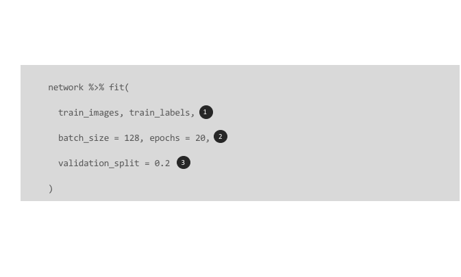
```

]

---
# Now you know!

.pull-left[

```{r, eval=FALSE}
network <- keras_model_sequential() %>%
  layer_dense(units = 512, activation = 'relu', input_shape = c(28 * 28)) %>%
  layer_dense(units = 10, activation = 'softmax')

network %>% compile(
  loss = "categorical_crossentropy",
  optimizer = "rmsprop",
  metrics = c("accuracy")
)

history <- network %>% 
  fit(train_images, train_labels, 
      batch_size = 128, epochs = 20, 
      validation_split = 0.2)
```

]

.pull-right[

```{r, echo=FALSE}
knitr::include_graphics("https://media1.tenor.com/images/8e0b403d6b9f899f5a25cb39b476c308/tenor.gif?itemid=10118626")
```

]

---
# Back home

<br><br><br><br>
[.center[`r anicon::faa("home", size = 10, animate = FALSE)`]](https://github.com/rstudio-conf-2020/dl-keras-tf)

.center[https://github.com/rstudio-conf-2020/dl-keras-tf]