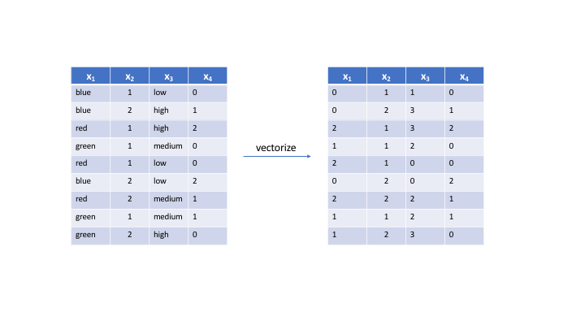
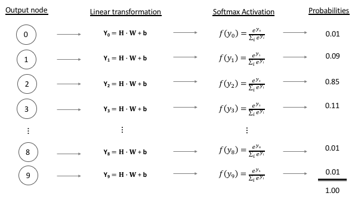

class: clear, center, middle

background-image: url(images/home4sale.jpg)
background-size: cover

```{r setup, include=FALSE, cache=FALSE}
# set working directory to docs folder
setwd(here::here("docs"))

# Set global R options
options(htmltools.dir.version = FALSE, servr.daemon = TRUE)

# Set global knitr chunk options
knitr::opts_chunk$set(
  fig.align = "center", 
  cache = TRUE,
  error = FALSE,
  message = FALSE, 
  warning = FALSE, 
  collapse = TRUE 
)

# Use a clean black and white ggplot2 theme
library(tidyverse)
library(keras)
library(gganimate)
thm <- theme_bw()
theme_set(thm)
```

---
# Vectorization & standardization

.font120.bold[_All inputs and response values in a neural network must be tensors of either 
floating-point or integer data._]

```{r, echo=FALSE}

```


---
# Vectorization & standardization

.font120.bold[_Moreover, our feature values should not be relatively large compared to the randomized initial weights <u>and</u> all our features should take values in roughly the same range._]

.pull-left[

- Values should not be significantly larger than the initial weights

- Triggers large gradient updates that will prevent the network from converging

]

--

.pull-right[

- Option 1:
   - standardize between 0-1
   - easy when working with images since all features align to the same range
   
- Option 2:
   - normalize each feature to have mean of 0
   - normalize each feature to have standard deviation of 1
   - common when working with features with different ranges

]

---
# Feature engineering

.pull-left[

* Many different feature engineering techniques to do this plus other great things

* Misperception that neural nets do not require feature engineering


]

.pull-right[

]

---
# Feature engineering

.pull-left[

* Many different feature engineering techniques to do this plus other great things

* Misperception that neural nets do not require feature engineering

* [_Feature Engineering and Selection: A Practical Approach for Predictive Models_](http://www.feat.engineering/) by Max Kuhn & Kjell Johnson


]

.pull-right[

```{r, echo=FALSE, out.height="60%", out.width="60%"}
knitr::include_graphics("https://images.tandf.co.uk/common/jackets/amazon/978113807/9781138079229.jpg")
```

]

---
# Feature engineering

.pull-left[

* Many different feature engineering techniques to do this plus other great things

* Misperception that neural nets do not require feature engineering

* [_Feature Engineering and Selection: A Practical Approach for Predictive Models_](http://www.feat.engineering/) by Max Kuhn & Kjell Johnson

* [_Hands-On Machine Learning with R_](https://bradleyboehmke.github.io/HOML/) by Bradley Boehmke & Brandon Greenwell

]

.pull-right[

```{r, echo=FALSE, out.height="60%", out.width="60%"}
knitr::include_graphics("https://bradleyboehmke.github.io/HOML/images/homl-cover.jpg")
```

]

---
# Ames Example

.pull-left.code70[

```{r, eval=FALSE}
blueprint <- recipe(Sale_Price ~ ., data = ames_train) %>%
  step_nzv(all_nominal()) %>% #<<
  step_other(all_nominal(), threshold = .01, other = "other") %>% #<<
  step_integer(matches("(Qual|Cond|QC|Qu)$")) %>%
  step_YeoJohnson(all_numeric(), -all_outcomes()) %>%
  step_center(all_numeric(), -all_outcomes()) %>%
  step_scale(all_numeric(), -all_outcomes()) %>%
  step_dummy(all_nominal(), -all_outcomes(), one_hot = TRUE)
```

]

.pull-right[

* remove any constant categorical features
* reduce any categorical levels that show in only 1% or less of the observations to a single "other" level

]

---
# Ames Example

.pull-left.code70[

```{r, eval=FALSE}
blueprint <- recipe(Sale_Price ~ ., data = ames_train) %>%
  step_nzv(all_nominal()) %>% 
  step_other(all_nominal(), threshold = .01, other = "other") %>% 
  step_integer(matches("(Qual|Cond|QC|Qu)$")) %>% #<<
  step_YeoJohnson(all_numeric(), -all_outcomes()) %>%
  step_center(all_numeric(), -all_outcomes()) %>%
  step_scale(all_numeric(), -all_outcomes()) %>%
  step_dummy(all_nominal(), -all_outcomes(), one_hot = TRUE)
```

]

.pull-right[

* .bold[Vectorization]: convert features that represent ordered quality metrics to numeric values
   - `Overall_Qual` has 10 Levels: Very_Poor, Poor, Fair, Below_Average, Average, ..., Very_Excellent
   - Converted to: 1, 2, 3, 4, ..., 10

]


---
# Ames Example

.pull-left.code70[

```{r, eval=FALSE}
blueprint <- recipe(Sale_Price ~ ., data = ames_train) %>%
  step_nzv(all_nominal()) %>% 
  step_other(all_nominal(), threshold = .01, other = "other") %>% 
  step_integer(matches("(Qual|Cond|QC|Qu)$")) %>% 
  step_YeoJohnson(all_numeric(), -all_outcomes()) %>% #<<
  step_center(all_numeric(), -all_outcomes()) %>% #<<
  step_scale(all_numeric(), -all_outcomes()) %>% #<<
  step_dummy(all_nominal(), -all_outcomes(), one_hot = TRUE)
```

]

.pull-right[

* .bold[Standardizes numeric values]

* Yeo-Johnson normalizes value distributions, minimizes outliers which reduces large extreme values

* Centering standardizes features to have mean of zero

* Scaling standardizes feature to have standard deviation of zero

```{r, echo=FALSE, fig.height=2.25}
data.frame(x = rlnorm(1000, 10, 1)) %>%
  mutate(`Regular values` = x,
         `Standardized values` = scale(log(`Regular values`))) %>%
  gather(type, values, -x) %>%
  ggplot(aes(values)) +
    geom_histogram(bins = 50) +
    facet_wrap(~ type, scales = "free_x") +
    scale_x_continuous(NULL, labels = scales::comma)
```


]

---
# Ames Example

.pull-left.code70[

```{r, eval=FALSE}
blueprint <- recipe(Sale_Price ~ ., data = ames_train) %>%
  step_nzv(all_nominal()) %>% 
  step_other(all_nominal(), threshold = .01, other = "other") %>% 
  step_integer(matches("(Qual|Cond|QC|Qu)$")) %>% 
  step_YeoJohnson(all_numeric(), -all_outcomes()) %>% 
  step_center(all_numeric(), -all_outcomes()) %>%
  step_scale(all_numeric(), -all_outcomes()) %>% 
  step_dummy(all_nominal(), -all_outcomes(), one_hot = TRUE) #<<
```

]

.pull-right[

* .bold[Vectorize remaining categorical features]

* One-hot encoding

```{r, echo=FALSE}
knitr::include_graphics("https://bradleyboehmke.github.io/HOML/images/ohe-vs-dummy.png")
```
house
]

---
# Ames Example

.pull-left.code70[

```{r, eval=FALSE}
blueprint <- recipe(Sale_Price ~ ., data = ames_train) %>%
  step_nzv(all_nominal()) %>% 
  step_other(all_nominal(), threshold = .01, other = "other") %>% 
  step_integer(matches("(Qual|Cond|QC|Qu)$")) %>% 
  step_YeoJohnson(all_numeric(), -all_outcomes()) %>% 
  step_center(all_numeric(), -all_outcomes()) %>%
  step_scale(all_numeric(), -all_outcomes()) %>% 
  step_dummy(all_nominal(), -all_outcomes(), one_hot = TRUE)
```

]

.pull-right[

```{r, echo=FALSE, out.height="50%", out.width="50%"}
knitr::include_graphics("images/recipes.png")
```

.center[[https://tidymodels.github.io/recipes](https://tidymodels.github.io/recipes/)]

]


---
# Error Metrics

.pull-left.font80[

.bold[MSE]:

* the average of the squared error

* $MSE = \frac{1}{n} \sum^n_{i=1}(Y_i - \widehat Y_i)^2$

* squared component results in larger errors having larger penalties

]

.pull-right.font80[

House 1:
  - actuals $Y = 100,000$  
  - predicted: $\widehat Y = 90,000$ 
  - error: $Y - \widehat Y = 10,000$
  - SE: $(Y - \widehat Y)^2 = 100,000,000$ .white[
  - MSLE: 0.1053605]

House 2:
  - actual: $Y = 350,000$
  - predicted: $\widehat Y = 320,000$
  - error: $Y - \widehat Y = 30,000$
  - SE: $(Y - \widehat Y)^2 = 900,000,000$ .white[
  - MSLE: 0.08961216]

Total error:
  - MSE: 500,000,000

]

---
# Error Metrics

.pull-left.font80[

.bold[MSE]:

* the average of the squared error

* $MSE = \frac{1}{n} \sum^n_{i=1}(Y_i - \hat Y_i)^2$

* squared component results in larger errors having larger penalties

.bold[RMSE]:

* commonly used to make error more interpretable

* $RMSE = \sqrt{MSE}$

]

.pull-right.font80[

House 1:
  - actuals $Y = 100,000$  
  - predicted: $\widehat Y = 90,000$ 
  - error: $Y - \widehat Y = 10,000$
  - SE: $(Y - \widehat Y)^2 = 100,000,000$ .white[
  - MSLE: 0.1053605]

House 2:
  - actual: $Y = 350,000$
  - predicted: $\widehat Y = 320,000$
  - error: $Y - \widehat Y = 30,000$
  - SE: $(Y - \widehat Y)^2 = 900,000,000$ .white[
  - MSLE: 0.08961216]
  
Total error:
  - MSE: 500,000,000 
  - .bold[RMSE]: $\sqrt{MSE} = 22,360.68$

]

---
# Error Metrics

.pull-left.font80[

.bold[MSE]:

* the average of the squared error

* $MSE = \frac{1}{n} \sum^n_{i=1}(Y_i - \hat Y_i)^2$

* squared component results in larger errors having larger penalties

.bold[RMSE]:

* commonly used to make error more interpretable

* $RMSE = \sqrt{MSE}$

.bold[MSLE / RMSLE]:

* adjusts for magnitude of value when you want to treat XX% error equally

* $MSE = \frac{1}{n} \sum^n_{i=1}(\log(Y_i) - \log(\hat Y_i))^2$

]

.pull-right.font80[

House 1:
  - actuals $Y = 100,000$  
  - predicted: $\widehat Y = 90,000$ 
  - error: $Y - \widehat Y = 10,000$
  - SE: $(Y - \widehat Y)^2 = 100,000,000$
  - MSLE: $(\log(Y_i) - \log(\hat Y_i))^2 = 0.01110084$

House 2:
  - actual: $Y = 350,000$
  - predicted: $\widehat Y = 320,000$
  - error: $Y - \widehat Y = 30,000$
  - MSE: $(Y - \widehat Y)^2 = 900,000,000$ 
  - MSLE: $(\log(Y_i) - \log(\hat Y_i))^2 = 0.008030339$
  
Total error:
  - MSE: 500,000,000 
  - RMSE: $\sqrt{MSE} = 22,360.68$
  - .bold[MSLE]: 0.009565589

]

---
# Batch sizes & epochs

* Recall that batch sizes commonly take on values of $2^s \rightarrow 32, 64, 128, 256, 512$

* And we use enough epochs so that our learning rate reaches a minimum

* General advice:
   - large batch sizes ( $\geq 512$) tend to reach "sharp minimums" quickly which tend to generalize poorly
   - small batch sizes ( $\leq 8$) tend to take many more epochs to converge
   - can be influenced by size of data:
      - larger $n$ can afford larger batch sizes (128, 256, 512)
      - smaller $n$ often do better with smaller batch sizes (16, 32, 64)

* Which is best...
   - I typically start with 32 or 64
   - Trial and error for your specific problem


---
# Callbacks

.pull-left[

Training a model can be like flying a paper airplane...

<br><br>

...once you let go you have little control over its trajectory!

]

.pull-right[

```{r, echo=FALSE, out.height="80%", out.width="80%"}
knitr::include_graphics("https://media2.giphy.com/media/zMS612WWVzQPu/source.gif")
```

]

---
# Callbacks

.pull-left.font90[

When training a model, sometimes we want to:

<br>

- automatically stop a model once performance has stopped improving

- dynamically adjust values of certain parameters (i.e. learning rate)

- log model information to use or visualize later on

- continually save the model during training and save the model with the best performance

.center[_These tasks and others can help control the trajectory of our model._]

]

---
# Callbacks

.pull-left.font90[

When training a model, sometimes we want to:

<br>

- .blue[automatically stop a model once performance has stopped improving]

- .red[dynamically adjust values of certain parameters (i.e. learning rate)]

- .grey[log model information to use or visualize later on]

- .purple[continually save the model during training and save the model with the best performance]

.center[_These tasks and others can help control the trajectory of our model._]

]

.pull-right.font90[

Callbacks provide a way to control and monitor our model during training:

<br>

- .blue[`callback_early_stopping()`]

- .red[`callback_reduce_lr_on_plateau()`]

- .red[`callback_learning_rate_scheduler()`]

- .grey[`callback_csv_logger()`]

- .purple[`callback_model_checkpoint()`]

- and others (`keras::callback_xxx`)

]

---
# Validation procedures

.pull-left[

So far, we've used `validation_split` to pull out XX% of our training data and use as "unseen" validation data.

```{r, eval=FALSE}
network %>% fit(
  x_train,
  y_train,
  epochs = 50,
  batch_size = 32,
  validation_split = 0.2 #<<
)
```

]

--

.pull-right[

We can also supply validation data with `validation_data` .white[more text to force on next line ttttttttttttttttt]


```{r, eval=FALSE}
network %>% fit(
  x_train,
  y_train,
  epochs = 50,
  batch_size = 32,
  validation_data = list(x_val, y_val) #<<
)
```

]

---
# Validation procedures

.pull-left[

Variability in validation results exists from two sources:

1. randomness in initial weights .white[

2. differences in the actual data used for validation]

]

.pull-right[

```{r, echo=FALSE}
df <- readr::read_csv("data/model_variance_due_to_weights.csv")

p1 <- ggplot(df, aes(Epoch, Loss, group = Model)) +
  geom_line(alpha = 0.1) +
  scale_y_log10("log(Loss)") +
  ggtitle("Learning curve variability")

p2 <- df %>%
  group_by(Model) %>%
  summarize(Min_loss = min(Loss)) %>%
  ggplot(aes(Min_loss)) +
  geom_histogram() +
  ggtitle("Minimum loss variability")

gridExtra::grid.arrange(p1, p2)
```

]

---
# Validation procedures

.pull-left[

Variability in validation results exists from two sources:

1. randomness in initial weights

2. differences in the actual data used for validation

]

.pull-right[

```{r, echo=FALSE}
df <- readr::read_csv("data/model_variance_due_to_val_data.csv")

p1 <- ggplot(df, aes(Epoch, Loss, group = Model)) +
  geom_line(alpha = 0.1) +
  scale_y_log10("log(Loss)") +
  ggtitle("Learning curve variability")

p2 <- df %>%
  group_by(Model) %>%
  summarize(Min_loss = min(Loss)) %>%
  ggplot(aes(Min_loss)) +
  geom_histogram() +
  ggtitle("Minimum loss variability")

gridExtra::grid.arrange(p1, p2)
```

]

---
# Validation procedures

.pull-left[

Variability in validation results exists from two sources:

1. randomness in initial weights

2. differences in the actual data used for validation

]

.pull-right[

* These difference become minimal for very large data sets

* but can skew our confidence in smaller data sets ( $<10\text{K}$ observations)

]

---
# _k_-fold cross validation

.pull-left[

* _k_-fold CV is a resampling method that randomly divides the training data into _k_ groups (aka folds) of approximately equal size

* fit model on $k−1$ folds and then the remaining fold is used to compute model performance

* average the _k_ error estimates

* typically use $k=5$ or $k=10$

]

.pull-right[

```{r, echo=FALSE}
knitr::include_graphics("https://bradleyboehmke.github.io/HOML/images/cv.png")
```

]

---
class: clear, center, middle

background-image: url(https://www.elitereaders.com/wp-content/uploads/2016/04/worst-movie-reviews-featured.jpg)
background-size: cover
---
# IMDB data set

.pull-left[

```{r, echo=FALSE}
knitr::include_graphics("https://www.wikihow.com/images/thumb/4/46/Prepare-a-Review-on-IMDb-Step-6-Version-2.jpg/aid2512841-v4-728px-Prepare-a-Review-on-IMDb-Step-6-Version-2.jpg")
```


]

.pull-right[

* A  collection of 50,000 reviews from IMDB on the condition there are no more than 30 reviews per movie. 

* The numbers of positive and negative reviews are equal. 
   - .red[Negative] reviews: score $\leq$ 4 out of 10
   - .green[Positive] reviews: score $\geq$ 7 out of 10
   - Neutral reviews are not included. 
   
* The 50,000 reviews are divided evenly into the training and test set.

]

---
# Vectorizing text

.pull-left[

.bold[Before vectorization] $\rightarrow$ list of integers

```{r, echo=FALSE}
imdb <- dataset_imdb(num_words = 10000)
c(c(train_data, train_labels), c(test_data, test_labels)) %<-% imdb
```

```{r}
str(train_data)
```


]

.pull-right[

.bold[After vectorization] $\rightarrow$ 2D Tensor of 0s & 1s

```{r, echo=FALSE}
n_features <- c(train_data, test_data) %>%  
  unlist() %>% 
  max()

# function to create 2D tensor (aka matrix)
vectorize_sequences <- function(sequences, dimension = n_features) {
  # Create a matrix of 0s
  results <- matrix(0, nrow = length(sequences), ncol = dimension)

  # Populate the matrix with 1s
  for (i in seq_along(sequences))
    results[i, sequences[[i]]] <- 1
  results
}

# apply to training and test data
train_data_vec <- vectorize_sequences(train_data)
col_titles <- c("pad", "start", "unknown", paste0("word", 1:(ncol(train_data_vec)-3)))
colnames(train_data_vec) <- col_titles
```

```{r}
train_data_vec[, 1:10]
```

]

---
# Vectorizing text

.pull-left[

list of integers $\rightarrow$ list of word indeces

```{r, echo=FALSE}
word_index <- dataset_imdb_word_index() %>% 
  unlist() %>%                                 
  sort() %>%                                   
  names()

c(c(train_data, train_labels), c(test_data, test_labels)) %<-% imdb

for (i in seq_along(train_data)) {
  train_data[[i]] <- train_data[[i]] %>% 
  purrr::map_chr(~ ifelse(.x >= 3, word_index[.x - 3], "?"))
}
```

```{r}
str(train_data)
```


]

.pull-right[

2D Tensor of 0s & 1s $\rightarrow$ one-hot encoded words

```{r, echo=FALSE}
c(c(train_data, train_labels), c(test_data, test_labels)) %<-% imdb

new_index <- unique(unlist(train_data)) %>% sort()
new_index <- new_index - 3
new_index <- new_index[new_index > 0]
words_used <- word_index[new_index]
words_used <- c("pad", "start", "unknown", words_used)
colnames(train_data_vec) <- words_used
```


```{r}
train_data_vec[, 1:10]
```

]


---
# Sigmoid activation

.pull-left[

* Recall how sigmoid activation gives us a 0-1 probability

* In this case, we are predicting the probability that a review is positive.

]

.pull-right.center[

```{r, echo=FALSE, fig.height=4.5}
x <- seq(-5, 5, by = 0.01)
y <- 1 / (1 + exp(-x))
df <- data.frame(x, y)
ggplot(df, aes(x, y)) + 
   geom_line() +
   xlab("y") +
   scale_y_continuous("f(y) = probability of event", labels = scales::percent) +
   ggtitle("Sigmoid activation function") +
   annotate("text", x = 2.5, y = 0.8, label = "Review is positive", hjust = 0) +
   annotate("text", x = -5, y = 0.2, label = "Review is negative", hjust = 0) +
   geom_hline(yintercept = 0.5, lty = "dashed", alpha = 0.25, size = 1.5)
```

.font120[
$f(y) = \frac{1}{1 + e^{-y}}$
]
]

---
# Binary crossentropy

.pull-left[

* Cross-entropy loss, or log loss, measures the performance of a classification model whose output is a probability value between 0 and 1. 

* Cross-entropy loss increases as the predicted probability diverges from the actual label. 

* So predicting a probability of .012 when the actual observation label is 1 would be bad and result in a high loss value

]

.pull-right[

```{r, echo=FALSE, fig.height=5.5}
crossentropy <- data.frame(
  prob = seq(0.01, 0.99, 0.01),
  `label = 1` = NA,
  `label = 0` = NA
)
for (iter in seq_along(crossentropy$prob)) {
  prob <- crossentropy$prob[iter]
  crossentropy[iter, 2] <- -(1 * log(prob) + (1-1) * log(1 - prob))
  crossentropy[iter, 3] <- -(0 * log(prob) + (1-0) * log(1 - prob))
}
crossentropy %>% 
  gather(label, loss, -prob) %>%
  ggplot(aes(prob, loss, color = label)) +
  geom_line(show.legend = FALSE) +
  annotate("text", x = 0.12, y = 3, label = "label = 1", vjust = 0, hjust = 0, size = 8, color = "#00BFC4") +
  annotate("text", x = 0.88, y = 3, label = "label = 0", vjust = 0, hjust = 1, size = 8, color = "#F8766D") +
  ylab("Log loss") +
  xlab("predicted probability")
```

$$-{(y \cdot \log(p) + (1 - y) \cdot \log(1 - p))}$$

]

---
# Binary crossentropy

.pull-left[

* Cross-entropy loss, or log loss, measures the performance of a classification model whose output is a probability value between 0 and 1. 

* Cross-entropy loss increases as the predicted probability diverges from the actual label. 

* So predicting a probability of .012 when the actual observation label is 1 would be bad and result in a high loss value

* Binary crossentropy is just the average of these values across all observations

$$-\frac{1}{N} \sum^{N=2}_{i=1} {(y_i \cdot \log(p_i) + (1 - y_i) \cdot \log(1 - p_i))}$$

]

.pull-right[

```{r, echo=FALSE, fig.height=5.5}
crossentropy <- data.frame(
  prob = seq(0.01, 0.99, 0.01),
  `label = 1` = NA,
  `label = 0` = NA
)
for (iter in seq_along(crossentropy$prob)) {
  prob <- crossentropy$prob[iter]
  crossentropy[iter, 2] <- -(1 * log(prob) + (1-1) * log(1 - prob))
  crossentropy[iter, 3] <- -(0 * log(prob) + (1-0) * log(1 - prob))
}
crossentropy %>% 
  gather(label, loss, -prob) %>%
  ggplot(aes(prob, loss, color = label)) +
  geom_line(show.legend = FALSE) +
  annotate("text", x = 0.12, y = 3, label = "label = 1", vjust = 0, hjust = 0, size = 8, color = "#00BFC4") +
  annotate("text", x = 0.88, y = 3, label = "label = 0", vjust = 0, hjust = 1, size = 8, color = "#F8766D") +
  ylab("Log loss") +
  xlab("predicted probability")
```

$$-{(y \cdot \log(p) + (1 - y) \cdot \log(1 - p))}$$

]

---
# Customizing compile step

.pull-left.font100[

* The compile step allows us to specify how gradient descent will be deployed and the metrics to track

* This can be customized multiple ways...

]

.pull-right[

```{r, eval=FALSE}
network %>% compile(
  optimizer = "rmsprop",
  loss = "binary_crossentropy",
  metrics = "accuracy",
  loss_weights = NULL, 
  sample_weight_mode = NULL,
  weighted_metrics = NULL, 
  target_tensors = NULL, 
  ...
)
```

]

---
# Customizing compile step

.pull-left.font100[

* The compile step allows us to specify how gradient descent will be deployed and the metrics to track

* This can be customized multiple ways...
   - We can customize our optimizer function (typically we only alter the learning rate)

]

.pull-right[

```{r, eval=FALSE}
network %>% compile(
  optimizer =  optimizer_sgd(lr = 0.005), #<<
  loss = "binary_crossentropy",
  metrics = "accuracy",
  loss_weights = NULL, 
  sample_weight_mode = NULL,
  weighted_metrics = NULL, 
  target_tensors = NULL, 
  ...
)
```

]

---
# Customizing compile step

.pull-left.font100[

* The compile step allows us to specify how gradient descent will be deployed and the metrics to track

* This can be customized multiple ways...
   - We can customize our optimizer function
   - We can create customized loss functions and metrics to pass

]

.pull-right[

```{r, eval=FALSE}
# create metric using backend tensor functions
metric_mean_pred <- custom_metric("mean_pred", function(y_true, y_pred) { #<<
  k_mean(y_pred) #<<
}) #<<

network %>% compile(
  optimizer =  optimizer_sgd(lr = 0.005),
  loss = loss_binary_crossentropy, #<<
  metrics = c("accuracy", metric_mean_pred) #<<
  loss_weights = NULL, 
  sample_weight_mode = NULL,
  weighted_metrics = NULL, 
  target_tensors = NULL, 
  ...
)
```

]

---
# Customizing compile step

.pull-left.font100[

* The compile step allows us to specify how gradient descent will be deployed and the metrics to track

* This can be customized multiple ways...
   - We can customize our optimizer function
   - We can create customized loss functions and metrics to pass
   - We can include:
      - weighted loss contributions
      - weight metrics
      - and more sophisticated control options

]

.pull-right[

```{r, eval=FALSE}
network %>% compile(
  optimizer =  optimizer_sgd(lr = 0.005),
  loss = loss_binary_crossentropy, 
  metrics = c("accuracy", metric_mean_pred) 
  loss_weights = NULL, #<<
  sample_weight_mode = NULL, #<<
  weighted_metrics = NULL,  #<<
  target_tensors = NULL, #<<
  ... #<<
)
```

]

---
# Controlling the size of your network

.pull-left[

___Model capacity___ is controlled by:

* number of layers (_depth_)
* number of nodes (_width_)

<br><br><br>
.center.bold[Typically we see better performance (accuracy & compute efficiency) by increasing the number of layers moreso than nodes]

]

.pull-right[

```{r, echo=FALSE, out.height="90%", out.width="90%"}
knitr::include_graphics(c("images/model_capacity_depth.png",
                          "images/model_capacity_width.png"))
```

]

---
# Best practice for layers & nodes .red[(for preditive models)]

.pull-left[

Layers are typically:

- Tunnel shaped
- Funnel shaped

For best performance:

- Nodes are powers of 2 (16, 32, 64, 128, etc.)
- Relative to number of inputs (remember layers condense our features)
- Consistent number of nodes per layer makes tuning easier
- Last hidden layer should always have more nodes than the output layer


]

.pull-right[

```{r, echo=FALSE, out.height="90%", out.width="90%"}
knitr::include_graphics(c("images/model_capacity_depth.png",
                          "images/model_capacity_funnel.png"))
```

]

---
# Ames Housing

.pull-left[

* Single hidden layer with varying # of neurons


```{r, eval=FALSE}
## # A tibble: 9 x 3
##   neurons min_loss train_time
##     <dbl>    <dbl>      <dbl>
## 1       4   30.5         4.74
## 2       8   37.5         4.61
## 3      16   18.5         4.66
## 4      32   13.9         4.77
## 5      64    8.77        5.06
## 6     128    6.33        5.20
## 7     256    2.80        5.77
## 8     512    1.11        7.25
## 9    1024    0.139       8.75
```


]

.pull-right[

* Varying # of hidden layers with 128 neurons per layer

```{r, eval=FALSE}
## # A tibble: 8 x 3
##   nlayers min_loss train_time
##     <int>    <dbl>      <dbl>
## 1       1    5.959       6.88
## 2       2    0.824       4.32
## 3       3    0.609       4.32
## 4       4    0.750       4.54
## 5       5    0.665       4.36
## 6       6    0.998       4.43
## 7       7    0.802       4.45
## 8       8    0.603       4.78
```

]

---
class: clear, center, middle

background-image: url(https://www.refinitiv.com/content/dam/marketing/en_us/images/product/knowledge-direct-news-screenshot.jpg.transform/rect-768/q82/image.jpg)
background-size: cover

---
# Categorical crossentropy

.pull-left[

Remember our softmax activation function that produces the probability of each class?

```{r, echo=FALSE}

```

]

.pull-right[

* Categorical crossentropy simply computes the log loss of the probability that the outcome is a particular class versus not being that class

* i.e.: $y = 3$ vs $y \neq 3$ 

* it just needs to sum up the probabilities of $y \neq 3$

<br>

$$-\frac{1}{N} \sum^{N=C}_{i=1} {(y_i \cdot \log(p_i) + (1 - y_i) \cdot \log(1 - p_i))}$$

]

---
# Sparse categorical crossentropy

.pull-left[

.bold[When your response is a vector of integers use sparse categorical crossentropy]

```{r, echo=FALSE}
reuters <- dataset_reuters(num_words = 10000)
c(c(train_data, train_labels), c(test_data, test_labels)) %<-% reuters
```


```{r}
str(train_labels)
```

.bold[When your response is a one-hot encoded tensor use categorical crossentropy]

```{r, echo=FALSE}
train_labels <- to_categorical(train_labels)
```


```{r}
train_labels
```

]

.pull-right[

* Categorical crossentropy simply computes the log loss of the probability that the outcome is a particular class versus not being that class

* i.e.: $y = 3$ vs $y \neq 3$ 
* it just needs to sum up the probabilities of $y \neq 3$

* .red[___sparse categorical crossentropy___]
   - mathematically the same
   - does not require the summation
   - requires less memory and is more efficient when dealing with ___many___ response categories (i.e. 10K)

]

---
# Weight regularization

* Regular loss function: $\text{minimize} \left( MSE = \frac{1}{n} \sum^n_{i=1}(Y_i - \hat Y_i)^2 \right)$

--

* Weight regularization: $\text{minimize} \left( SSE + P \right)$

--

* $\text{L}^2$ norm (aka _weight decay_): $\text{minimize } \left( MSE + \lambda \sum^p_{j=1} w_j^2 \right)$

<br>

```{r, echo=FALSE, fig.height=4.2, fig.width=9}
boston_train_x <- model.matrix(cmedv ~ ., pdp::boston)[, -1]
boston_train_y <- pdp::boston$cmedv
# model
boston_ridge <- glmnet::glmnet(
  x = boston_train_x,
  y = boston_train_y,
  alpha = 0
)
lam <- boston_ridge$lambda %>% 
  as.data.frame() %>%
  mutate(penalty = boston_ridge$a0 %>% names()) %>%
  rename(lambda = ".")
results <- boston_ridge$beta %>% 
  as.matrix() %>% 
  as.data.frame() %>%
  rownames_to_column() %>%
  gather(penalty, coefficients, -rowname) %>%
  left_join(lam)
result_labels <- results %>%
  group_by(rowname) %>%
  filter(lambda == min(lambda)) %>%
  ungroup() %>%
  top_n(5, wt = abs(coefficients)) %>%
  mutate(var = paste0("w", 1:5))

ggplot() +
  geom_line(data = results, aes(lambda, coefficients, group = rowname, color = rowname), 
            show.legend = FALSE) +
  scale_x_log10(breaks = c(1, 7000), labels = c("small", "large")) +
  geom_text(data = result_labels, aes(lambda, coefficients, label = var, color = rowname), 
            nudge_x = -.06, show.legend = FALSE) +
  ylab("weights")
```

---
# Weight regularization

* Regular loss function: $\text{minimize} \left( MSE = \frac{1}{n} \sum^n_{i=1}(Y_i - \hat Y_i)^2 \right)$

* Weight regularization: $\text{minimize} \left( SSE + P \right)$

* $\text{L}^2$ norm (aka _weight decay_): $\text{minimize } \left( MSE + \lambda \sum^p_{j=1} w_j^2 \right)$

* $\text{L}^1$ norm: $\text{minimize } \left( MSE + \lambda \sum^p_{j=1} | w_j | \right)$

```{r, echo=FALSE, fig.height=4, fig.width=9}
# model
boston_lasso <- glmnet::glmnet(
  x = boston_train_x,
  y = boston_train_y,
  alpha = 1
)
lam <- boston_lasso$lambda %>% 
  as.data.frame() %>%
  mutate(penalty = boston_lasso$a0 %>% names()) %>%
  rename(lambda = ".")
results <- boston_lasso$beta %>% 
  as.matrix() %>% 
  as.data.frame() %>%
  rownames_to_column() %>%
  gather(penalty, coefficients, -rowname) %>%
  left_join(lam)
result_labels <- results %>%
  group_by(rowname) %>%
  filter(lambda == min(lambda)) %>%
  ungroup() %>%
  top_n(5, wt = abs(coefficients)) %>%
  mutate(var = paste0("x", 1:5))
ggplot() +
  geom_line(data = results, aes(lambda, coefficients, group = rowname, color = rowname), 
            show.legend = FALSE) +
  scale_x_log10(breaks = c(0.01, 7), labels = c("small", "large")) +
  geom_text(data = result_labels, aes(lambda, coefficients, label = var, color = rowname), 
            nudge_x = -.05, show.legend = FALSE) +
  ylab("weights")
```

---
# Weight regularization

* Regular loss function: $\text{minimize} \left( MSE = \frac{1}{n} \sum^n_{i=1}(Y_i - \hat Y_i)^2 \right)$

* Weight regularization: $\text{minimize} \left( SSE + P \right)$

* $\text{L}^2$ norm (aka _weight decay_): $\text{minimize } \left( MSE + \lambda \sum^p_{j=1} w_j^2 \right)$

* $\text{L}^1$ norm: $\text{minimize } \left( MSE + \lambda \sum^p_{j=1} | w_j | \right)$

* You can combine $\text{L}^1$ and $\text{L}^2$ akin to elastic nets

--

* Tips:
   - Typical penalties range from 0-0.1 (common searches: 0.0001, 0.001, 0.1)
   - $\text{L}^2$ is most common
   - Can be used on all network types
   - Common to first fit a large, overfit model & then regularize

---
# Dropout

.pull-left[

* During each run, each neuron has *p* probability of being dropped (set to 0)

* Help prevent the model from latching onto happenstance patterns (noise) that are not significant

* Tips:
   - dropout rates range from 0.2 – 0.5
   - usually applied to between each layer with the same rate
   - larger dropout rates can increase convergence so you may need to increase # epochs

]

.pull-right[

```{r, echo=FALSE}
knitr::include_graphics("images/dropout_illustration.png")
```


]