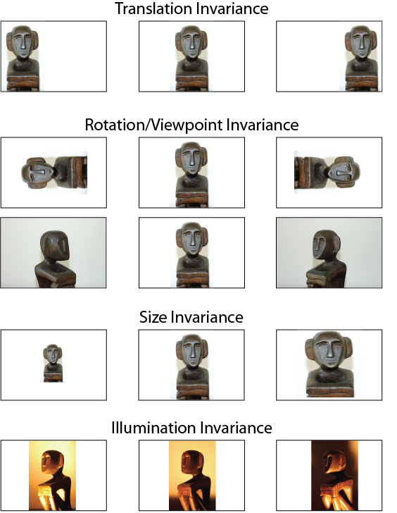
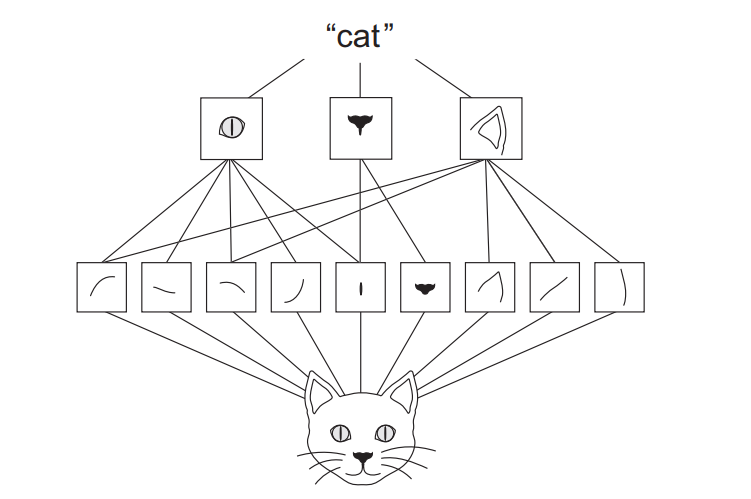
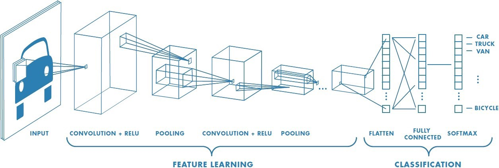
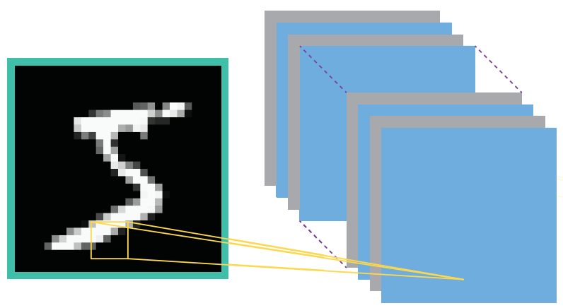
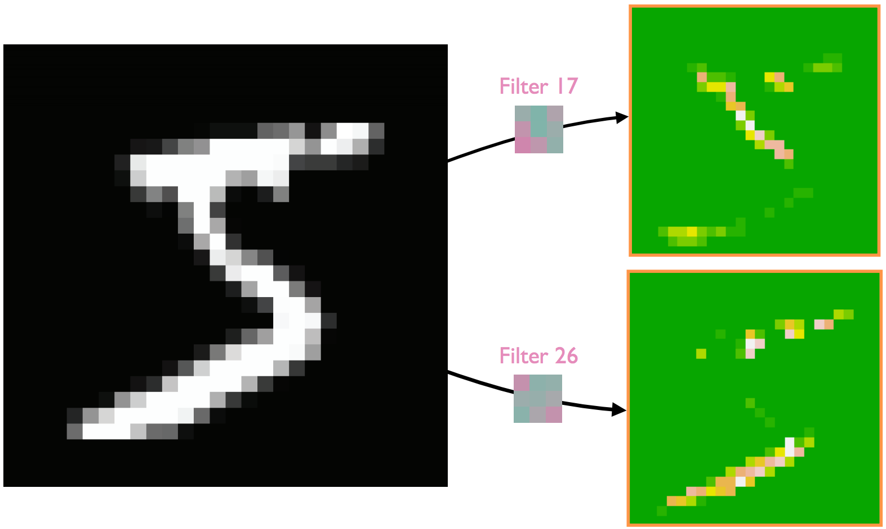

# Densely connected MLPs find common patterns

```{r setup, include=FALSE, cache=FALSE}
# set working directory to docs folder
setwd(here::here("docs"))

# Set global R options
options(htmltools.dir.version = FALSE, servr.daemon = TRUE)

# Set global knitr chunk options
knitr::opts_chunk$set(
  fig.align = "center", 
  cache = TRUE,
  error = FALSE,
  message = FALSE, 
  warning = FALSE, 
  collapse = TRUE 
)

# Use a clean black and white ggplot2 theme
library(keras)
library(tidyverse)
library(gganimate)
thm <- theme_bw()
theme_set(thm)
```

.pull-left[

```{r, echo=FALSE}
mnist <- dataset_mnist()
c(c(train_images, train_labels), c(test_images, test_labels)) %<-% mnist

index <- which(train_labels == 5)
number5 <- train_images[index,,]

par(mfrow = c(10, 10), mar = c(0,0,0,0))
for (i in 1:100) {
  plot(as.raster(number5[i,,], max = 255))
}
```

]

.pull-right[

```{r, echo=FALSE}
avg5 <- matrix(nrow = 28, ncol = 28)
for (i in seq_len(28)) {
  for (j in seq_len(28)) {
    avg5[i, j] <- mean(number5[, i, j])
  }
}

plot(as.raster(avg5, max = max(avg5)))
```

]

---
# Densely connected MLPs find common patterns

.pull-left[

```{r, echo=FALSE}
par(mfrow = c(10, 10), mar = c(0,0,0,0))
for (i in 1:100) {
  plot(as.raster(train_images[i,,], max = 255))
}
```

]

.pull-right[

```{r, echo=FALSE}
avg_nums <- list()

for (number in 0:9) {
  index <- which(train_labels == number)
  subset_images <- train_images[index,,]
  avg <- matrix(nrow = 28, ncol = 28)
  for (i in seq_len(28)) {
    for (j in seq_len(28)) {
      avg[i, j] <- mean(subset_images[, i, j])
    }
  }
  avg_nums[[number + 1]] <- avg
}

par(mfrow = c(2, 5), mar = c(0,0,0,0))
for (avg_image in seq_along(avg_nums)) {
  avg_number_matrix <- avg_nums[[avg_image]]
  plot(as.raster(avg_number_matrix, max = max(avg_number_matrix)))
}
```

]

---
class: clear

.red.font160[But they also expect the features to be conistently located...]

.pull-left[

```{r, echo=FALSE}
# create ordered MNIST features
index <- sort(train_labels, index.return = TRUE)$ix
sorted_images <- train_images[index,,]
image_features <- array_reshape(sorted_images, c(60000, 28 * 28))

# create ordered AMES

# plot all outputs
par(mar = c(0,0,0,0))
plot(as.raster(image_features[c(1:99, 6000:6099, 15000:15099, 20000:20099, 30000:30099,
                                35000:35099, 40000:40099, 45000:45099, 50000:50099,
                                59000:59099),], max = 255))
```

]

.pull-right[

```{r, echo=FALSE}
par(mfrow = c(2, 5), mar = c(0,0,0,0))
for (avg_image in seq_along(avg_nums)) {
  avg_number_matrix <- avg_nums[[avg_image]]
  plot(as.raster(avg_number_matrix, max = max(avg_number_matrix)))
}
```

]

---
class: clear, center, middle
background-image: url(images/Computer-Vision.png)
background-size: cover

---
# .red[Image variance]

.pull-left[

Computer vision should be robust to ___image variance___

]

.pull-right[

```{r, echo=FALSE, out.height="80%", out.width="80%"}

```

]

---
# Convolutional neural networks (CNNs)

<br>

```{r, echo=FALSE}
knitr::include_graphics("https://iq.opengenus.org/content/images/2019/04/pic01-1.png")
```

---
# CNNs...

.pull-left[

.bold[identify a hierarchy of features]

<br>

```{r, echo=FALSE}

```


]

--

.pull-right[

 .bold[provide several features to allow for image variance]

```{r, echo=FALSE, out.height="60%", out.width="60%"}

```

]

---
# Case studies

.pull-left[
.bold.center[MNIST]

```{r, echo=FALSE}
knitr::include_graphics("https://upload.wikimedia.org/wikipedia/commons/2/27/MnistExamples.png")
```

]

.pull-right[
.bold.center[Cats vs Dogs]

```{r, echo=FALSE}
knitr::include_graphics("images/woof_meow.jpg")
```


]

---
# New concepts

.pull-left.font140[
* Image variance

* Spatial hierarchy

* Convolutions

* Filters and kernels

* Feature maps
]

.pull-right.font140[
* Pooling

* Flattening

* Augmentation

* Pre-trained networks
]

---
class: clear, center, middle

.font300.bold[MNIST revisited as a CNN]

.opacity[
```{r, echo=FALSE, out.height="100%", out.width="100%"}
knitr::include_graphics("https://upload.wikimedia.org/wikipedia/commons/2/27/MnistExamples.png")
```
]

---
# The structure of CNN models

<br>

```{r, echo=FALSE}

```

---
# What the convolution operation is doing

.pull-left[

* A convolution layer has an input and a ___filter___ (aka kernel)

* The filter is typically a 3x3 or 5x5 matrix of weights

* Similar to MLP these weights are initially randomized, updated and optimized with backpropagation

]

.pull-right[

```{r, echo=FALSE}
knitr::include_graphics("https://miro.medium.com/max/1026/1*cTEp-IvCCUYPTT0QpE3Gjg@2x.png")
```

]

---
# What the convolution operation is doing

.pull-left[

* We slide this filter over the inputs and perform a simple computation:

$$(1 \times 1) + (1 \times 0) + \cdots + (0 \times 0) + (1 \times 1)$$

* Results in a scalar value that goes into a new matrix called a ___feature map___

]

.pull-right[

```{r, echo=FALSE}
knitr::include_graphics("https://miro.medium.com/max/1018/1*ghaknijNGolaA3DpjvDxfQ@2x.png")
```

]

---
# What the convolution operation is doing

.pull-left[

* We place this filter over the inputs and perform a simple computation:

$$(1 \times 1) + (1 \times 0) + \cdots + (0 \times 0) + (1 \times 1)$$

* Results in a scalar value that goes into a new matrix called a ___feature map___

* We slide the filter and repeat the process to complete our feature map matrix

]

.pull-right[

```{r, echo=FALSE, out.height="110%", out.width="110%"}
knitr::include_graphics("https://cdn-media-1.freecodecamp.org/images/Htskzls1pGp98-X2mHmVy9tCj0cYXkiCrQ4t")
```

]

---
# What the convolution operation is doing

.pull-left.opacity[

* We place this filter over the inputs and perform a simple computation:

$$(1 \times 1) + (1 \times 0) + \cdots + (0 \times 0) + (1 \times 1)$$

* Results in a scalar value that goes into a new matrix called a ___feature map___

* We slide the filter and repeat the process to complete our feature map matrix

]

.pull-right.opacity[

```{r, echo=FALSE, out.height="110%", out.width="110%"}
knitr::include_graphics("https://cdn-media-1.freecodecamp.org/images/Htskzls1pGp98-X2mHmVy9tCj0cYXkiCrQ4t")
```

]

But what does `filters = 32` mean?

```{r, eval=FALSE}
model <- keras_model_sequential() %>%
  layer_conv_2d(filters = 32, ...) #<<
```

---
# Many feature maps

.pull-left[

* We're actually going to do this 32 times

* Each convolution will use a different filter (different weights)

]

.pull-right[

```{r, echo=FALSE}

```

]


---
# Many feature maps

.pull-left[

* We're actually going to do this 32 times

* Each convolution will use a different filter (different weights)

* Each feature map will learn unique features represented in the image

]

.pull-right[

```{r, echo=FALSE}

```

]

---
# Many feature maps

.pull-left[

* We're actually going to do this 32 times

* Each convolution will use a different filter (different weights)

* Each feature map will learn unique features represented in the image

* Consequently, the output of a convolution layer will typically be:
   - smaller in width x height
   - deeper due to the multiple feature maps

]

.pull-right[

```{r, eval=FALSE}
summary(model)
Model: "sequential_1"
______________________________________________________________
Layer (type)               Output Shape             Param #   
==============================================================
conv2d_1 (Conv2D)          (None, 26, 26, 32)       320        #<<
______________________________________________________________
max_pooling2d (MaxPooling2 (None, 13, 13, 32)       0         
______________________________________________________________
conv2d_2 (Conv2D)          (None, 11, 11, 64)       18496     
______________________________________________________________
max_pooling2d_1 (MaxPoolin (None, 5, 5, 64)         0         
______________________________________________________________
conv2d_3 (Conv2D)          (None, 3, 3, 64)         36928     
==============================================================
Total params: 55,744
Trainable params: 55,744
Non-trainable params: 0
______________________________________________________________
```

]

---
# .red[Stride] & padding

.pull-left[

* ___Stride___ specifies how much we move the convolution filter at each step
   - most common is 1 (default)
   - larger strides 
      - less feature correlation
      - less memory required
      - minimizes overfitting
   - pooling helps with many of these issues    
]

.pull-right[

```{r, echo=FALSE, out.height="75%", out.width="75%"}
knitr::include_graphics("https://miro.medium.com/max/790/1*L4T6IXRalWoseBncjRr4wQ@2x.gif")
```

```{r, echo=FALSE, out.height="70%", out.width="70%"}
knitr::include_graphics("https://miro.medium.com/max/721/1*4wZt9G7W7CchZO-5rVxl5g@2x.gif")
```

]

---
# Stride & .red[padding]

.pull-left[

* ___Stride___ specifies how much we move the convolution filter at each step

* ___Padding___ zero padding adds a border with values of 0
   - helps keep information at the edges
   - prevents deep models from reducing feature map sizes too quickly
]

.pull-right[

```{r, echo=FALSE}
knitr::include_graphics("https://miro.medium.com/max/1063/1*W2D564Gkad9lj3_6t9I2PA@2x.gif")
```

]

---
# What about images with .red[multiple channels?]

.pull-left.font140[

* Our filter/kernel simply becomes a cube

]

.pull-right[

```{r, echo=FALSE}
knitr::include_graphics("https://miro.medium.com/max/326/1*NsiYxt8tPDQyjyH3C08PVA@2x.png")
```

]

---
# What about images with .red[multiple channels?]

.pull-left.font120[

* Our filter/kernel simply becomes a cube

* but math doesn't get much more complex

* and the output is still a scalar

]

.pull-right[

```{r, echo=FALSE}
knitr::include_graphics("https://miro.medium.com/max/1280/1*ciDgQEjViWLnCbmX-EeSrA.gif")
```

]

---
# ReLU

.pull-left.font110[

* Note that we still use a ReLU activation function

* This applies the ReLU activation across each feature map output from a convolution layer

* Simply puts focus on non-negative values in the feature map

```{r, eval=FALSE}
layer_conv_2d(..., activation = "relu", ...) #<<
```

]

.pull-right[

<br><br>

```{r, echo=FALSE}
knitr::include_graphics("https://ujwlkarn.files.wordpress.com/2016/08/screen-shot-2016-08-07-at-6-18-19-pm.png?w=748")
```

.center[This is why we say the first convolution layer is an _edge_ detector]

]

---
# Pooling for downsampling

.code125[

```{r, eval=FALSE}
model <- keras_model_sequential() %>%
  layer_conv_2d() %>%
  layer_max_pooling_2d(pool_size = c(2, 2)) %>% #<<
  ...
```

]

---
# Pooling for downsampling

.pull-left[

* After one or more convolution operations we usually perform pooling to reduce the dimensionality

* Identifies the most prominent features within each feature map
]

.pull-right[

```{r, echo=FALSE}
knitr::include_graphics("https://miro.medium.com/max/596/1*KQIEqhxzICU7thjaQBfPBQ.png")
```

]

---
# Pooling for downsampling

.pull-left[

* After one or more convolution operations we usually perform pooling to reduce the dimensionality

* Identifies the most prominent features within each feature map

* Pooling reduces the width x height dimensions of each feature map independently, keeping the depth intact

* 2x2 with a stride of 2 is most common
]

.pull-right[

```{r, eval=FALSE}
summary(model)
Model: "sequential_1"
______________________________________________________________
Layer (type)               Output Shape             Param #   
==============================================================
conv2d_1 (Conv2D)          (None, 26, 26, 32)       320        
______________________________________________________________
max_pooling2d (MaxPooling2 (None, 13, 13, 32)       0         #<<
______________________________________________________________
conv2d_2 (Conv2D)          (None, 11, 11, 64)       18496     
______________________________________________________________
max_pooling2d_1 (MaxPoolin (None, 5, 5, 64)         0         
______________________________________________________________
conv2d_3 (Conv2D)          (None, 3, 3, 64)         36928     
==============================================================
Total params: 55,744
Trainable params: 55,744
Non-trainable params: 0
______________________________________________________________
```

]

---
# Pooling for downsampling


.bold[Benefits]...

* makes the feature dimensions smaller and more manageable

* improves computation time & controlls overfitting

* makes the network invariant to image variance $\rightarrow$ a small distortion in input will not change the output of pooling – since we take the maximum / average value in a local neighborhood)

* helps us arrive at an almost scale invariant representation of our image

```{r, echo=FALSE}
knitr::include_graphics("https://ujwlkarn.files.wordpress.com/2016/08/screen-shot-2016-08-06-at-12-45-35-pm.png?w=748")
```

---
# Multiple convolutions & pooling

.pull-left[

.bold[The idea...]

* More convolution steps results in more complicated features learnt

* Initial layers typically find lower level detail features (i.e. edges)

* Subsequent layers aggregate lower level features into larger ones

* Facial recognition example:
   - Layer 1 detects edges
   - Layer 2 uses edges to identify facial items (i.e. eyes, nose, mouth)
   - Layer 3 puts these features together into faces

]

.pull-right[

.bold[A common misinterpretation...]

```{r, echo=FALSE, out.width="80%", out.height="80%"}
knitr::include_graphics("https://ujwlkarn.files.wordpress.com/2016/08/screen-shot-2016-08-10-at-12-58-30-pm.png?w=242&h=256")
```

]

---
# Multiple convolutions & pooling

In reality, early layers will resemble the initial images the most and subsequent layers create abstract images that only make sense mathematically.

```{r, echo=FALSE, out.height="80%", out.width="80%"}
knitr::include_graphics("images/2layer-cnn.png")
```

---
# Check this out!

<br><br><br>
.center[

.font200[Spend a couple minutes playing around with this]

.font150[http://scs.ryerson.ca/~aharley/vis/conv/flat.html]
]

---
# Last step

.pull-left.code60[

___Flattening___ simply takes our last multidimensional convolution output and flattens it into a vector

```{r, eval=FALSE}
model %>%
    layer_flatten() %>% #<<
    layer_dense(units = 64, activation = "relu") %>%
    layer_dense(units = 10, activation = "softmax")

summary(model)
Model: "sequential_1"
______________________________________________________________________________
Layer (type)                       Output Shape              Param #      
==============================================================================
conv2d_1 (Conv2D)                  (None, 26, 26, 32)        320          
______________________________________________________________________________
max_pooling2d (MaxPooling2D)       (None, 13, 13, 32)          0            
______________________________________________________________________________
conv2d_2 (Conv2D)                  (None, 11, 11, 64)      18496        
______________________________________________________________________________
max_pooling2d_1 (MaxPooling2D)     (None, 5, 5, 64)            0            
______________________________________________________________________________
conv2d_3 (Conv2D)                  (None, 3, 3, 64)        36928     #<<   
______________________________________________________________________________
flatten (Flatten)                  (None, 576)                 0         #<<   
______________________________________________________________________________
dense (Dense)                      (None, 64)               36928        
______________________________________________________________________________
dense_1 (Dense)                    (None, 10)                 650          
==============================================================================
Total params: 93,322
Trainable params: 93,322
Non-trainable params: 0
______________________________________________________________________________
```

]

.pull-right[

Feed into a densely connected MLP for final classification.

```{r, echo=FALSE}
knitr::include_graphics("https://miro.medium.com/max/1025/1*IWUxuBpqn2VuV-7Ubr01ng.png")
```

]

---
# Some tips for convolutional layers

* Hyperparameters:
   - filter size: 3x3, 5x5, 7x7
   - stride size
   - number of filters: $2^p \rightarrow$ 32, 64, 128, ..., 1024
   - number of convolutional layers

* Pooling
   - most common size: 2x2 or 3x3
   - not necessary after every convolutional layer
   - balance speed and efficiency with performance
   
* Since the convolution layer does most of the feature extraction, the capacity of the densely connected portion of the network can often be much smaller and use less epochs

* Larger problem sets will require GPUs!

---
class: yourturn
# Your Turn! (lines of code 131+)

.font150[Spend 5 minutes adjusting various CNN components:]

.font140[
- change the number of filters
- change filter/kernel size
- adjust the stride
- add padding
- add more convolution layers
]

---
class: center
# Where are the images?

<br>
<br>

.bold[Cats vs Dogs Case Study]

[]()

---
class: clear, center, middle

.font300.bold[Cats vs. Dogs]

.opacity[
```{r, echo=FALSE, out.height="85%", out.width="85%"}
knitr::include_graphics("https://miro.medium.com/proxy/1*oB3S5yHHhvougJkPXuc8og.gif")
```
]

```{r image-file-paths, echo=FALSE}
# define the directories:
image_dir <- here::here("docs", "data", "dogs-vs-cats")
train_dir <- file.path(image_dir, "train")
valid_dir <- file.path(image_dir, "validation")
test_dir <- file.path(image_dir, "test")

# create train, validation, and test file paths for cat images
train_cats_dir <- file.path(train_dir, "cats")
valid_cats_dir <- file.path(valid_dir, "cats")
test_cats_dir <- file.path(test_dir, "cats")

# create train, validation, and test file paths for cat images
train_dogs_dir <- file.path(train_dir, "dogs")
valid_dogs_dir <- file.path(valid_dir, "dogs")
test_dogs_dir <- file.path(test_dir, "dogs")
```

---
# Image augmentation

.pull-left[

There are many approaches we can take to augment images such as:

- rotate the image
- shift the image vertically and horizontally
- shear the image
- zoom in and out
- flip the orientation

```{r, eval=FALSE}
datagen <- image_data_generator(
  rescale = 1/255,
  rotation_range = 40,
  width_shift_range = 0.2,
  height_shift_range = 0.2,
  shear_range = 0.2,
  zoom_range = 0.2,
  horizontal_flip = TRUE,
  fill_mode = "nearest"
)
```

]

---
# Image augmentation

.pull-left[

There are many approaches we can take to augment images such as:

- .bold[rotate the image]
- shift the image vertically and horizontally
- shear the image
- zoom in and out
- flip the orientation

```{r, eval=FALSE}
datagen <- image_data_generator(
  rescale = 1/255,
  rotation_range = 40, #<<
  width_shift_range = 0.2,
  height_shift_range = 0.2,
  shear_range = 0.2,
  zoom_range = 0.2,
  horizontal_flip = TRUE,
  fill_mode = "nearest"
)
```

]

.pull-right[


```{r, echo=FALSE}
plot_image <- function(datagen, n = 16, row = 4, col = 4) {
  # get the first cat image
  fnames <- list.files(train_cats_dir, full.names = TRUE)
  img_path <- fnames[[1]]
  
  # resize & reshape
  img <- image_load(img_path, target_size = c(150, 150))
  img_array <- image_to_array(img)
  img_array <- array_reshape(img_array, c(1, 150, 150, 3))
  
  # generate a a single augmented image
  augmentation_generator <- flow_images_from_data(
    img_array,
    generator = datagen,
    batch_size = 1
  )
  
  # plot 10 augmented images of the first cat image
  op <- par(mfrow = c(row, col), mar = c(0.01, 0.01, 0.01, 0.01))
  for (i in 1:n) {
    batch <- generator_next(augmentation_generator)
    plot(as.raster(batch[1,,,]))
  }
  par(op)
}

datagen <- image_data_generator(
  rescale = 1/255,
  rotation_range = 40,
  #width_shift_range = 0.2,
  #height_shift_range = 0.2,
  #shear_range = 0.2,
  #zoom_range = 0.2,
  #horizontal_flip = TRUE,
  #fill_mode = "nearest"
)

plot_image(datagen)
```

]

---
# Image augmentation

.pull-left[

There are many approaches we can take to augment images such as:

- rotate the image
- .bold[shift the image vertically and horizontally]
- shear the image
- zoom in and out
- flip the orientation

```{r, eval=FALSE}
datagen <- image_data_generator(
  rescale = 1/255,
  rotation_range = 40, 
  width_shift_range = 0.2, #<<
  height_shift_range = 0.2, #<<
  shear_range = 0.2,
  zoom_range = 0.2,
  horizontal_flip = TRUE,
  fill_mode = "nearest"
)
```

]

.pull-right[

```{r, echo=FALSE}
datagen <- image_data_generator(
  rescale = 1/255,
  #rotation_range = 40,
  width_shift_range = 0.2,
  height_shift_range = 0.2,
  #shear_range = 0.2,
  #zoom_range = 0.2,
  #horizontal_flip = TRUE,
  #fill_mode = "nearest"
)

plot_image(datagen)
```

]

---
# Image augmentation

.pull-left[

There are many approaches we can take to augment images such as:

- rotate the image
- shift the image vertically and horizontally
- .bold[shear the image]
- zoom in and out
- flip the orientation

```{r, eval=FALSE}
datagen <- image_data_generator(
  rescale = 1/255,
  rotation_range = 40, 
  width_shift_range = 0.2, 
  height_shift_range = 0.2,
  shear_range = 0.2, #<<
  zoom_range = 0.2,
  horizontal_flip = TRUE,
  fill_mode = "nearest"
)
```

]

.pull-right[

```{r, echo=FALSE}
datagen <- image_data_generator(
  rescale = 1/255,
  #rotation_range = 40,
  #width_shift_range = 0.2,
  #height_shift_range = 0.2,
  shear_range = 25,
  #zoom_range = 0.2,
  #horizontal_flip = TRUE,
  #fill_mode = "nearest"
)

plot_image(datagen)
```

]

---
# Image augmentation

.pull-left[

There are many approaches we can take to augment images such as:

- rotate the image
- shift the image vertically and horizontally
- shear the image
- .bold[zoom in and out]
- flip the orientation

```{r, eval=FALSE}
datagen <- image_data_generator(
  rescale = 1/255,
  rotation_range = 40, 
  width_shift_range = 0.2, 
  height_shift_range = 0.2,
  shear_range = 0.2, 
  zoom_range = 0.2, #<<
  horizontal_flip = TRUE,
  fill_mode = "nearest"
)
```

]

.pull-right[

```{r, echo=FALSE}
datagen <- image_data_generator(
  rescale = 1/255,
  #rotation_range = 40,
  #width_shift_range = 0.2,
  #height_shift_range = 0.2,
  #shear_range = 0.2,
  zoom_range = 0.4,
  #horizontal_flip = TRUE,
  #fill_mode = "nearest"
)

plot_image(datagen)
```

]

---
# Image augmentation

.pull-left[

There are many approaches we can take to augment images such as:

- rotate the image
- shift the image vertically and horizontally
- shear the image
- zoom in and out
- .bold[flip the orientation]

```{r, eval=FALSE}
datagen <- image_data_generator(
  rescale = 1/255,
  rotation_range = 40, 
  width_shift_range = 0.2, 
  height_shift_range = 0.2,
  shear_range = 0.2, 
  zoom_range = 0.2, 
  horizontal_flip = TRUE, #<<
  fill_mode = "nearest"
)
```

]

.pull-right[

```{r, echo=FALSE}
datagen <- image_data_generator(
  rescale = 1/255,
  #rotation_range = 40,
  #width_shift_range = 0.2,
  #height_shift_range = 0.2,
  #shear_range = 0.2,
  #zoom_range = 0.2,
  horizontal_flip = TRUE,
  #fill_mode = "nearest"
)

plot_image(datagen)
```

]

---
# Image augmentation

.pull-left[

There are many approaches we can take to augment images such as:

- rotate the image
- shift the image vertically and horizontally
- shear the image
- zoom in and out
- flip the orientation

```{r, eval=FALSE}
datagen <- image_data_generator(
  rescale = 1/255,
  rotation_range = 40, 
  width_shift_range = 0.2, 
  height_shift_range = 0.2,
  shear_range = 0.2, 
  zoom_range = 0.2, 
  horizontal_flip = TRUE, 
  fill_mode = "nearest" #<<
)
```

]

.pull-right[

```{r, echo=FALSE}
datagen1 <- image_data_generator(
  rescale = 1/255,
  rotation_range = 40,
  width_shift_range = 0.2,
  height_shift_range = 0.2,
  shear_range = 0.2,
  zoom_range = 0.2,
  horizontal_flip = TRUE,
  fill_mode = "constant"
)
datagen2 <- image_data_generator(
  rescale = 1/255,
  rotation_range = 40,
  width_shift_range = 0.2,
  height_shift_range = 0.2,
  shear_range = 0.2,
  zoom_range = 0.2,
  horizontal_flip = TRUE,
  fill_mode = "nearest"
)
  
# get the first cat image
fnames <- list.files(train_cats_dir, full.names = TRUE)
img_path <- fnames[[1]]

# resize & reshape
img <- image_load(img_path, target_size = c(150, 150))
img_array <- image_to_array(img)
img_array <- array_reshape(img_array, c(1, 150, 150, 3))

# generate a a single augmented image
augmentation_generator1 <- flow_images_from_data(
  img_array,
  generator = datagen1,
  batch_size = 1
)

augmentation_generator2 <- flow_images_from_data(
  img_array,
  generator = datagen2,
  batch_size = 1
)

# plot 10 augmented images of the first cat image
op <- par(mfrow = c(2, 4), mar = c(0.01, 0.01, 0.01, 0.01))
for (i in 1:8) {
  if (i %in% 1:4) {
    batch <- generator_next(augmentation_generator1)
    plot(as.raster(batch[1,,,]))
  }
  if (i %in% 5:8) {
    batch <- generator_next(augmentation_generator2)
    plot(as.raster(batch[1,,,]))
  }
}
par(op)
```

]

---
class: clear, center, middle

.font300.bold[Transfer Learning]

```{r, echo=FALSE, out.height="85%", out.width="85%"}

```

---
# TBD