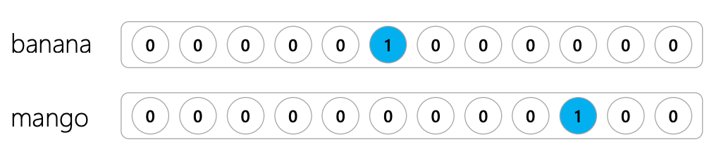
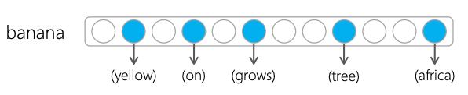
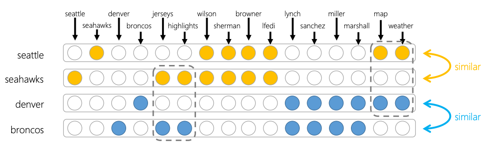
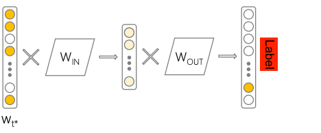

```{r setup, include=FALSE}
library(tidyverse)

# Set global knitr chunk options
knitr::opts_chunk$set(
  fig.align = "center", 
  cache = FALSE,
  error = FALSE,
  message = FALSE, 
  warning = FALSE, 
  collapse = TRUE 
)
```

# Language modeling

<br>

The relative likelihood of words and phrases...

<br><br>

.center[
.font200.blue[Brad is currently teaching a] <font color="red"><u>&nbsp;&nbsp;&nbsp;&nbsp;&nbsp;&nbsp;&nbsp;&nbsp;&nbsp;&nbsp;&nbsp;&nbsp;&nbsp;&nbsp;&nbsp;&nbsp;&nbsp;&nbsp;&nbsp;&nbsp;&nbsp;</u></font>
]

---
# Language modeling

.pull-left[

Significant growth in algorithms:

- [word2vec](https://papers.nips.cc/paper/5021-distributed-representations-of-words-and-phrases-and-their-compositionality.pdf)

- [GloVe](https://nlp.stanford.edu/pubs/glove.pdf)

- [BERT](https://github.com/google-research/bert)

- [ELMo](https://allennlp.org/elmo)

- [ULMFiT](https://arxiv.org/abs/1801.06146)

- [GPT-2](https://github.com/openai/gpt-2)

]

.pull-right[

Many use-cases:

- Keyboard auto-complete

- Speech recognition

- Chat bot Q&A

- Translation

- Text generation

- POS tagging

]

<br>
.blue.center.bold[Advancement in this area has been a result of moving towards vector space representations of terms.]

---
# Vector space representation

.pull-left[

.bold[One-hot encoding] only allows us to account for words as single distinct items without accounting for sequence or relationships to other words

<br>

```{r, echo=FALSE}

```


]

.pull-right[

.bold[Word embeddings] allow us to capture the relationship terms have without other terms. Creates better feature representation.

<br>

```{r, echo=FALSE}

```

<br><br><br><br><br>
.font70.right[Images: [Bhaskar Mitra](https://www.slideshare.net/BhaskarMitra3/neural-text-embeddings-for-information-retrieval-wsdm-2017?from_action=save)]

]

---
# Notions of similarity

.pull-left-40[

Consider the following phrases:

- "seattle map"
- "seattle weather"
- "seahawks jerseys"
- "seahawks highlights"
- "seattle seahawks wilson"
- "seattle seahawks sherman"
- "seattle seahawks browner"
- "seattle seahawks Ifedi"
- "denver map"
- "denver weather"
- "broncos jerseys"
- "broncos highlights"
- "denver broncos lynch"
- "denver broncos sanchez"
- "denver broncos miller"
- "denver broncos marshall"

]

--

.pull-right-60[

<br><br><br>

```{r, echo=FALSE}

```

<br><br><br><br>
.font70.right[Image: [Bhaskar Mitra](https://www.slideshare.net/BhaskarMitra3/neural-text-embeddings-for-information-retrieval-wsdm-2017?from_action=save)]

]

---
# Notions of similarity

.pull-left-40.code70[

```{r, collapse=TRUE}
seattle <- c(0, 1, 0, 0, 0, 0, 1, 1, 1, 1, 0, 0, 0, 0, 1, 1)
seahawks <- c(1, 0, 0, 0, 1, 1, 1, 1, 1, 1, 0, 0, 0, 0, 0, 0)

denver <- c(0, 0, 0, 1, 0, 0, 0, 0, 0, 0, 1, 1, 1, 1, 1, 1)
broncos <- c(0, 0, 1, 0, 1, 1, 0, 0, 0, 0, 1, 1, 1, 1, 0, 0)

# rbind
m1 <- rbind(seattle, seahawks, denver, broncos)

# similarities
similarities <- text2vec::sim2(m1)
Matrix::tril(similarities)
```

.content-box-gray.center[Measured with cosine similarity]

]

.pull-right-60[

<br><br><br>

```{r, echo=FALSE}

```

<br><br><br><br>
.font70.right[Image: [Bhaskar Mitra](https://www.slideshare.net/BhaskarMitra3/neural-text-embeddings-for-information-retrieval-wsdm-2017?from_action=save)]

]

---
# How do we get embeddings from this?

<br><br><br><br><br>

.center.bold.font180[Let's check out a simple example in...Excel 😳 !]

---
# Example

```{r, echo=FALSE}
path <- here::here("materials", "data", "glove", "glove.6B.100d.txt")
glove_wts <- data.table::fread(path, quote = "", data.table = FALSE) %>% 
  as_tibble()

names(glove_wts) <- c("word", paste0("v", 1:100))

embeddings <- glove_wts %>%
  filter(word %in% c("king", "man", "boy", "queen", "woman", "girl", "water"))

king_embeddings <- embeddings %>%
  filter(word == "king") %>%
  select(v1:v100) %>%
  gather() %>%
  pull(value)
```

Embeddings for "King" based on Wikipedia (2014 file dump) and Gigaword 5 (2 years of newswire data)

```{r, collapse=TRUE}
king_embeddings
```

---
# Example

```{r, echo=FALSE, fig.align='right', fig.width=15.58, fig.height=2}
embeddings %>% 
  filter(word %in% c("king", "queen")) %>%
  #select(1:40) %>%
  gather(wt, value, -word) %>% 
  mutate(value = round(value, 1),
         word = str_pad(word, 6)) %>%
  ggplot(aes(wt, word, fill = value)) +
  geom_tile() +
  scale_fill_gradientn(colours = hcl.colors(5)) + 
  scale_x_discrete(NULL, expand = c(0, 0)) + 
  scale_y_discrete(NULL, expand = c(0, 0)) + 
  theme(axis.text.x = element_blank(), 
        axis.ticks.x = element_blank(),
        axis.text.y = element_text(size = 20),
        legend.position = "none",
        panel.grid.major = element_line(color = "white", size = 1),
        panel.grid.minor = element_line(color = "white", size = 1))
```

```{r, echo=FALSE, fig.align='right', fig.width=16, fig.height=2}
embeddings %>% 
  filter(word %in% c("man", "woman")) %>%
  #select(1:40) %>%
  gather(wt, value, -word) %>% 
  mutate(value = round(value, 1),
         word = str_pad(word, 6)) %>%
  ggplot(aes(wt, word, fill = value)) +
  geom_tile() +
  scale_fill_gradientn(colours = hcl.colors(5)) + 
  scale_x_discrete(NULL, expand = c(0, 0)) + 
  scale_y_discrete(NULL, expand = c(0, 0)) + 
  theme(axis.text.x = element_blank(), 
        axis.ticks.x = element_blank(),
        axis.text.y = element_text(size = 20),
        legend.position = "none")
```

```{r, echo=FALSE, fig.align='right', fig.width=15.45, fig.height=2}
embeddings %>% 
  filter(word %in% c("boy", "girl")) %>%
  #select(1:40) %>%
  gather(wt, value, -word) %>% 
  mutate(value = round(value, 1),
         word = str_pad(word, 6)) %>%
  ggplot(aes(wt, word, fill = value)) +
  geom_tile() +
  scale_fill_gradientn(colours = hcl.colors(5)) + 
  scale_x_discrete(NULL, expand = c(0, 0)) + 
  scale_y_discrete(NULL, expand = c(0, 0)) + 
  theme(axis.text.x = element_blank(), 
        axis.ticks.x = element_blank(),
        axis.text.y = element_text(size = 20),
        legend.position = "none")
```

```{r, echo=FALSE, fig.align='right', fig.width=15.53, fig.height=1}
embeddings %>% 
  filter(word == "water") %>%
  #select(1:40) %>%
  gather(wt, value, -word) %>% 
  mutate(value = round(value, 1),
         word = str_pad(word, 6)) %>%
  ggplot(aes(wt, word, fill = value)) +
  geom_tile() +
  scale_fill_gradientn(colours = hcl.colors(5)) + 
  scale_x_discrete(NULL, expand = c(0, 0)) + 
  scale_y_discrete(NULL, expand = c(0, 0)) + 
  theme(axis.text.x = element_blank(), 
        axis.ticks.x = element_blank(),
        axis.text.y = element_text(size = 20),
        legend.position = "none")
```

---
# Example

.code150.center[

```{r, echo=FALSE}
embeddings_matrix <- as.matrix(embeddings[, 2:101])
row.names(embeddings_matrix) <- embeddings$word

similarities <- text2vec::sim2(embeddings_matrix)
Matrix::tril(similarities) %>% round(2)
```

]

---
# Resources to learn more about word embeddings

- [Why do we use word embeddings in NLP?](https://towardsdatascience.com/why-do-we-use-embeddings-in-nlp-2f20e1b632d2)

- [The illustrated word2vec](http://jalammar.github.io/illustrated-word2vec/)

- [Sebastian Ruder's series on Word Embeddings](https://ruder.io/word-embeddings-1/index.html)

- [Distributed Representations of Words and Phrases and their Compositionality](https://papers.nips.cc/paper/5021-distributed-representations-of-words-and-phrases-and-their-compositionality.pdf)

- [Efficient Estimation of Word Representations in Vector Space](https://arxiv.org/pdf/1301.3781.pdf)

- [A Neural Probabilistic Language Model](http://www.jmlr.org/papers/volume3/bengio03a/bengio03a.pdf)

- [Speech and Language Processing by Dan Jurafsky and James H. Martin is a leading resource for NLP. Word2vec is tackled in Chapter 6.](https://web.stanford.edu/~jurafsky/slp3/)

- [Chris McCormick](http://mccormickml.com/) has written some great blog posts about Word2vec.

---
# Embeddings for predictive models

.center.font120[Our embeddings are developed to maximize predictive accuracy]

<br>

```{r, echo=FALSE, fig.align='center'}

```

---
# Back home

<br><br><br><br>
[.center[`r anicon::faa("home", size = 10, animate = FALSE)`]](https://github.com/rstudio-conf-2020/dl-keras-tf)

.center[https://github.com/rstudio-conf-2020/dl-keras-tf]