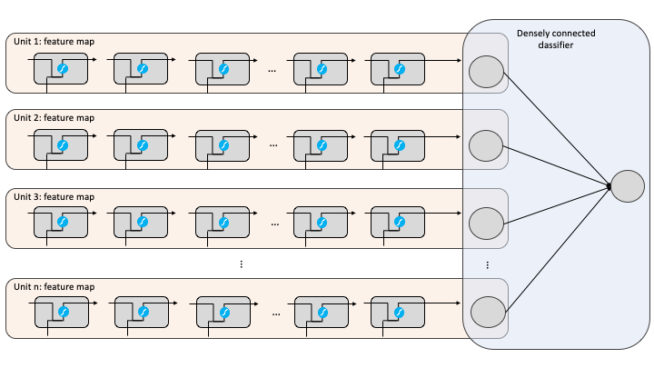

# Text is a sequence of information

.pull-left[

```{r, echo=FALSE}
knitr::include_graphics("images/sequential-text.gif")
```

]

--

.pull-right[

Sometimes our context is nearby:

.center[I grew up in .blue[France] and speak .red[French]]

<br>

Sometimes we need distant context:

.center[My father worked for the .blue[French] retailer .blue[Carrefour] and I
grew up in a little village called .blue[La Roque-Gageac], which is on the north
bank of the .blue[Dordogne River]. Consequently, I learned to speak .red[French]]

]

---
# RNNs

.font120[RNNs are just a looping mechanism that allows us to retain information from
previous states.]

--

.center[We typically see images such as this to represent RNNs:]

```{r, echo=FALSE, fig.align='center'}
knitr::include_graphics("https://cdn-images-1.medium.com/max/1600/1*T_ECcHZWpjn0Ki4_4BEzow.gif")
```

.footnote[Image: [Michael Phi](http://www.kurious.pub/)]

---
# RNNs

.font120[RNNs are just a looping mechanism that allows us to retain information from
previous states.]

.center[But if we unroll this layer, its just a multi-layer perceptron:]

```{r, echo=FALSE, fig.align='center'}
knitr::include_graphics("https://miro.medium.com/max/1400/1*AQ52bwW55GsJt6HTxPDuMA.gif")
```

.footnote[Image: [Michael Phi](http://www.kurious.pub/)]

---
# Hidden state

.pull-left[

This passing of information from previous states is what we call the
.blue[___hidden state___].

It is common for the hidden state to be analogized to .blue[memory].

]

.pull-right[

```{r, echo=FALSE}
knitr::include_graphics("https://miro.medium.com/max/1400/1*o-Cq5U8-tfa1_ve2Pf3nfg.gif")
```

]

.footnote[Image: [Michael Phi](http://www.kurious.pub/)]

---
# Hidden state

.pull-left[

1. The previous hidden state and the current state input are combined to form a
vector. That vector now has information on the current input and previous inputs. 

2. The vector goes through the __tanh__ activation, 

3. The output is the new hidden state, or the memory of the network.

]

.pull-right[

```{r, echo=FALSE, out.width='110%', out.width='110%'}
knitr::include_graphics("https://miro.medium.com/max/1400/1*WMnFSJHzOloFlJHU6fVN-g.gif")
```

]

.footnote[Image: [Michael Phi](http://www.kurious.pub/)]

---
# Tanh activation

.pull-left[

The .blue[__tanh__] activation helps to keep values between -1 and 1.

]

.pull-right[

```{r, echo=FALSE}
knitr::include_graphics("https://miro.medium.com/max/1400/1*iRlEg1GBKRzGTre5aOQUCg.gif")
```

]

.footnote[Image: [Michael Phi](http://www.kurious.pub/)]

---
# Weights

.pull-left[

The .blue[weights] of the network will determine what parts of the sequence to
emphasize (aka .blue[_remember_]) to accurately predict what comes next.

<br>

.center[.opacity20[My father worked for the] .blue[French] .opacity20[retailer]
.blue[Carrefour] .opacity20[and I grew up in a little village called]
.blue[La Roque-Gageac], .opacity20[which is on the north bank of the]
.blue[Dordogne River]. .opacity20[Consequently, I learned to speak] .red[French]]

]

.pull-right[
<br><br><br><br><br>

```{r, echo=FALSE}
knitr::include_graphics("https://colah.github.io/posts/2015-08-Understanding-LSTMs/img/RNN-longtermdependencies.png")
```

]

.footnote[Image: [Christopher Olah](https://colah.github.io/)]

---
# Multiple units

.pull-left[

The number of units we specify in a recurrent layer is analogous to [feature maps](https://rstudio-conf-2020.github.io/dl-keras-tf/04-computer-vision-cnns.html#18)
in CNNs. 

* Each unit will be a full sequence of RNN cells

* Each unit will have its own weight matrix

* Results in different features of the sequence to be emphasized

]

.pull-right[

```{r, echo=FALSE}

```

]

---
# Vanishing gradient

.pull-left.font90[

* When doing back propagation, each node in a layer calculates its gradient with
  respect to the effects of the gradients in the layer before it.

* If the adjustments to the layers before it is small, then adjustments to the
  current layer will be even smaller.
  
* This causes gradients to ___exponentially shrink___ as they back propagate

* Small gradients mean small adjustments, which causes the early layers not to learn.

.center.red[___RNNs can't learn long-range dependencies!___]

]

.pull-right[

<br><br><br>

```{r, echo=FALSE}
knitr::include_graphics("https://cdn-images-1.medium.com/max/1600/1*Ku54qmCryZVBaIc6g8rjGA.gif")
```

]

.footnote[Image: [Michael Phi](http://www.kurious.pub/)]

---
# LSTMs


---
# Learn more

- [Colah's blog](https://colah.github.io/)

- [Michael Phi's "Illustrated" blog](http://www.kurious.pub/)


---
# Back home

<br><br><br><br>
[.center[`r anicon::faa("home", size = 10, animate = FALSE)`]](https://github.com/rstudio-conf-2020/dl-keras-tf)

.center[https://github.com/rstudio-conf-2020/dl-keras-tf]