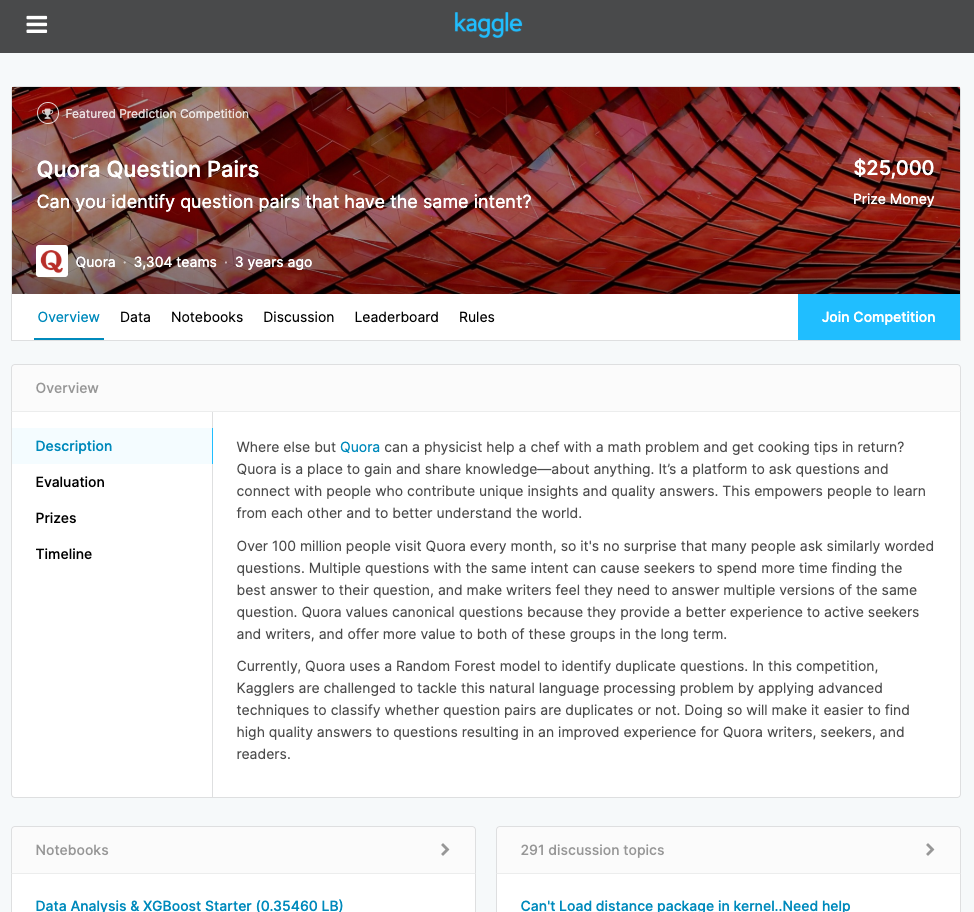
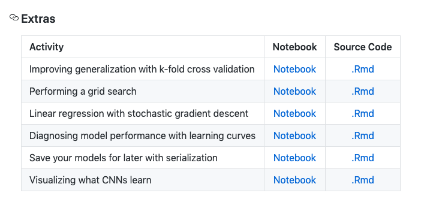

class: inverse, center, middle

# You've learned a lot!

---
# Modeling purposes

.font130[
.pull-left[
.bold[Covered:]

`r clisymbols::symbol$checkbox_on` Regression

`r clisymbols::symbol$checkbox_on` Classification

`r clisymbols::symbol$checkbox_on` Computer vision

`r clisymbols::symbol$checkbox_on` Recommendation systems

`r clisymbols::symbol$checkbox_on` NLP processing & classification

]

.pull-right[
.bold[Not covered:]

`r clisymbols::symbol$checkbox_off` Language modeling

`r clisymbols::symbol$checkbox_off` Time series analysis

`r clisymbols::symbol$checkbox_off` Anomaly detection

`r clisymbols::symbol$checkbox_off` Object detection/tracking

`r clisymbols::symbol$checkbox_off` Video classification

`r clisymbols::symbol$checkbox_off` and more!
]
]

---
# Model architectures

.font130[
.pull-left[
.bold[Covered:]

`r clisymbols::symbol$checkbox_on` MLPs

`r clisymbols::symbol$checkbox_on` CNNs

`r clisymbols::symbol$checkbox_on` Embeddings

`r clisymbols::symbol$checkbox_on` RNNs

`r clisymbols::symbol$checkbox_on` LSTMs

`r clisymbols::symbol$checkbox_on` Transfer learning

]

.pull-right[
.bold[Not covered:]

`r clisymbols::symbol$checkbox_off` Autoencoders

`r clisymbols::symbol$checkbox_off` Reinforcement learning

`r clisymbols::symbol$checkbox_off` Generative adversarial networks

`r clisymbols::symbol$checkbox_off` Natural language models

`r clisymbols::symbol$checkbox_off` Alternative (CNN, RNN, embedding, ...) architectures

]
]

---
# Model gears

.font130[
.pull-left[
.bold[Covered:]

`r clisymbols::symbol$checkbox_on` Tensors  
`r clisymbols::symbol$checkbox_on` Sequential vs functional models  
`r clisymbols::symbol$checkbox_on` Activation functions  
`r clisymbols::symbol$checkbox_on` Derivatives  
`r clisymbols::symbol$checkbox_on` Backward propagation  
`r clisymbols::symbol$checkbox_on` Batches & epochs  
`r clisymbols::symbol$checkbox_on` Learning rate  
`r clisymbols::symbol$checkbox_on` Various types of layers  
`r clisymbols::symbol$checkbox_on` and more!


]

.pull-right[
.bold[Not covered:]

`r clisymbols::symbol$checkbox_off` Batch normalization  
`r clisymbols::symbol$checkbox_off` Gradient clipping  
`r clisymbols::symbol$checkbox_off` Greedy layer-wise pretraining  
`r clisymbols::symbol$checkbox_off` Alternative learning rate schedules  
`r clisymbols::symbol$checkbox_off` Alternative optimizers    
`r clisymbols::symbol$checkbox_off` Alternative callbacks  
`r clisymbols::symbol$checkbox_off` Attention mechanisms  
`r clisymbols::symbol$checkbox_off` Flags for grid searches  
`r clisymbols::symbol$checkbox_off` and more!

]
]

---
class: inverse, center

<br><br><br><br><br>
# You now have the fundamentals knowledge to learn these more advanced features...<br>

---
class: inverse, center

<br><br><br><br><br>
# You now have the fundamentals knowledge to learn these more advanced features...<br><br>So what next `r anicon::cia("https://emojis.slackmojis.com/emojis/images/1542340471/4979/thinking.gif?1542340471", animate = FALSE)`

---
# Immediate pain

.pull-left[

.bold[Give the final project a try]

```{r, echo=FALSE}

```

]

--

.pull-right[

.bold[Check out some of the extra notebooks]

```{r, echo=FALSE}

```

]

---
# Books

.pull-left[

.bold[Start with...]

* [Deep Learning with R](https://www.amazon.com/Deep-Learning-R-Francois-Chollet/dp/161729554X/ref=sr_1_3?keywords=Deep+learning+with+r&qid=1578497534&sr=8-3)

* [Deep Learning with R in Motion](https://www.manning.com/livevideo/deep-learning-with-r-in-motion)

* [Hands-On Machine Learning with Scikit-Learn, Keras, and TensorFlow](https://www.amazon.com/Hands-Machine-Learning-Scikit-Learn-TensorFlow/dp/1492032646/ref=sr_1_2?keywords=Hands-On+Machine+Learning+with+Scikit-Learn%2C+Keras%2C+and+TensorFlow&qid=1578497554&sr=8-2)

* [Better Deep Learning](https://machinelearningmastery.com/better-deep-learning/)

* [Deep Learning for Computer Vision](https://www.pyimagesearch.com/deep-learning-computer-vision-python-book/)

* [Deep Learning](http://www.deeplearningbook.org/) (theoretical)

]

.pull-right[
<br><br><br><br>
.bold.center[These books will point you to other books to read later]
]

---
# Online resources

.font130.pull-left[

.bold[Online courses:]

* [fast.ai](https://www.fast.ai/)
   - Practical Deep Learning for Coders
   - Deep Learning from the Foundations
   - Code-first Introduction to Natural Language Processing

* [Andrew Ng's Deep Learning course](https://www.coursera.org/specializations/deep-learning?edocomorp=mar19affiliate20off&ranMID=40328&ranEAID=vedj0cWlu2Y&ranSiteID=vedj0cWlu2Y-B5mQGmLDcZfcJrMEYdAdGA&siteID=vedj0cWlu2Y-B5mQGmLDcZfcJrMEYdAdGA&utm_content=10&utm_medium=partners&utm_source=linkshare&utm_campaign=vedj0cWlu2Y)

* [Deep Learning with R in Motion](https://www.manning.com/livevideo/deep-learning-with-r-in-motion)
]

.font130.pull-right[

.bold[Other:]

* https://tensorflow.rstudio.com/

* https://keras.rstudio.com/

* https://community.rstudio.com/

* https://www.pyimagesearch.com/

]

---
class: inverse

# Stay in touch!

.font150.white.pull-right-wide[
<br><br>
[`r fontawesome::fa("globe", fill = "white")`](http://bradleyboehmke.github.io/) bradleyboehmke.github.io  <br>
[`r fontawesome::fa("github", fill = "white")`](https://github.com/bradleyboehmke/) @bradleyboehmke  <br>
[`r fontawesome::fa("twitter", fill = "white")`](https://twitter.com/bradleyboehmke) @bradleyboehmke  <br>
[`r fontawesome::fa("envelope", fill = "white")`](mailto:bradleyboehmke@gmail.com) bradleyboehmke@gmail.com  

]

---
# .center.font120[[rstd.io/ws-survey](http://rstd.io/ws-survey)]

```{r, echo=FALSE, out.height="45%", out.width="45%", fig.align='center'}
knitr::include_graphics("https://d2dfxqxblmblx4.cloudfront.net/wp-content/uploads/2016/03/18151100/Survey-2-1024x1024.jpg")
```


---
# Back home

<br><br><br><br>
[.center[`r anicon::faa("home", size = 10, animate = FALSE)`]](https://github.com/rstudio-conf-2020/dl-keras-tf)

.center[https://github.com/rstudio-conf-2020/dl-keras-tf]

