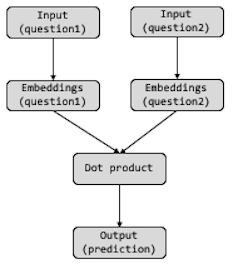
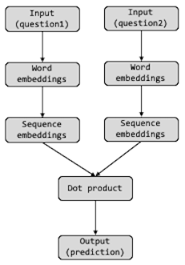

```{r setup, include=FALSE}
knitr::opts_chunk$set(
  echo = TRUE,
  message = FALSE,
  warning = FALSE
  )
```

This project is designed to test your current knowledge on applying several of
the skills you learned today (i.e. embeddings, LSTM, functional keras API). The
objective is to develop a model that predicts which of the provided pairs of
Quora questions contain the same meaning (could be classified as duplicates).
The dataset first appeared in the Kaggle competition
[Quora Question Pairs](https://www.kaggle.com/c/quora-question-pairs) and
consists of approximately 400,000 pairs of questions along with a column
indicating if the question pair is considered a duplicate.

After you complete this project, you can read about Quora's approach to this
problem in this [blog post](https://bit.ly/39po8VI).

___Good luck!___

# Package Requirements

```{r}
library(keras)
library(tidyverse)
library(rsample)
library(testthat)
library(glue)
```

# Import Data

Data can be downloaded from the Kaggle dataset webpage or from Quora’s release
of the dataset. The data set should contain 404,290 observations and 6 columns.

```{r}
quora_data <- get_file(
  "quora_duplicate_questions.tsv",
  "http://qim.fs.quoracdn.net/quora_duplicate_questions.tsv"
) %>%
  read_tsv()

expect_equal(dim(quora_data), c(404290, 6))
```

<br><center>⚠️⚠️⚠️⚠️⚠️⚠️⚠️⚠️⚠️⚠️⚠️⚠️⚠️⚠️️⚠️⚠️⚠️⚠️⚠️⚠️</center><br>

Often when you are working with large datasets, it is wise to just start with
a fraction of the data to do initial model exploration. Once you have a good
working model, then you can remove this code chunk and run the analysis on the
full dataset. Note that modeling with the full dataset can take multiple hours
on a CPU and even close to an hour on a GPU when using LSTM layers.

<br><center>⚠️⚠️⚠️⚠️⚠️⚠️⚠️⚠️⚠️⚠️⚠️⚠️⚠️⚠️️⚠️⚠️⚠️⚠️⚠️⚠️</center>

```{r}
# remove after you have a good working model
set.seed(123)
quora_data <- quora_data %>% sample_frac(0.05)
dim(quora_data)
```

Our dataset contains six columns. The last three columns are the ones of
interest:

* __id__: observation (aka row) ID
* __qid1__, __qid2__: unique IDs of each question
* __question1__, __question2__: the full text of each question
* __is_duplicate__: the target variable, set to 1 if question1 and question2
  have essentially the same meaning, and 0 otherwise.

```{r}
quora_data
```

# Data Exploration

We can see that approximately 36% of our question pairs represent questions with
similar meaning (aka duplicates). For this project you do not need to worry
about resampling procedures to balance the response.

```{r}
table(quora_data$is_duplicate) %>% prop.table()
```

Now let's assess our questions text. First, we'll get all unique questions.

```{r}
unique_questions <- unique(c(quora_data$question1, quora_data$question2))
```

Let’s take a look at the number of unique words across all our questions. This
will helps us to decide the vocabular size, which can be treated as a
hyperparameter of our model.

The following code chunk:

1. splits up all our text into individual words,
2. does some text cleaning to remove punctuations and normalize the case,
3. and computes the number of unique words.

We can see that there are 110,842 unique words in the full dataset (23,739
unique words when using our sampled data).

```{r}
unique_questions %>% 
  str_split(pattern = " ") %>% 
  unlist() %>% 
  str_remove_all(pattern = "[[:punct:]]") %>%
  str_to_lower() %>%
  unique() %>% 
  length()
```

Let’s take a look at the number of words in each question. This will helps us to
decide the padding length, another hyperparameter of our model. We can see that
nearly all questions have 32 or less words.

```{r}
unique_questions %>%
  map_int(~ str_count(., "\\w+")) %>%
  quantile(c(0.25, 0.5, 0.75, 0.99), na.rm = TRUE)
```

# Set basic hyperparameters

Let's go ahead and set some basic hyperparameters for our model. These are all
values that you can adjust if time allows.

* __vocab_size__: The size of our vocab. Often, we start with about 50% of our
  total vocab size. So we can start with about 10,000 for our sampled dataset
  and 50,000 for the entire dataset. This would be a hyperparameter you tune
  for optimal performance.
* __max_len__: Length to pad each question to. Since the text is shorter, and
  we want to capture as much content as possible in each question, we can set
  this using the upper quantile (80-95%) of the word distribution, which equates
  to 15-25.
* __embedding_size__: The size of the word embeddings. We'll start large since
  we want to capture fine relationships aross semantic meanings.
* __lstm_size__: The size of the LSTM sequence embedding. Similar to the word
  embedding size, We'll start large since we want to capture fine relationships
  aross semantic meanings.

```{r}
vocab_size <- 10000
max_len <- 20
embedding_size <- 256
lstm_size <- 512
```

# Preprocess our text

Next, let's create a text tokenizer to define how we want to preprocess the text
(i.e. convert to lowercase, remove punctuation, token splitting characters) and
then apply it to our question text.

```{r}
tokenizer <- text_tokenizer(num_words = vocab_size) %>%
  fit_text_tokenizer(unique_questions)
```

Next, let's create two new objects:

* `question1`: the text tokenizer for all `quora_data$question1` text
* `question2`: the text tokenizer for all `quora_data$question2` text

```{r}
question1 <- texts_to_sequences(tokenizer, quora_data$question1)
question2 <- texts_to_sequences(tokenizer, quora_data$question2)
```

If you look at the first 6 `question1` obs, we see that they are of different
length. To create embeddings for these questions, we need to standardize their
length.  Go ahead and create two new objects (`question1_padded` & `question2_padded`)
that pad `question1` and `question2`. 

The default padding value is 0, but this value is often used for words that
don’t appear within the established word index. We could still pad with this
value or we could differentiate this value by padding with `vocab_size + 1`.

```{r}
question1_padded <- pad_sequences(question1, maxlen = max_len, value = vocab_size + 1)
question2_padded <- pad_sequences(question2, maxlen = max_len, value = vocab_size + 1)
```

We have now finished the preprocessing steps. We will now run a simple benchmark
model before moving on to the Keras model.

# Simple benchmark

Before creating a complicated model let’s take a simple approach. Let’s create
two predictors: percentage of words from question1 that appear in the question2
and vice-versa. Then we will use a logistic regression to predict if the
questions are duplicates.

```{r}
perc_words_question1 <- map2_dbl(question1, question2, ~mean(.x %in% .y))
perc_words_question2 <- map2_dbl(question2, question1, ~ mean(.x %in% .y))

df_model <- data.frame(
  perc_words_question1 = perc_words_question1,
  perc_words_question2 = perc_words_question2,
  is_duplicate = quora_data$is_duplicate
) %>%
  na.omit()
```

Now that we have our predictors, let’s create the logistic model. We will take a
small sample for validation.

```{r}
set.seed(123)
index <- sample.int(nrow(df_model), 0.9 * nrow(df_model))
benchmark_train <- df_model[index, ]
benchmark_valid <- df_model[-index, ]

logistic_regression <- glm(
  is_duplicate ~ perc_words_question1 + perc_words_question2, 
  family = "binomial",
  data = benchmark_train
)

summary(logistic_regression)
```

Let’s calculate the accuracy on our validation set.

```{r}
pred <- predict(logistic_regression, benchmark_valid, type = "response")
pred <- pred > mean(benchmark_valid$is_duplicate)
accuracy <- table(pred, benchmark_valid$is_duplicate) %>% 
  prop.table() %>% 
  diag() %>% 
  sum()

glue("Our benchmark model achieves a {round(accuracy * 100, 2)}% accuracy.")
```

Now your goal is to create a keras model that out performs this benchmark.

# Modeling with just embeddings

For our first model, we'll use a similar architecture as we saw in the
collaborative filtering notebook [ℹ️](http://bit.ly/dl-cf-notebook) with a
couple of adjustments. In essence, we want to build a model that:

1. creates word embeddings for question 1 and 2,
2. computes the dot product of these embeddings,
3. adds a dense classifier to predict if the questions are duplicates.

```{r, echo=FALSE}

```

First, create the keras model components by filling in the blanks.

1. Input layers
   - we need two inputs, one for each question
   - the input layer shape needs to be the same size as the number of columns of
     our inputs (`question1_padded`, `question2_padded`)
2. Embedding layers
   - build onto our input layers
   - `input_dim`: in this case `input_dim` equals `vocab_size + 2` since we have
      the number of words (`vocab_size`), plus the value 0 represents words not
      in our declared frequency, and the value `vocab_size + 1` represents our
      padding value.
   - `output_dim`: represents the desired embeddings dimension (line 154).
   - `input_length`: represents the length of our inputs (`max_len`). We need
      this value because we need to flatten our embeddings for downstream computation.
3. Flatten layer
   - In the collaborative filtering notebook, we were embedding single input
     values (i.e. user ID & movie ID). In this example, we are embedding inputs
     of length 20 (`max_len`), which results in a matrix. Consequently, we
     flatten these embedding matrices so that we can compute the dot product.
4. Dot product
   - The dot product will be computed for our flattened embeddings of question 1
     and 2.
   - Since we flattened our embeddings we use `axes = 1`
5. Output/prediction
   - Since our response is binary (1 = is duplicate, 0 = not duplicate), we need
     to use the applicable activation function.
     

```{r}
# input layers
input_q1 <- layer_input(shape = max_len, name = "Q1")
input_q2 <- layer_input(shape = max_len, name = "Q2")

# embedding layers
q1_embeddings <- input_q1 %>% 
  layer_embedding(
    input_dim = vocab_size + 2,
    output_dim = embedding_size,
    input_length = max_len,
    name = "Q1_embeddings"
  )

q2_embeddings <- input_q2 %>% 
  layer_embedding(
    input_dim = vocab_size + 2,
    output_dim = embedding_size,
    input_length = max_len,
    name = "Q2_embeddings"
  )

# flatten embeddings
q1_em_flatten <- q1_embeddings %>% layer_flatten(name = "Q1_embeddings_flattened")
q2_em_flatten <- q2_embeddings %>% layer_flatten(name = "Q2_embeddings_flattened")

# dot product
dot <- layer_dot(list(q1_em_flatten, q2_em_flatten), axes = 1, name = "dot_product")

# output/prediction
pred <- dot %>% layer_dense(units = 1, activation = "sigmoid", name = "similarity_prediction")
```

Now that we have all the model components, we can create our functional keras
model and establish the desired compiler.

```{r}
embedding_model <- keras_model(list(input_q1, input_q2), pred)
embedding_model %>% compile(
  optimizer = "rmsprop", 
  loss = "binary_crossentropy", 
  metrics = "accuracy"
)

summary(embedding_model)
```

Before we train our model, let's create training and validation sets based on
the sampling index used for the logistic regression benchmark model. That way we
can compare results directly to the benchmark.

```{r}
train_question1_padded <- question1_padded[index,]
train_question2_padded <- question2_padded[index,]
train_response <- quora_data$is_duplicate[index]

val_question1_padded <- question1_padded[-index,]
val_question2_padded <- question2_padded[-index,]
val_response <- quora_data$is_duplicate[-index]
```

Now we can train our model.

```{r}
m1_history <- embedding_model %>%
  fit(
    list(train_question1_padded, train_question2_padded),
    train_response, 
    batch_size = 64, 
    epochs = 10, 
    validation_data = list(
      list(val_question1_padded, val_question2_padded), 
      val_response
    ),
    callbacks = list(
      callback_early_stopping(patience = 5, restore_best_weights = TRUE),
      callback_reduce_lr_on_plateau(patience = 3)
    )
  )
```

You should see an improvement over and above the benchmark model. 

```{r}
best_epoch <- which(m1_history$metrics$val_loss == min(m1_history$metrics$val_loss))
loss <- m1_history$metrics$val_loss[best_epoch] %>% round(3)
acc <- m1_history$metrics$val_accuracy[best_epoch] %>% round(3)

glue("The best epoch had a loss of {loss} and mean absolute error of {acc}")
```

# Modeling with sequence embeddings using LSTMs

Let's modify our model so that in addition to embedding our questions, we can
use LSTMs to embed our sequences. We do this by adding an LSTM layer after the
embedding layer as represented here:

```{r, echo=FALSE}

```

The idea behind this is that the LSTM sequence embeddings may allow us to improve
the ability to capture questions with strong similarities but worded in
contrasting order and/or length. For example:

> "_I am a 13-year-old boy that wants to learn how to program video games. What
programming languages should I learn? How do I get started?_"

> "_I am entering the world of video game programming and want to know what
language I should learn? Because there are so many languages I do not know which
one to start with. Can you recommend a language that's easy to learn and can be
used with many platforms?_"

To create this model structure, we can use the same input (`input_q1` & `input_q2`)
and word embedding (`q1_embeddings` & `q2_embeddings`) objects created earlier.
However, since our word embeddings showed signs of overfitting, we can create
new word embedding objects that include regularization (another hyperparameter
that could be adjusted).

Now, instead of flattening the word embeddings, we will simply feed them into
LSTM layers, which you can also add regularization if desired. Set the size of
the LSTM layers to that specified with `lstm_size` (line 512). The output of an
LSTM layer is a vector (1D tensor) so we do not need to flatten it prior to
feeding it into the dot product, so the rest of the code is as it was earlier.

```{r}
# word embeddings
q1_embeddings <- input_q1 %>% 
  layer_embedding(
    input_dim = vocab_size + 2,
    output_dim = embedding_size,
    input_length = max_len,
    embeddings_regularizer = regularizer_l2(0.0001),
    name = "Q1_embeddings"
  )

q2_embeddings <- input_q2 %>% 
  layer_embedding(
    input_dim = vocab_size + 2,
    output_dim = embedding_size,
    input_length = max_len,
    embeddings_regularizer = regularizer_l2(0.0001),
    name = "Q2_embeddings"
  )

# sequence embeddings
q1_lstm <- q1_embeddings %>%
  layer_lstm(
    units = lstm_size, 
    kernel_regularizer = regularizer_l2(0.0001), 
    name = "Q1_lstm"
    )

q2_lstm <- q2_embeddings %>%
  layer_lstm(
    units = lstm_size, 
    kernel_regularizer = regularizer_l2(0.0001),  
    name = "Q2_lstm"
    )

# dot product
dot <- layer_dot(list(q1_lstm, q2_lstm), axes = 1, name = "dot_product")

# output/prediction
pred <- dot %>% layer_dense(units = 1, activation = "sigmoid", name = "similarity_prediction")
```

Now create and compile the model as before.

```{r}
lstm_model <- keras_model(list(input_q1, input_q2), pred)
lstm_model %>% compile(
  optimizer = "rmsprop", 
  loss = "binary_crossentropy", 
  metrics = "accuracy"
)

summary(lstm_model)
```

Now train the model as before. Note how much slower training time is when we add
LSTM layers!

```{r}
m2_history <- lstm_model %>%
  fit(
    list(train_question1_padded, train_question2_padded),
    train_response, 
    batch_size = 64, 
    epochs = 20, 
    validation_data = list(
      list(val_question1_padded, val_question2_padded), 
      val_response
    ),
    callbacks = list(
      callback_early_stopping(patience = 5, restore_best_weights = TRUE),
      callback_reduce_lr_on_plateau(patience = 3)
    )
  )
```

You should see an improvement over and above the benchmark model. 

```{r}
best_epoch <- which(m2_history$metrics$val_loss == min(m2_history$metrics$val_loss))
loss <- m2_history$metrics$val_loss[best_epoch] %>% round(3)
acc <- m2_history$metrics$val_accuracy[best_epoch] %>% round(3)

glue("The best epoch had a loss of {loss} and mean absolute error of {acc}")
```

# Next steps

Once you get the above models working on a smaller fraction of the data, go
ahead and train them on the entire dataset (you'll need to re-run the
preprocessing steps). Feel free to tune the hyperparameters to find a near
optimal model (although time will be a constraint). If you find the right model
you will be able to get near 85% accuracy.

Although training time for these models can be quite slow, applying the models
to new input (aka "scoring") is quite fast. For example, the following function
can be used to make predictions. In this function we preprocess the input data
in the same way we preprocessed the training data (`tokenizer`).

```{r}
predict_question_pairs <- function(model, tokenizer, q1, q2) {
  q1 <- texts_to_sequences(tokenizer, list(q1))
  q2 <- texts_to_sequences(tokenizer, list(q2))
  
  q1 <- pad_sequences(q1, 20)
  q2 <- pad_sequences(q2, 20)
  
  as.numeric(predict(model, list(q1, q2)))
}
```

We can now call it with new pairs of questions, for example:

```{r}
Q1 <- "What's R programming?"
Q2 <- "What is R programming?"

pred <- predict_question_pairs(embedding_model, tokenizer, Q1, Q2)

glue("Our model suggests that the supplied questions have a {round(pred, 2)}",
     "probability of being duplicates.", .sep = " ")
```

# Deploy the model

To demonstrate deployment of the trained model, I created a simple Shiny
application, where you can paste 2 questions from Quora and find the probability
of them being duplicates. Follow these steps to run the Shiny app:

1. Save your final preprocessing tokenizer to the `dl-keras-tf/materials/09-project`
directory.
```{r}
save_text_tokenizer(tokenizer, "tokenizer-question-pairs")
```

2. Save your final model to the `dl-keras-tf/materials/09-project` directory.
```{r}
save_model_hdf5(model, "model-question-pairs.hdf5")
```

3. Now launch the Shiny app by running the `app-question-pairs.Rmd` file in the
`dl-keras-tf/materials/09-project` directory.

---

Speaking of duplication^[This project is based on Daniel Falbel's blog post
"Classifying Duplicate Questions from Quora with Keras" on the [TensorFlow for R
blog](https://blogs.rstudio.com/tensorflow/), a great resource to learn from!]