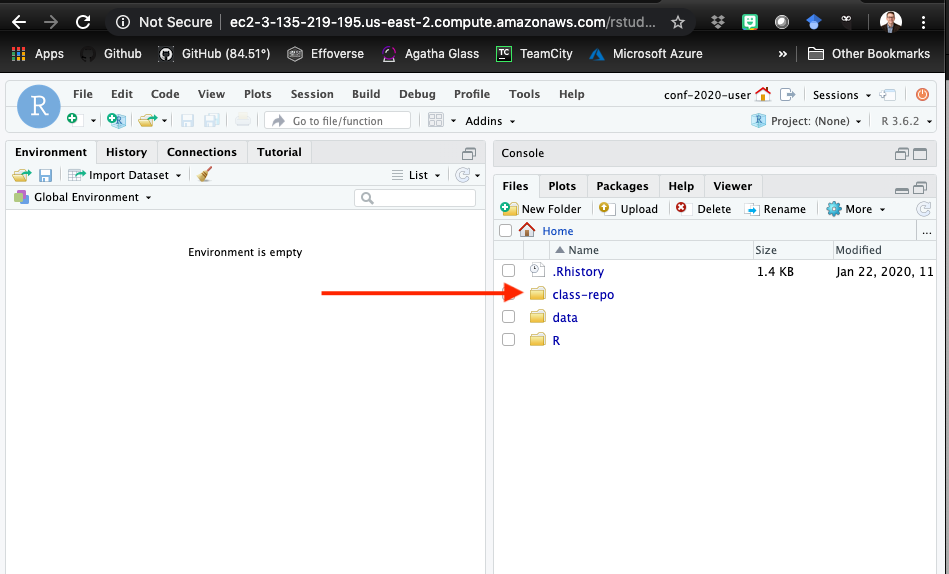
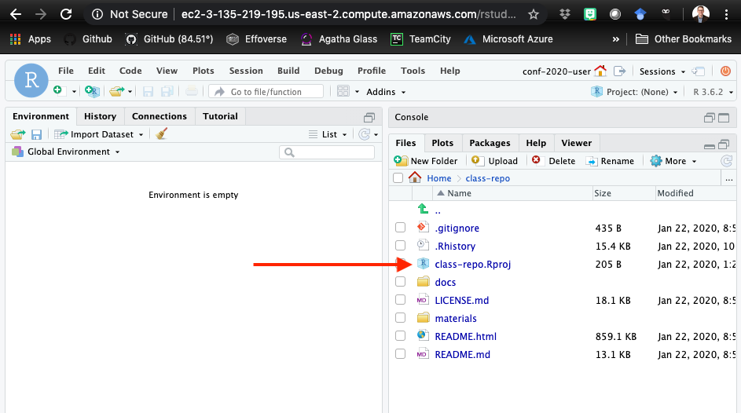
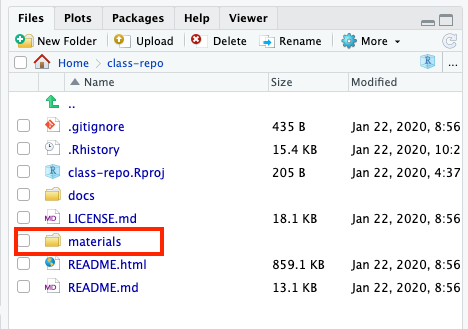

1. Go to http://rstd.io/class

2. Workshop identifier: "deep_learn"

3. A new page will open that provides you with:
   a. A URL to your RStudio server instance (i.e. http://ec2......)
   b. A username and password (they will look very generic)

4. Click on the provided URL and log in with username and password

5. Click on "New Session" - use default settings:
   - Session Name: RStudio Session
   - Editor: RStudio
   - Cluster: Local
   
6. Click on the class-repo folder



7. Click on the class-repo.Rproj to load the project. It will ask you if you
   want to open the project ~/class-repo...choose "Yes"
   


8. Run the following code. If you are connected to GPUs then it will list them.
   
```{r, eval=FALSE}
library(tensorflow)

tf$config$experimental$list_physical_devices()
```

9. __Course notebooks__: You will work through the course notebooks located in the
materials directory. 


