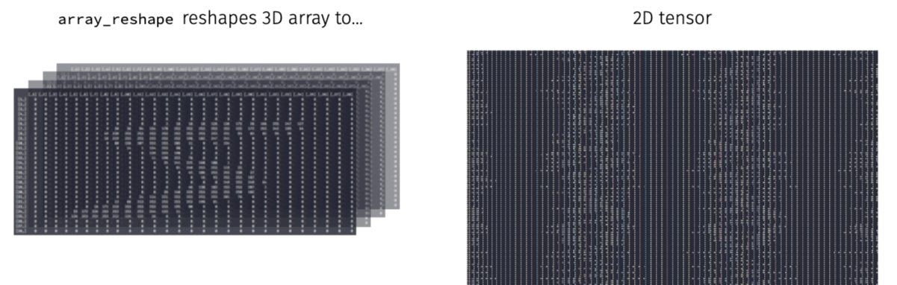

```{r setup, include=FALSE}
knitr::opts_chunk$set(echo = TRUE, message = FALSE, warning = FALSE)
ggplot2::theme_set(ggplot2::theme_minimal())
```

This module is designed to get you thinking about how to strategically approach
training a deep learning (DL) model. Although finding optimal hyperparameters
for a DL model includes a lot of artistry and patience, using a methodical
approach can reduce overall model exploratory time. 

The following steps provide a good mental model for tuning our model. Realize
this approach does not guarantee you'll find the optimal model; however, it
should give you a higher probability of finding a near optimal one.

1. Prepare data
2. Balance batch size with a default learning rate
3. Tune the adaptive learning rate optimizer
4. Add callbacks to control training
5. Explore model capacity
6. Regularize overfitting
7. Repeat steps 1-6
8. Evaluate final model results

We'll demonstrate with one of the most famous benchmark data sets, MNIST. We'll
continue working with a multi-layer perceptron (MLP); however, realize that
these steps also translate to other DL models (i.e. CNNs, RNNs, LSTMs).

# Package Requirements

```{r}
library(keras)       # for modeling
library(tidyverse)   # for wrangling & visualization
library(glue)        # for string literals
```

# MNIST

`keras` has many built in data sets (or functions to automatically install data
sets). Check out the available datasets with `dataset_` + tab.

We're going to use the __MNIST__ data set which is the "hello world" for 
learning deep learning! [ℹ️](http://yann.lecun.com/exdb/mnist/)

```{r data}
mnist <- dataset_mnist()
str(mnist)
```

Our training images (aka features) are stored as 3D arrays

* 60,000 images consisting of a...
* 28x28 matrix with...
* values ranging from 0-255 representing gray scale pixel values.

```{r features}
# 60K images of 28x28 pixels
dim(mnist$train$x)

# pixel values are gray scale ranging from 0-255
range(mnist$train$x)
```

Check out the first digit

```{r first-digit}
digit <- mnist$train$x[1,,]
digit
```

Lets plot the first digit and compare to the above matrix

```{r plot-first-digit}
plot(as.raster(digit, max = 255))
```

Now lets check out the first 100 digits

```{r plot-first-100-digits}
par(mfrow = c(10, 10), mar = c(0,0,0,0))
for (i in 1:100) {
  plot(as.raster(mnist$train$x[i,,], max = 255))
}
```

# Prepare Data

When we work with keras:

* training and test sets need to be independent
* features and labels (aka target, response) need to be independent
* use `%<-%` for ___object unpacking___ (see `?zeallot::%<-%`)

```{r extract-train-test}
c(c(train_images, train_labels), c(test_images, test_labels)) %<-% mnist

# the above is the same as
# train_images <- mnist$train$x
# train_labels <- mnist$train$y
# test_images <- mnist$test$x
# test_labels <- mnist$test$y
```

## Shape into proper tensor form

The shape of our data is dependent on the type of DL model we are training. MLPs
require our data to be in a 2D tensor (aka matrix); however, our data are
currently in a 3D tensor.

We can reshape our tensor from 3D to 2D. Much like a matrix can be flattened to
a vector:

```{r}
m <- matrix(1:9, ncol = 3)
m

# flattened matrix
as.vector(m)
```

We can reshape a 3D array to a 2D array with `array_reshape()`



```{r reshape-to-2D-tensor}
# reshape 3D tensor (aka array) to a 2D tensor (aka matrix)
train_images <- array_reshape(train_images, c(60000, 28 * 28))
test_images <- array_reshape(test_images, c(10000, 28 * 28))

# our training data is now a matrix with 60K observations and
# 784 features (28 pixels x 28 pixels = 784)
str(train_images)
```

Since we are dealing with a multi-classification problem where the target ranges
from 0-9, we'll reformat with `to_categorical()`. 

__Note__: column 1 refers to the digit "0", column 2 refers to the digit "1", etc.

```{r}
train_labels <- to_categorical(train_labels)
test_labels <- to_categorical(test_labels)

head(train_labels)
```

## Stabilize learning by data scaling

When applying DL models, our feature values should not be relatively large
compared to the randomized initial weights _and_ all our features should take
values in roughly the same range. 

> ___When features have large or widely varying values, large gradient updates can
be triggered that will prevent the network from converging___

__Tips__:

1. When all features have the same value range (i.e. images), we can standardize
   values between 0-1.

2. When features varying in range from one another (i.e. age, height, longitude)
   normalize each feature to have mean of 0 and standard deviation of 1 (?`scale()`)

```{r}
# all our features (pixels) range from 0-255
range(train_images)
```

```{r}
# standardize train and test features
train_images <- train_images / 255
test_images <- test_images / 255
```

## Randomize data

Although I know that this data is not ordered, we should always get in the habit
of randomizing our data so that our train and validation datasets are properly
represented.

```{r}
obs <- nrow(train_images)
set.seed(123)
randomize <- sample(seq_len(obs), size = obs, replace = FALSE)
train_images <- train_images[randomize, ]
train_labels <- train_labels[randomize, ]
```

We're finally ready to train some DL models!!

# Balance Batch Size & Default Learning Rate

The learning rate is the most important hyperparameter to get right but before I
tuning it, I like to find a batch size that balances:

- smoothness of the learning curve 
- speed of training

__Tips__: start with...

- a default learning rate,
- a single hidden layer with units set to around `mean(n_features + n_response_classes)`,
- the default batch size of 32,
- then test ranges of batch sizes [16, 32, 64, 128, 256, 512].

```{r}
# get number of features
n_feat <- ncol(train_images)

# 1. Define model architecture
model <- keras_model_sequential() %>%
  layer_dense(units = 512, activation = 'relu', input_shape = n_feat) %>%
  layer_dense(units = 10, activation = 'softmax')

# 2. Define how our model is going to learn
model %>% compile(
  loss = "categorical_crossentropy",
  optimizer = "sgd",
  metrics = "accuracy"
)

summary(model)
```

Let's train our model with the default batch size of 32.

```{r}
# 3. Train our model
history <- model %>% fit(
  train_images, train_labels,
  validation_split = 0.2
  )
```

```{r}
history
```

```{r}
plot(history)
```


## Your turn! (3min)

Now retrain the same model but try with batch sizes of 16, 128, 512 while
leaving everything else the same. How do the results (loss, accuracy, and
compute time) compare?

```{r}
# define model architecture
model <- keras_model_sequential() %>%
  layer_dense(units = 512, activation = 'relu', input_shape = n_feat) %>%
  layer_dense(units = 10, activation = 'softmax')

# define how the model is gonig to learn
model %>% compile(
  loss = "categorical_crossentropy",
  optimizer = "sgd",
  metrics = "accuracy"
  )

history <- model %>% fit(
  train_images, train_labels,
  validation_split = 0.2,
  ____ = ____
  )
```


# Pick an Adaptive Learning Rate Optimizer

Once we've picked an adequate batch size, next we want to start tuning the
learning rate. There are two main considerations:

1. We usually always assess different learning rates ranging from [1e-1, 1e-7].
2. Adaptive learning rate optimizers nearly always outperform regular SGD

> ___Adaptive learning rates help to escape "saddle points".___


__Tips__: the primary adaptive learning rates include:

- SGD with momentum `?optimizer_sgd()`.
- RMSprop (`?optimizer_rmsprop()`) which adds an exponentially decaying average
  of squared gradients --> similar effect as momentum.
- Adam (`?optimizer_adam()`) which is RMSprop + momentum
- Each has their own default learning rates so tune relative to those values
- See https://ruder.io/optimizing-gradient-descent/ for more details

## Your turn! (5min)

Retrain our DL model using:

- SGD with momentum (`optimizer_sgd()`)
  - Try default learning rate (0.01) with momentum (0.5, 0.9, 0.99)
  - Try larger learning rates (0.1, 1) with momentum
- RMSprop (`optimizer_rmsprop()`)
  - What is the default learning rate? Train with default.
  - Try a larger learning rate. What happens?
- Adam (`optimizer_adam()`)
  - What is the default learning rate? Train with default.
  - Try a larger learning rate. What happens?

```{r}
model <- keras_model_sequential() %>%
  layer_dense(units = 512, activation = 'relu', input_shape = n_feat) %>%
  layer_dense(units = 10, activation = 'softmax')

model %>% compile(
  loss = "categorical_crossentropy",
  optimizer = ____,
  metrics = "accuracy"
  )

history <- model %>% fit(
  train_images, train_labels,
  validation_split = 0.2,
  batch_size = 128
  )
```

# Add Callbacks

When training a model, sometimes we want to:

- automatically stop a model once performance has stopped improving
- dynamically adjust values of certain parameters (i.e. learning rate)
- log model information to use or visualize later on
- continually save the model during training and save the model with the best
  performance
  
Keras provides a suite of tools called ___callbacks__ that help us to monitor,
control, and customize the training procedure.

## Stop training at the right time

We often don't know how many epochs we'll need to reach a minimum loss. The
early stopping callback allows us to automatically stop training after we
experience no improvement in our loss after `patience` number of epochs.

__Tip__:

* If you are going to use the model after training you always want to retain the
  "best" model, which is the model with the lowest loss. `restore_best_weights`
  will restore the weights for this "best" model even after you've passed it by
  n epochs.
  
* Sometimes your model will stall on a low validation loss resulting in a tie.
  Even with early stopping the model will continue to train for all the epochs.
  `min_delta` allows you to state some small value that the loss must improve by
  otherwise it will stop.

```{r}
model <- keras_model_sequential() %>%
  layer_dense(units = 512, activation = 'relu', input_shape = n_feat) %>%
  layer_dense(units = 10, activation = 'softmax')

model %>% compile(
  loss = "categorical_crossentropy",
  optimizer = optimizer_sgd(lr = 0.1, momentum = 0.9),
  metrics = "accuracy"
)

history <- model %>% fit(
  train_images, train_labels,
  validation_split = 0.2,
  batch_size = 128,
  epochs = 20,
  callback = callback_early_stopping(patience = 3, restore_best_weights = TRUE,
                                     min_delta = 0.0001)
  )
```

```{r}
history
```

Note how we did not train for all the epochs...only until our loss didn't
improve by 0.0001 for 3 consistent epochs.

```{r}
plot(history)
```

## Add a learning rate scheduler

Although adaptive learning rate optimizers adjust the velocity of weight updates
depending on the loss surface, we can also incorporate additional ways to modify
the learning rate "on the fly".

__Options__:

- Learning rate decay reduces the learning rate at each epoch. Note the `decay`
  argument in `?optimizer_xxx()`.
  
- There has been some great research on cyclical learning rates (see 
  https://arxiv.org/abs/1506.01186). You can incorporate custom learning rates
  such as this with `callback_learning_rate_scheduler()`. This is more advanced
  but definitely worth reading up on post-workshop.

- A simpler, and very practical approach, is to reduce the learning rate after
  the model has stopped improving with `callback_reduce_lr_on_plateau()`. This
  approach allows the model to tell us when to reduce the learning rate.

__Tip__: When using `decay` or `callback_reduce_lr_on_plateau()`, you can
usually increase the base learning rate so that you learn quickly early on and
then the learning rate will reduce so you can take smaller steps as you approach
the minimum loss.

```{r}
model <- keras_model_sequential() %>%
  layer_dense(units = 512, activation = 'relu', input_shape = n_feat) %>%
  layer_dense(units = 10, activation = 'softmax')

model %>% compile(
  loss = "categorical_crossentropy",
  optimizer = optimizer_sgd(lr = 0.1, momentum = 0.9),
  metrics = "accuracy"
)

history <- model %>% fit(
  train_images, train_labels,
  validation_split = 0.2,
  batch_size = 128,
  epochs = 20,
  callback = list(
    callback_early_stopping(patience = 3, restore_best_weights = TRUE, min_delta = 0.0001),
    callback_reduce_lr_on_plateau(patience = 1, factor = 0.1)
    )
  )
```

```{r}
history
```

```{r}
plot(history)
```

```{r}
plot(history$metrics$lr)
```


# Explore Model Capacity

Now that we have found a pretty good learning rate and we have good control over
our training procedure with callbacks, we can start to assess how the capacity
of our model effects performance.

Recall that we control capacity two ways:

- __width__: the number of units in a hidden layer
- __depth__: the number of hidden layers


## Your turn! (5min)

Explore different model capacities while all other parameters constant. Try
increasing

* Width: remember that the number of units is usually a power of 2 (i.e. 32, 64,
  128, 256, 512, 1024).
* Depth: try using 2 or 3 hidden layers

```{r}
model <- keras_model_sequential() %>%
  ___________ %>%
  layer_dense(units = 10, activation = 'softmax')

model %>% compile(
  loss = "categorical_crossentropy",
  optimizer = optimizer_sgd(lr = 0.1, momentum = 0.9),
  metrics = "accuracy"
)

history <- model %>% fit(
  train_images, train_labels,
  validation_split = 0.2,
  batch_size = 128,
  epochs = 20,
  callback = list(
    callback_early_stopping(patience = 3, restore_best_weights = TRUE, min_delta = 0.0001),
    callback_reduce_lr_on_plateau(patience = 1, factor = 0.1)
    )
  )
```


## Smart experimenting

As we start to experiment more, it becomes harder to organize and compare our
results. Let's make it more efficient by: 

- Creating a function that allows us to dynamically change the number of layers
  and units.
- Using `callback_tensorboard()` which allows us to save and visually compare
  results.

__Tip__: there is another approach to performing grid searches. See the extras
notebook https://rstudio-conf-2020.github.io/dl-keras-tf/notebooks/imdb-grid-search.nb.html
for details.

```{r}
train_model <- function(n_units, n_layers, log_to) {
  
  # Create a model with a single hidden input layer
  model <- keras_model_sequential() %>%
    layer_dense(units = n_units, activation = "relu", input_shape = n_feat)
  
  # Add additional hidden layers based on input
  if (n_layers > 1) {
    for (i in seq_along(n_layers - 1)) {
      model %>% layer_dense(units = n_units, activation = "relu")
    }
  }
  
  # Add final output layer
  model %>% layer_dense(units = 10, activation = "softmax")
  
  # compile model
  model %>% compile(
    loss = "categorical_crossentropy",
    optimizer = optimizer_sgd(lr = 0.1, momentum = 0.9),
    metrics = "accuracy"
  )
  
  # train model and store results with callback_tensorboard()
  history <- model %>% fit(
    train_images, train_labels,
    validation_split = 0.2,
    batch_size = 128,
    epochs = 20,
    callback = list(
      callback_early_stopping(patience = 3, restore_best_weights = TRUE, min_delta = 0.0001),
      callback_reduce_lr_on_plateau(patience = 1, factor = 0.1),
      callback_tensorboard(log_dir = log_to)
      ),
    verbose = FALSE
    )
  
  return(history)
  }
```

Now we can create a grid for various model capacities. We include an ID for each
model, which we will use to save our results within `callback_tensorboard()`.

```{r}
grid <- expand_grid(
  units = c(128, 256, 512, 1024),
  layers = c(1:3)
) %>%
  mutate(id = paste0("mlp_", layers, "_layers_", units, "_units"))
grid
```

Now we can loop through each model capacity combination and train our models.
This will take a few minutes so this is a good time to go to the 🚽.

```{r}
for (row in seq_len(nrow(grid))) {
  # get parameters
  units <- grid[[row, "units"]]
  layers <- grid[[row, "layers"]]
  file_path <- paste0("mnist/", grid[[row, "id"]])
  
  # provide status update
  cat(layers, "hidden layer(s) with", units, "neurons: ")
  
  # train model
  m <- train_model(n_units = units, n_layers = layers, log_to = file_path)
  min_loss <- min(m$metrics$val_loss, na.rm = TRUE)
  
  # update status with loss
  cat(min_loss, "\n", append = TRUE)
}
```

Our results suggest that larger width models tend to perform better but it is
unclear if deeper models add much benefit. However, to get more clarity we can
analyze the learning rates with `tensorboard()`.

Note that `callback_tensorboard()` saved all the model runs in `/mnist`
subdirectory.

```{r}
tensorboard("mnist")
```

## Your turn! (3 min)

Retrain the model with:

- 2 hidden layers
- 1024 units in each hidden layer
- early stopping after 3 epochs of no improvement
- reduce learning rate after 1 epoch of no improvement


```{r}
model <- keras_model_sequential() %>%
  ___________ %>%
  ___________

model %>% compile(
  loss = "categorical_crossentropy",
  optimizer = optimizer_sgd(lr = 0.1, momentum = 0.9),
  metrics = "accuracy"
)

history <- model %>% fit(
  train_images, train_labels,
  validation_split = 0.2,
  batch_size = 128,
  epochs = 20,
  callback = list(
    callback______(patience = _____, restore_best_weights = TRUE, min_delta = 0.0001),
    callback______(patience = _____, factor = 0.1)
    )
  )
```

# Regularize Overfitting

Often, once we've found a model that minimizes the loss, there is still some
overfitting that is occuring...sometimes a lot. So our next objective is to try
flatten the validation loss learning curve and bring it as close to the training
loss curve as possible.

## Weight decay

A common way to mitigate overfitting is to put constraints on the complexity of
a network by forcing its weights to take on small values, which makes the
distribution of weight values more regular. This is called _weight regularization_
and its done by adding to the loss function of the network a cost associated
with having large weights.

If you a familiar with regularized regression [ℹ️](http://bit.ly/homlr-regularize)
(lasso, ridge, elastic nets) then weight regularization is essentially the same
thing. [ℹ️](http://bit.ly/dl-02#23)

$$Loss = MSE + \lambda \sum^p_{j=1} w^2_j$$


__Tips__:

- Although you can use L1, L2 or a combination, L2 is by far the most common and
  is known as ___weight decay___ in the context of neural nets.
- Optimal values vary but when tuning we typically start with factors of $10^{-s}$
  where s ranges between 1-4 (0.1, 0.01, ..., 0.0001).
- The larger the weight regularizer, the more epochs generally required to reach
  a minimum loss.
- Weight decay can cause a noisier learning curve so its often beneficial to
  increase the `patience` parameter for early stopping if this is noticable.

```{r}
model <- keras_model_sequential() %>%
  layer_dense(
    units = 512, activation = "relu", input_shape = n_feat,
    kernel_regularizer = regularizer_l2(l = 0.001)    # regularization parameter
    ) %>%
  layer_dense(
    units = 512, activation = "relu",
    kernel_regularizer = regularizer_l2(l = 0.001)    # regularization parameter
    ) %>%
  layer_dense(units = 10, activation = "softmax")

model %>% compile(
  loss = "categorical_crossentropy",
  optimizer = optimizer_sgd(lr = 0.1, momentum = 0.9),
  metrics = "accuracy"
)

history <- model %>% fit(
  train_images, train_labels,
  validation_split = 0.2,
  batch_size = 128,
  epochs = 20,
  callback = list(
    callback_early_stopping(patience = 3, restore_best_weights = TRUE, min_delta = 0.0001),
    callback_reduce_lr_on_plateau(patience = 1, factor = 0.1)
    )
  )
```

```{r}
history
```

```{r}
plot(history)
```

## Dropout

___Dropout___ is one of the most effective and commonly used regularization
techniques for neural networks. Dropout applied to a layer randomly drops out
(sets to zero) a certain percentage of the output features of that layer. By
randomly dropping some of a layer's outputs we minimize the chance of fitting
patterns to noise in the data, a common cause of overfitting.


__Tip__:

- Dropout rates typically ranges between 0.2-0.5. Sometimes higher rates are
  necessary but note that you will get a warning when supplying rate > 0.5.
- The higher the dropout rate, the slower the convergence so you may need to
  increase the number of epochs.
- Its common to apply dropout after each hidden layer and with the same rate;
  however, this is not necessary.

```{r}
model <- keras_model_sequential() %>%
  layer_dense(units = 512, activation = "relu", input_shape = n_feat) %>%
  layer_dropout(0.3) %>%                            # regularization parameter
  layer_dense(units = 512, activation = "relu") %>%
  layer_dropout(0.3) %>%                           # regularization parameter
  layer_dense(units = 10, activation = "softmax")

model %>% compile(
  loss = "categorical_crossentropy",
  optimizer = optimizer_sgd(lr = 0.1, momentum = 0.9),
  metrics = "accuracy"
)

history <- model %>% fit(
  train_images, train_labels,
  validation_split = 0.2,
  batch_size = 128,
  epochs = 20,
  callback = list(
    callback_early_stopping(patience = 3, restore_best_weights = TRUE, min_delta = 0.0001),
    callback_reduce_lr_on_plateau(patience = 1, factor = 0.1)
    )
  )
```

```{r}
history
```

```{r}
plot(history)
```

# Repeat

At this point, we have a pretty good model. However, often, iterating over these
steps can improve model performance even further. For brevity, we'll act as if
we have found a sufficient solution.

# Evaluate results

Once a final model is chosen, we can evaluate the model on our test set to
provide us with a accurate expectation of our generalization error. Our goal is
that our test error is very close to our validation error.

```{r}
model %>% evaluate(test_images, test_labels, verbose = FALSE)
```

## Confusion matrix

To understand our model's performance across the different response classes, we
can assess a confusion matrix [ℹ️](https://bradleyboehmke.github.io/HOML/process.html#classification-models).

First, we need to predict our classes and also get the actual response values.

```{r}
predictions <- model %>% predict_classes(test_images)
actual <- mnist$test$y
```

We can see the number of missed predictions in our test set

```{r}
missed_predictions <- sum(predictions != actual)
missed_predictions
```

We can use `caret::confusionMatrix()` to get our confusion matrix. We can see
which digits our model confuses the most by analyzing the confusion matrix.

* 9s are often confused with 4s
* 6s are often confused with 0s & 5s
* etc.

```{r confusion-matrix}
caret::confusionMatrix(factor(predictions), factor(actual))
```

## Visualize missed predictions

We can also visualize this with the following:

```{r visual-confusion-matrix}
tibble(
  actual,
  predictions
  ) %>% 
  filter(actual != predictions) %>%
  count(actual, predictions) %>%
  mutate(perc = n / n() * 100) %>% 
  filter(n > 1) %>% 
  ggplot(aes(actual, predictions, size = n)) +
  geom_point(shape = 15, col = "#9F92C6") +
  scale_x_continuous("Actual Target", breaks = 0:9) +
  scale_y_continuous("Prediction", breaks = 0:9) +
  scale_size_area(breaks = c(2, 5, 10, 15), max_size = 5) +
  coord_fixed() +
  ggtitle(paste(missed_predictions, "mismatches")) +
  theme(panel.grid.minor = element_blank()) +
  labs(caption = 'Adapted from Rick Scavetta')
```

# Visualize missed predictions

Lastly, lets check out those mispredicted digits.

```{r mis-predicted-digits}
missed <- which(predictions != actual)
plot_dim <- ceiling(sqrt(length(missed)))

par(mfrow = c(plot_dim, plot_dim), mar = c(0,0,0,0))
for (i in missed) {
  plot(as.raster(mnist$test$x[i,,], max = 255))
}
```

If we look at the predicted vs actual we can reason about why our model 
mispredicted some of the digits.

```{r}
par(mfrow = c(4, 4), mar = c(0,0,2,0))

for (i in missed[1:16]) {
  plot(as.raster(mnist$test$x[i,,], max = 255)) 
  title(main = paste("Predicted:", predictions[i]))
}
```