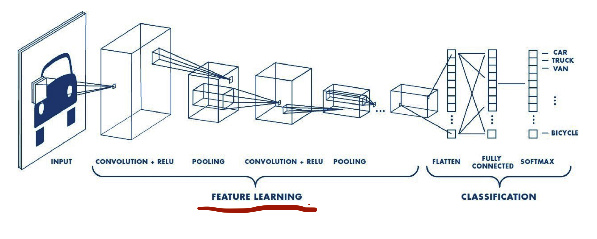
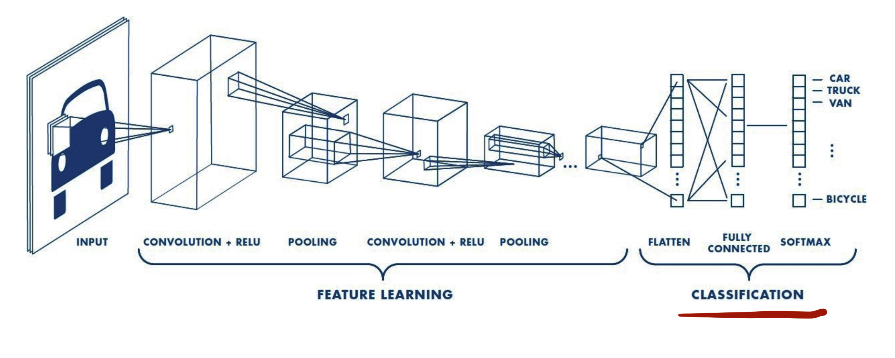

```{r setup, include=FALSE}
knitr::opts_chunk$set(echo = TRUE, message = FALSE, warning = FALSE)
ggplot2::theme_set(ggplot2::theme_minimal())
```

In this example, we are going to revisit the MNIST data set but use a CNN to 
classify the digits. This will take us one step closer to image classification 
and you will learn the fundamental concepts behind CNNs. [ℹ️](http://bit.ly/dl-03)

Learning objectives:

- Why is translation invariant & spatial hierarchy important
- What the general structure of CNN models looks like
- What is the convolution operation
- What are feature maps
- How pooling helps by downsampling

# Required packages

```{r}
library(keras)
```

# Prepare data

Let's import our training and test data. Rather than turn our image data into a 
2D tensor as we did in the earlier module, here we convert our data to a 4D 
tensor that has:

- 60K samples (train) and 10K samples (test)
- height x width = 28x28 pixels
- 1 color channel (these are gray scale rather than RGB, which has 3 color
  channels)


As before, our pixels range from 0-255 so we re-scale them to be between 0-1.

```{r get-data}
mnist <- dataset_mnist()
c(c(train_images, train_labels), c(test_images, test_labels)) %<-% mnist

train_images <- array_reshape(train_images, c(60000, 28, 28, 1)) / 255
test_images <- array_reshape(test_images, c(10000, 28, 28, 1)) / 255

train_labels <- to_categorical(train_labels)
test_labels <- to_categorical(test_labels)
```

# CNN: Feature detector

To run a CNN we will follow a very similar approach to what we've seen so far. 
The main difference is that we create a convolution and max pooling procedure 
prior to our densley connected MLP. This is known as our _feature detector_ step. 



We'll discuss the details of these steps shortly but for now just realize these 
main points:

1. our `input_shape` is 28x28 image with 1 color channel,
2. the output of each `layer_conv2d()` and `layer_max_pooling_2d()` is a 3D 
   tensor of shape (height, width, channels),
3. the height and width dimensions tend to shrink as you go deeper in the network,
4. while the number of channels increase.

```{r create-cnn}
model <- keras_model_sequential() %>%
  
  layer_conv_2d(filters = 32, kernel_size = c(3, 3), activation = "relu", 
                input_shape = c(28, 28, 1)) %>%
  layer_max_pooling_2d(pool_size = c(2, 2)) %>%
  
  layer_conv_2d(filters = 64, kernel_size = c(3, 3), activation = "relu") %>%
  layer_max_pooling_2d(pool_size = c(2, 2)) %>%
  
  layer_conv_2d(filters = 64, kernel_size = c(3, 3), activation = "relu")

summary(model)
```

# CNN: Classifier

Next, we feed the last output tensor of shape `(3, 3, 64)` into a densely 
connected MLP. This MLP is to classify our images and we often refer to this 
part of our CNN as the _classifier_. The only new concept here is `layer_flatten()` 
which is reducing the 3D tensor for a given image to a 1D tensor.



```{r add-classifier}
model %>%
  layer_flatten() %>%
  layer_dense(units = 64, activation = "relu") %>%
  layer_dense(units = 10, activation = "softmax")

summary(model)
```

# CNN: Compile & train

These steps are the same as before. However, you will notice that training takes 
longer, which is due to the added CNN procedure. While this model is training,
let's discuss what's happening under the hood of a CNN [ℹ️](http://bit.ly/dl-03#13).

Although we used a fairly basic model without optimizing the learning rate,
model capacity, batch, etc., you will also notice that our model performance is
superior to our MLP model from the earlier module:

- MLP: loss (~ 0.07) & accuracy (~ 0.975)
- CNN: loss (~ 0.04) & accuracy (~ 0.99) 

```{r train-model}
model %>% compile(
  optimizer = "rmsprop",
  loss = "categorical_crossentropy",
  metrics = c("accuracy")
)

history <- model %>% fit(
  train_images, train_labels,
  epochs = 5, 
  batch_size = 128,
  validation_split = 0.2
)
```

```{r}
history
```

```{r learning-curve}
plot(history)
```

# Evaluation

Using our CNN we obtain a test set accuracy of ~ 0.99.

```{r test-eval}
model %>% evaluate(test_images, test_labels, verbose = FALSE)
```

# Your Turn! (10 min)

Spend 10 minutes adjusting various CNN components:

- Change the number of filters
- Change filter/kernel size
- Adjust the stride
- Add padding
- Add more convolution layers

Or keep the same CNN components as above but apply some of the tuning steps we
covered this morning:

- Try different adaptive learning rate optimizers and learning rate values
- How does batch size impact performance
- You can even try to add weight decay or dropout to each layer to control
  overfitting:
    - weight decays can be applied with `kernel_regularizer` within `layer_conv_2d`
    - `layer_dropout()` can be applied before or after pooling but is more commonly
       seen after. Note that dropout in CNNs will randomly drop out entire
       feature maps

```{r your-turn-define}
model <- keras_model_sequential() %>%
  
  layer_conv_2d(filters = ____, kernel_size = ____, activation = "relu", 
                input_shape = c(28, 28, 1)) %>%
  layer_max_pooling_2d(pool_size = ____) %>%
  
  layer_conv_2d(filters = ____, kernel_size = ____, activation = "relu") %>%
  layer_max_pooling_2d(pool_size = ____) %>%
  
  layer_conv_2d(filters = ____, kernel_size = ____, activation = "relu")

model %>%
  _______ %>%
  layer_dense(units = 64, activation = "relu") %>%
  layer_dense(units = 10, activation = "softmax")

model %>% compile(
  optimizer = "rmsprop",
  loss = "categorical_crossentropy",
  metrics = c("accuracy")
)

summary(model)
```

```{r your-turn-train}
history <- model %>% fit(
  train_images, train_labels,
  epochs = 5, 
  batch_size = 64,
  validation_split = 0.2
)
```

# Key takeaways

* CNNs allow us to capture and control for image variance

* The convolution layer provides the main mechanism for feature engineering
   - We slide a filter/kernel over our images to create feature maps
   - We can use striding and padding to control the size of our feature maps
   - Apply pooling to downsample
   
* Always flatten the output of the convolution layer to feed into a dense layer

* Since all our feature engineering occurs in the convolution layer, we typically
  need only one hidden dense layer with far fewer units and epochs to train our
  model
  
[🏠](https://github.com/rstudio-conf-2020/dl-keras-tf)