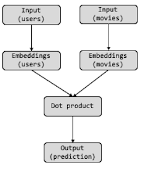
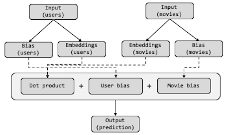

```{r setup, include=FALSE}
knitr::opts_chunk$set(echo = TRUE, cache = TRUE)
ggplot2::theme_set(ggplot2::theme_bw())
```

In this example, we are going to learn how to make a recommendation system using
collaborative filtering. Collaborative filtering is one of the most common
approaches used to recommend products or services to customers and became very
popular after the famous [Netflix competition](https://en.wikipedia.org/wiki/Netflix_Prize).
By creating a collaborative filtering algorithm with keras, you will also be
exposed to how we can create more customized models with keras' functional
model options.

Learning objectives:

- How to create a neural network collaborative filtering algorithm
- How to create a customized functional keras model

# Requirements

```{r, message=FALSE, warning=FALSE}
library(keras)
library(tidyverse)
library(glue)
```

# Prepare our data

For this module we'll use [MovieLens data](https://grouplens.org/datasets/movielens/),
which provides user rating information for movies. There are multiple dataset
sizes; however, for efficiency we will use the smaller dataset that contains
100,836 ratings of 9,724 movies rated by 610 users.

```{r, message=FALSE, warning=FALSE}
data_dir <- here::here("materials", "data", "ml-latest-small")
movies <- read_csv(file.path(data_dir, "movies.csv"))
ratings <- read_csv(file.path(data_dir, "ratings.csv"))
```

Currently our datasets are separate and movie ID ranges from 1 to 193,609 even
though our data only contains 9,724 unique movie IDs. Consequently, the following
creates a `dense_movie_id` so there are no gaps, which makes future mapping of
our word vector to embeddings simpler, and also joins our datasets and
cleans up our column names.

```{r, message=FALSE}
movie_data <- ratings %>% 
  distinct(movieId) %>%
  rowid_to_column(var = "dense_movie_id") %>%
  inner_join(ratings) %>%
  inner_join(movies) %>%
  select(user_id = userId, movie_id = movieId, dense_movie_id, rating, everything())

movie_data
```

Let's extract the number of movies and users. We'll use these parameters later
in our keras model.

```{r}
n_movies <- n_distinct(movie_data$dense_movie_id)
n_users <- n_distinct(movie_data$user_id)

glue("This dataset includes {nrow(movie_data)} ratings by {n_users} users on {n_movies} unique movies")
```

Lastly, let's randomize our data and then create our feature and response
tensors. Note that our feature set simply contains the user and movie ID.

```{r}
set.seed(123)
movie_data <- movie_data %>% sample_frac()

x_train <- movie_data %>% select(c(user_id, dense_movie_id)) %>% as.matrix()
y_train <- movie_data %>% pull(rating)

head(x_train)
```

# Create a collaborative filtering algorithm

Collaborative filtering is a general concept and there are several algorithms to
implement it. Here is a good [article](https://bit.ly/34sQV8g) that discusses
the different types but they can loosely be categorized as:

* Distance-based (i.e. cosine similarity, correlation)
* Matrix factorization ([ℹ️](http://bit.ly/dl-07-Excel))
* Clustering
* Deep learning

The following implements a neural network approach.

## Embeddings

One of the first things we need to do is select the dimension of the embeddings
that we will use for users and movies. As with word embeddings, the dimension of
our embeddings is a tunable hyperparameter. For now, we'll use 64.

```{r}
embedding_dim <- 64
```

## Basic model

To build our model, we need to take a different approach than the traditional
`keras_sequential()` model. Instead we need to build a model that resembles this:

```{r, echo=FALSE, fig.align='center'}

```

First, let's create our input and embedding layers. We create an input and
embedding for our user IDs and our movie IDs. Since each of these inputs are a
single dimension we specify `shape = 1` in our `layer_input()`.

Our embedding layers build onto each of these inputs:

- `input_dim`: input dimension has to be equal to the number of unique words.
   If zero maps to a word, one can leave `input_dim = n_users`  otherwise
   `input_dim = n_users + 1`. Typically only relevant within Python API.
- `output_dim`: represents the desired embeddings dimension (64 in this example).

```{r}
# input layers
input_users <- layer_input(shape = 1, name = "users")
input_movies <- layer_input(shape = 1, name = "movies")

user_embeddings <- input_users %>% 
  layer_embedding(
    input_dim = n_users + 1,
    output_dim = embedding_dim,
    name = "user_embeddings"
  ) 

movie_embeddings <- input_movies %>% 
  layer_embedding(
    input_dim = n_movies + 1,
    output_dim = embedding_dim,
    name = "movie_embeddings"
  ) 
```

Recall in from our Excel example, we multiplied the user embeddings by the movie
embeddings. This is referred to as a dot product and we can use `layer_dot()` to
execute this computation. Since our embeddings outputs are matrices we want to
perform a dot product with the embedding columns (`axes = 2`). If our outputs
were vectors we would use `axes = 1`.

We add our final prediction layer with `layer_dense()`. Since our predicted
rating can't be < 0 I use `activation = "relu"` rather than a purely linear
activation.

```{r}
dot <- layer_dot(list(user_embeddings, movie_embeddings), axes = 2, name = "dot_product")

pred <- dot %>% layer_dense(units = 1, activation = "relu", name = "rating_prediction")
```

Now, we just need to combine these layers into a keras model. We use
`keras_model()` to do so and we specify our 2 input layers and map them to our
output layer. We can then add our compilation information as usual.

Note how our model summary illustrates how our layers are connected together.

```{r}
# define model inputs/outputs
model <- keras_model(inputs = c(input_users, input_movies), outputs = pred)

model %>% compile(
  optimizer = "rmsprop",
  loss = "mse",
  metric = "mae"
)

# inspect model
summary(model)
```

We are now ready to train our model. The only difference in this step is since
we have two different input layers (`input_users` & `input_movies`), we need to
supply a list of two inputs:

- `x_train[, "user_id", drop = FALSE]`: tensor (matrix) of user IDs
- `x_train[, "dense_movie_id", drop = FALSE]`: tensor (matrix) of movie IDs

```{r}
# train the model
history <- model %>% fit(
  x = list(
    x_train[, "user_id", drop = FALSE],
    x_train[, "dense_movie_id", drop = FALSE]
  ),
  y = y_train,
  epochs = 10,
  batch_size = 32, 
  validation_split = 0.2,
  callbacks = list(callback_early_stopping(patience = 2))
)
```

Our model obtains a a loss in the lower 0.8 range.

```{r}
best_epoch <- which(history$metrics$val_loss == min(history$metrics$val_loss))
loss <- history$metrics$val_loss[best_epoch] %>% round(3)
mae <- history$metrics$val_mae[best_epoch] %>% round(3)

glue("The best epoch had a loss of {loss} and mean absolute error of {mae}")
```

## Accounting for bias

Unfortunately, our simple model does not account for biases. For example, some
people tend to rate everything favorably and some movies are consistently highly
rated. We can capture this extra information by including extra bias weights in
our model [ℹ️](http://bit.ly/dl-07-Excel).

Doing this results in a neural net architecture that looks like:

```{r, echo=FALSE, fig.align='center'}

```

We follow the same procedure as before to set up the user and movie embeddings.
We also create two new bias layers (`user_bias` & `movie_bias`) that will have
an output dimension of 1 since this is creating a single bias weight for each
user and movie.

```{r}
# input layers
input_users <- layer_input(shape = 1, name = "users")
input_movies <- layer_input(shape = 1, name = "movies")

user_embeddings <- input_users %>%
  layer_embedding(
    input_dim = n_users + 1,
    output_dim = embedding_dim,
    name = "user_embeddings"
  )

movie_embeddings <- input_movies %>%
  layer_embedding(
    input_dim = n_movies + 1,
    output_dim = embedding_dim,
    name = "movie_embeddings"
  )

user_bias <- input_users %>%
  layer_embedding(
    input_dim = n_users + 1,
    output_dim = 1,
    name = "user_bias"
  ) 

movie_bias <- input_users %>%
  layer_embedding(
    input_dim = n_movies + 1,
    output_dim = 1,
    name = "movie_bias"
  ) 
```

We create our dot product and then add one more layer that adds the dot product
with the user and movie biases (via `layer_add()`). We then complete our model
with our final prediction layer.

```{r}
dot <- layer_dot(list(user_embeddings, movie_embeddings), axes = 2, name = "dot_product") 
dot_bias <- layer_add(list(dot, user_bias, movie_bias), name = "add_bias")

pred <- dot_bias %>% layer_dense(units = 1, activation = "relu", name = "rating_prediction")
```

We follow the same procedure to build our model with `keras_model()` and then
compile. Our model summary shows our new layers that include, or are connected
to, our biases.

```{r}
# define model inputs/outputs
model <- keras_model(inputs = c(input_users, input_movies), outputs = pred)

model %>% compile(
  optimizer = "rmsprop",
  loss = "mse",
  metric = "mae"
)

# inspect model
summary(model)
```

We train our model the same way as before:

```{r}
# train the model
history <- model %>% fit(
  x = list(
    x_train[, "user_id", drop = FALSE],
    x_train[, "dense_movie_id", drop = FALSE]
  ),
  y = y_train,
  epochs = 10,
  batch_size = 32, 
  validation_split = 0.2,
  callbacks = list(callback_early_stopping(patience = 2))
)
```

Our results show an improvement of over 5 percentage points! Spending some time
on hyperparameter optimization could very well lead to even better results.

```{r}
best_epoch <- which(history$metrics$val_loss == min(history$metrics$val_loss))
loss <- history$metrics$val_loss[best_epoch] %>% round(3)
mae <- history$metrics$val_mae[best_epoch] %>% round(3)

glue("The best epoch had a loss of {loss} and mean absolute error of {mae}")
```

# A closer look at the embeddings

If we wanted to take a closer look at our beddings we can always access them.
For example, let's grab the movie embeddings:

```{r}
movie_embeddings <- model %>%
  get_layer("movie_embeddings") %>% 
  get_weights() %>%
  .[[1]]
```

The following just adds the actual movie titles to the embeddings after some
regex clean up to remote unncessary info. Note that the movie embeddings are
ordered based on the `dense_movie_id` value (i.e. 1, 2, ..., n) so we need to
properly order the titles before adding them as row names.

```{r}
movie_titles <- movie_data %>%
  select(dense_movie_id, title) %>%
  distinct() %>%
  arrange(dense_movie_id) %>%
  mutate(title = title %>% str_remove("\\(.+\\)") %>% str_trim())

row.names(movie_embeddings) <- c(NA, movie_titles$title)

movie_embeddings[1:10, 1:4]
```

We can now use some kind of dimension reduction procedure. The following applies
TSNe to group our movie embeddings along two dimensions and then plot them. If
you zoom in you will see some clear themes among the groupings (i.e. Billy
Madison, The Wedding Singer, Dumb & Dumber, Austin Powers are similar comedies).

```{r, fig.width=10, fig.height=6}
n_words_to_plot <- 200

tsne <- Rtsne::Rtsne(
  X = movie_embeddings[1:n_words_to_plot,], 
  perplexity = 30, 
  pca = FALSE
  )

p <- tsne$Y %>%
  as.data.frame() %>%
  mutate(word = row.names(movie_embeddings)[1:n_words_to_plot]) %>%
  ggplot(aes(x = V1, y = V2, label = word)) + 
  geom_text(size = 3)

plotly::ggplotly(p)
```

You could do a similar process to find similar groupings of customers.

# Make a customer prediction

Now that we have a model, we often want to make recommendations to customers
about new products we think they'd like. For example, let's look at customer 53.
The following does some data wrangling to identify the movies that user 53 has
and has not watched. 

We can use this info to recommend a movie to this customer
that we think they would enjoy but have not watched yet.

```{r}
user_53 <- movie_data %>%
  filter(user_id == 53) %>%
  select(user_id, dense_movie_id) %>%
  as.matrix()

movies_watched <- movie_data %>%
  filter(user_id == 53) %>% 
  pull(dense_movie_id)

all_movies <- movie_data %>% 
  distinct(dense_movie_id) %>%
  pull()
  
movies_not_watched <- setdiff(all_movies, movies_watched)

movie_options <- movie_data %>%
  filter(dense_movie_id %in% movies_not_watched) %>%
  distinct(dense_movie_id, title)

movie_options
```

To do so, we create a new matrix that includes the user ID. In this example we
this column is always "53" since we are only focusing on this one user. We then
add a second column of all the `dense_movie_id`s for the movies that user 53
has not watched.

```{r}
customer_53_options <- expand.grid(
  user_id = 53, 
  dense_movie_id = movies_not_watched
  ) %>%
  as.matrix()

head(customer_53_options)
```

We can now feed this information into our `predict()` function. Remember, our
keras model takes two inputs (`user_id` & `dense_movie_id`) so our `predict()`
function is going to expect a list of two inputs as well.

```{r}
inputs <- list(
  customer_53_options[, "user_id", drop = FALSE],
  customer_53_options[, "dense_movie_id", drop = FALSE]
  )

pred <- model %>% predict(inputs)

head(pred)
```

We can now add these predictions to our `customer_53_options` data, join the
`movie_options` dataset that has the titles for the movies and rank-order our
movies for those that have the highest expected rating.

```{r}
customer_53_options %>%
  as_tibble() %>%
  mutate(predictions = as.vector(pred)) %>%
  left_join(movie_options, by = "dense_movie_id") %>%
  arrange(desc(predictions))
```

# Key takeaways

* Collaborative filtering
   - A common and relatively simple approach to make recommendations
   - There are many algorithms to choose from but matrix factorization and our
     deep learning extension is probably the most common.
   - All we're doing is 
      1. creating embeddings for both our users and products
      2. dot product multiplies these matrices of embeddings
      3. use additional bias weights to account for user/product biases
      4. and we can extend this with typical deep learning layers (i.e. hidden
         layers, dropout, etc.)
* Keras functional model
   - Allows us flexibility in creating custom models
   - We can have multiple inputs (and subsequent layers) along with multiple
     outputs
   - Naming our layers allows us to easily view the layer connections
   - For more information on keras' functional model see:
      - [Deep Learning with R](https://bit.ly/2PvOrBv), Ch. 7
      - [Guide to the Functional API](https://bit.ly/35wZqAx)