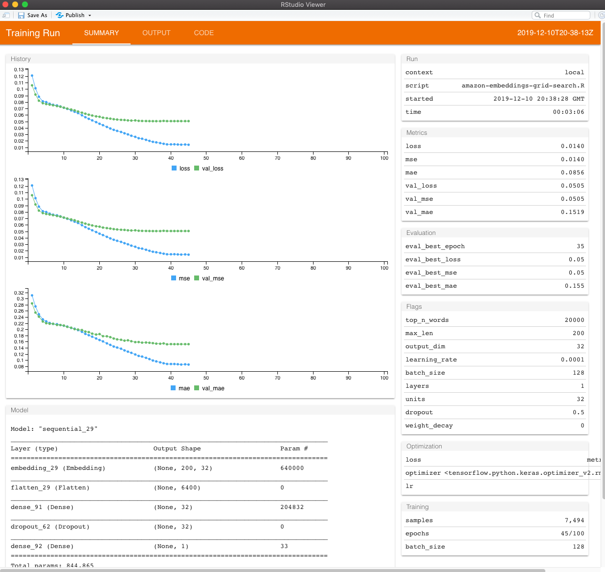

```{r setup, include=FALSE}
knitr::opts_chunk$set(echo = TRUE)
ggplot2::theme_set(ggplot2::theme_minimal())

# clean up in case you run this multiple times
#tfruns::clean_runs(runs_dir = "amazon_runs", confirm = FALSE)
```

This notebook shows an example of performing a grid search for the [Amazon review
helpfulness project](https://rstudio-conf-2020.github.io/dl-keras-tf/notebooks/project-embeddings-amazon-reviews.nb.html).
If you are unfamiliar with Keras/Tensorflow grid searches please review this
[notebook](https://rstudio-conf-2020.github.io/dl-keras-tf/notebooks/imdb-grid-search.nb.html) first.

```{r, message=FALSE, warning=FALSE}
library(tfruns)
library(dplyr)
```

Our grid search setup is located in this [amazon-embeddings-grid-search.R](https://rstudio-conf-2020.github.io/dl-keras-tf/materials/99-extras/amazon-embeddings-grid-search.R)
script. The grid we're going to search across is below and contains ___5,832___
hyperparameter combinations. This is way too large to evaluate all possible
combinations so, rather, we'll perform a [random search](http://jmlr.csail.mit.edu/papers/volume13/bergstra12a/bergstra12a.pdf)
which typically finds a near optimal solution. We execute a random search by
including a `sample` argument less than 1. 

Here, we evaluate only 10% (583 models) of the possible hyperparameter
combinations. In fact, I even cut the grid search short which resulted in 137
models being evaluated.

___Note: this will take several hours to run on a non-GPU___

```{r, message=FALSE, warning=FALSE}
grid_search <- list(
  top_n_words = c(5000, 10000, 20000),
  max_len = c(75, 150, 200),
  output_dim = c(16, 32, 64),
  learning_rate = c(0.001, 0.0001),
  batch_size = c(32, 64, 128),
  layers = c(1, 2, 3),
  units = c(16, 32, 128),
  dropout = c(0, 0.5),
  weight_decay = c(0, 0.01)
)

tuning_run(
  "amazon-embeddings-grid-search.R",
  flags = grid_search,
  runs_dir = "amazon_runs",
  sample = 0.1,
  confirm = FALSE,
  echo = FALSE
  )
```

This grid search execution will create an "amazon_runs" subdirectory within your
working directory. Our results indicate that the best performing models all have
optimal MSEs in the low 0.05 range.

```{r,}
ls_runs(runs_dir = "amazon_runs", order = eval_best_loss, decreasing = FALSE)
```

If we look at our optimal model we see it has the following parameters:

- top_n_words: 20,000
- max_len: 200
- output_dim: 32
- layers (hidden layers in classifier): 1
- units (in hidden layers): 32
- learning_rate: 0.0001
- batch_size: 128
- dropout: 0.5
- weight_decay: 0

```{r, eval=FALSE}
best_run <- ls_runs(
  runs_dir = "amazon_runs",
  order = eval_best_loss,
  decreasing = FALSE
  ) %>%
  slice(1) %>%
  pull(run_dir)

view_run(best_run)
```

```{r, echo=FALSE}

```