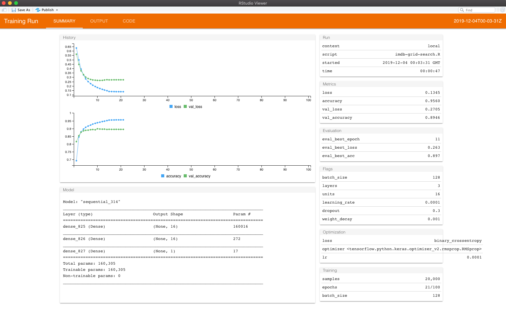

```{r setup, include=FALSE}
knitr::opts_chunk$set(echo = TRUE)
ggplot2::theme_set(ggplot2::theme_minimal())

# clean up in case you run this multiple times
tfruns::clean_runs(confirm = FALSE)
```

Hyperparameter tuning for DNNs tends to be a bit more involved than other ML
models due to the number of hyperparameters that can/should be assessed and the
dependencies between these parameters. To automate the hyperparameter tuning
for keras and tensorflow, we use the [__tfruns__](https://github.com/rstudio/tfruns)
package.

This notebook shows an example of performing a grid search on a densley connected
feedforward neural network for the IMDB movie review classifier introduced in
this [case study](https://rstudio-conf-2020.github.io/dl-keras-tf/notebooks/02-imdb.nb.html).

```{r, message=FALSE, warning=FALSE}
library(tfruns)
library(dplyr)
```

tfruns provides added flexibility for tracking, visualizing, and managing 
training runs. The most common way to use tfruns is to create an R script that
contains the code to be executed. For this example, I created the
[imdb-grid-search.R](https://rstudio-conf-2020.github.io/dl-keras-tf/materials/99-extras/imdb-grid-search.R)
script.

Within this script, we create "flags", which identify the hyperparameters of
interest. For this example, I assess:

- batch sizes of 128 and 512
- layers of 1, 2, and 3
- number of units per hidden layer of 16, 32, and 64
- learning rate of 0.001 and 0.0001
- dropout rates of 0, 0.3, and 0.5
- weight decay of 0, 0.01, and 0.001

This equates to 324 models. Since these models run relatively quickly, and since
I ran this at the end of the day, I performed a full cartesian grid search. This
means I ran and assessed every single one of the 324 models. If you are pressed
for time you can run a stochastic hyperparameter grid search by using the
`sample` parameter in `tuning_run` below.

Next, to execute this grid search, you first specify the grid search hyperparameter
values for the flags you created in your .R script like below. You then run
`tuning_run()` in place of `source()` to execute your .R script for the supplied
hyperparameter grid.

___Note: this takes over 3 hours to run on a non-GPU___

```{r, message=FALSE, warning=FALSE}
grid_search <- list(
  batch_size = c(128, 512),
  layers = c(1, 2, 3),
  units = c(16, 32, 64),
  learning_rate = c(0.001, 0.0001),
  dropout = c(0, 0.3, 0.5),
  weight_decay = c(0, 0.01, 0.001)
)

tuning_run("imdb-grid-search.R", flags = grid_search, confirm = FALSE, echo = FALSE)
```

This grid search execution will create a "runs" subdirectory within your working
directory. This fold contains information for every single training run executed
during the grid search.

To list the results you can run `ls_runs()`:

```{r}
data.frame(ls_runs(runs_dir = "imdb_runs"))
```

You can even filter and order the results. The following illustrates that a few
models tied with the lowest loss score of 0.262.

```{r}
ls_runs(runs_dir = "imdb_runs", order = eval_best_loss, decreasing = FALSE)
```

To see details about any one of these models you can run `view_run()`. In this
example, I take the first optimal model from above. When you execute this,
a pop up window will appear with that models summary information as illustrated
below.

```{r, eval=FALSE}
best_run <- ls_runs(
  runs_dir = "imdb_runs",
  order = eval_best_loss,
  decreasing = FALSE
  ) %>%
  slice(1) %>%
  pull(run_dir)

view_run(best_run)
```

```{r, echo=FALSE}

```

There are many other handy features to the tfruns package. I suggest you check
it out at https://tensorflow.rstudio.com/tools/tfruns/overview/ and take it for
a test drive.